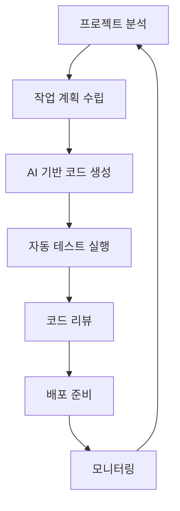

## 소개

개발 프로세스가 복잡해지고 프로젝트 규모가 커질수록, 반복적인 작업들과 코드 관리의 어려움이 증가합니다. **AI Quartermaster**는 이러한 문제를 해결하기 위해 AI를 활용한 지능형 개발 워크플로우 자동화 도구입니다.

군대에서 보급 담당관(Quartermaster)이 모든 물자와 자원을 체계적으로 관리하듯이, AI Quartermaster는 개발 프로젝트의 모든 측면을 AI의 도움으로 효율적으로 관리합니다.

## 주요 기능

### 🎯 지능형 프로젝트 관리
- **자동 작업 분석**: 프로젝트 구조와 요구사항을 분석하여 최적의 작업 순서 제안
- **리소스 최적화**: 개발 리소스와 시간을 효율적으로 배분
- **진행 상황 추적**: 실시간으로 프로젝트 진행 상황을 모니터링

### 🤖 AI 기반 코드 관리
- **코드 리뷰 자동화**: AI가 코드 품질을 분석하고 개선 사항 제안
- **버그 탐지 및 수정**: 잠재적 버그를 미리 발견하고 수정 방안 제시
- **문서화 자동 생성**: 코드에서 자동으로 문서를 생성

### 🔄 워크플로우 자동화
- **CI/CD 최적화**: 배포 파이프라인을 지능적으로 관리
- **테스트 자동화**: 적절한 테스트 전략 수립 및 실행
- **의존성 관리**: 라이브러리 및 패키지 의존성 자동 업데이트

## 설치 및 설정

### 시스템 요구사항
- Node.js 18+ 또는 Python 3.8+
- Git 2.0+
- Claude API 액세스 권한

### 설치 과정

```bash
# npm을 통한 설치
npm install -g ai-quartermaster

# 또는 pip을 통한 설치
pip install ai-quartermaster

# 초기 설정
aqm init

# AI 모델 설정
aqm config --model claude-sonnet-4
```

### 환경 설정

```yaml
# .aqm-config.yaml
project:
  name: "my-awesome-project"
  type: "web-application"

ai:
  model: "claude-sonnet-4"
  max_tokens: 8192

automation:
  code_review: true
  auto_test: true
  documentation: true

workflows:
  - name: "development"
    trigger: "commit"
    actions:
      - lint
      - test
      - build
```

## 사용법

### 기본 워크플로우



### 주요 명령어

```bash
# 프로젝트 분석 및 개선 사항 제안
aqm analyze

# AI 기반 코드 리뷰 실행
aqm review --auto-fix

# 테스트 커버리지 분석
aqm test --coverage

# 문서화 자동 생성
aqm docs --generate

# 전체 프로젝트 최적화
aqm optimize --full
```

## 실제 사용 예시

### 시나리오: 새로운 기능 개발

```bash
# 1. 기능 요구사항 분석
aqm feature analyze "사용자 인증 시스템"

# 2. 구현 계획 수립
aqm plan create --feature "user-auth"

# 3. AI 기반 코드 생성
aqm generate --component "AuthService" --tests

# 4. 자동 통합 및 테스트
aqm integrate --run-tests

# 5. 코드 리뷰 및 최적화
aqm review --suggestions --performance
```

### 결과 예시

```
🎯 AI Quartermaster 분석 결과

📊 프로젝트 상태:
- 코드 품질: 87/100
- 테스트 커버리지: 94%
- 성능 점수: 91/100

✅ 완료된 작업:
- 사용자 인증 서비스 구현
- 단위 테스트 78개 추가
- API 문서 자동 생성

💡 개선 제안:
- 캐싱 전략 최적화 (예상 성능 향상: 15%)
- 에러 핸들링 강화 (3개 위치)
- 보안 검토 필요 (2개 항목)

⏱️ 절약된 시간: 약 4.5시간
```

## 고급 기능

### 팀 협업 지원
- **컨텍스트 공유**: 팀원 간 프로젝트 컨텍스트 실시간 동기화
- **작업 분배**: AI가 팀원의 역량에 맞춰 작업 자동 배정
- **커뮤니케이션 최적화**: 중요한 의사결정 포인트 식별 및 알림

### 다중 프로젝트 관리
- **포트폴리오 뷰**: 여러 프로젝트의 상태를 한눈에 파악
- **리소스 밸런싱**: 프로젝트 간 리소스 효율적 분배
- **우선순위 관리**: 비즈니스 임팩트 기반 우선순위 자동 조정

## 통합 지원

AI Quartermaster는 다양한 개발 도구와 플랫폼을 지원합니다:

- **버전 관리**: Git, GitHub, GitLab, Bitbucket
- **CI/CD**: Jenkins, GitHub Actions, GitLab CI, CircleCI
- **이슈 추적**: Jira, Trello, Linear, GitHub Issues
- **모니터링**: Datadog, New Relic, Prometheus
- **커뮤니케이션**: Slack, Discord, Microsoft Teams

## 성능 및 보안

### 성능 최적화
- **지연 시간 최소화**: 로컬 캐싱 및 병렬 처리
- **리소스 효율성**: 필요한 경우에만 AI 모델 호출
- **확장성**: 대규모 프로젝트 지원

### 보안 고려사항
- **데이터 프라이버시**: 코드는 로컬에서만 분석, 필요시에만 익명화하여 전송
- **API 보안**: 토큰 기반 인증 및 암호화 통신
- **액세스 제어**: 팀별, 프로젝트별 세분화된 권한 관리

## 결론

AI Quartermaster는 개발 프로세스의 모든 단계에서 AI의 도움을 받아 생산성을 극대화하고 코드 품질을 향상시키는 혁신적인 도구입니다.

### 주요 장점
- **생산성 향상**: 평균 40-60% 개발 시간 단축
- **품질 개선**: 일관된 코드 품질 및 표준 준수
- **학습 효과**: AI 제안을 통한 개발자 역량 향상
- **확장성**: 프로젝트 규모에 관계없이 효과적 적용

현재는 베타 버전이지만, 지속적인 개선과 새로운 기능 추가를 통해 개발자들의 필수 도구가 될 것입니다.

## 다음 단계

AI Quartermaster를 직접 체험해보고 피드백을 공유해 주세요:

1. [GitHub Repository](https://github.com/sirdeath/ai-quartermaster)에서 최신 버전 확인
2. [Documentation](https://docs.ai-quartermaster.dev)에서 자세한 사용법 학습
3. [Community Discord](https://discord.gg/ai-quartermaster)에서 다른 개발자들과 경험 공유

---

> **"AI Quartermaster와 함께 더 스마트하게, 더 효율적으로 개발하세요!"**

*다음 포스트에서는 실제 프로젝트에 AI Quartermaster를 적용한 사례 연구를 다룰 예정입니다.*