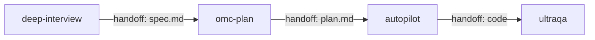

## 소개

Claude Code의 **스킬(Skills)** 기능은 반복적인 워크플로우를 자동화하는 강력한 도구입니다. 하지만 한국어 자료가 부족해 많은 개발자들이 이 기능을 제대로 활용하지 못하고 있습니다.

이 가이드에서는 Claude Code 스킬의 기본 개념부터 고급 활용법까지, 실제 예시와 함께 상세히 설명합니다. 28개의 내장 스킬 분석과 실전 작성 팁으로 여러분만의 맞춤형 워크플로우를 만들어보세요.

## Claude Code 스킬이란?

스킬은 **재사용 가능한 워크플로우 템플릿**입니다. 단순한 매크로가 아닌, AI 에이전트가 실행하는 지능형 자동화 도구로:

- 복잡한 다단계 작업을 하나의 명령으로 실행
- 상황에 맞는 적응적 실행 (컨텍스트 기반 판단)
- 다른 스킬과의 연쇄 실행 (파이프라인)
- 자동 학습을 통한 패턴 기반 스킬 제안

### 스킬 vs 일반 명령어

```bash
# 일반적인 방법 (여러 단계 수동 실행)
git add .
git commit -m "구현 완료"
npm test
npm run build
git push

# 스킬 방법 (한 번에 자동화)
/oh-my-claudecode:autopilot "사용자 인증 기능 구현"
```

## 스킬 시스템 아키텍처

### 스킬 로드 우선순위

```mermaid
graph TD
    A[스킬 실행 요청] --> B{스킬 탐색}
    B --> C[.omc/skills/ (프로젝트)]
    B --> D[~/.claude/skills/omc-learned/ (글로벌)]
    B --> E[내장 스킬 (28개)]
    C --> F[프로젝트 스킬 우선]
    D --> F
    E --> F
    F --> G[스킬 로드 및 실행]
```

### 스킬 파일 구조

```
프로젝트 스킬 (최우선)
.omc/skills/
  └── my-custom-skill/
      └── SKILL.md

글로벌 스킬 (학습된 스킬)
~/.claude/skills/omc-learned/
  └── extracted-workflow/
      └── SKILL.md

내장 스킬 (28개)
oh-my-claudecode/skills/
  ├── autopilot/SKILL.md
  ├── ralph/SKILL.md
  └── ultrawork/SKILL.md
```

## 스킬 작성 기본 구조

### SKILL.md 파일 템플릿

```yaml
---
name: my-awesome-skill                  # 필수: 스킬 이름
description: 짧고 명확한 설명           # 필수: 한 줄 설명
triggers: [keyword1, keyword2]          # 권장: 자동 활성화 키워드
tags: [workflow, automation]            # 선택: 분류 태그
model: sonnet                           # 선택: 권장 모델 (haiku/sonnet/opus)
agent: executor                         # 선택: 권장 에이전트
argument-hint: "<task-description>"     # 선택: 사용법 힌트
aliases: [alias1, alias2]               # 선택: 별칭
pipeline: [skill1, skill2, skill3]      # 선택: 파이프라인 순서
next-skill: next-skill-name             # 선택: 다음 스킬
next-skill-args: "--flag value"         # 선택: 다음 스킬 인자
handoff: .omc/artifacts/result.md       # 선택: 결과 전달 파일
---

# 스킬 이름

## Purpose
이 스킬이 해결하는 문제와 목적을 명확히 설명합니다.

## Use When
- 조건 1: 특정 상황에서 사용
- 조건 2: 특정 작업이 필요할 때
- 조건 3: 반복적인 패턴이 감지될 때

## Do Not Use When
- 피해야 할 상황 1
- 피해야 할 상황 2
- 더 적절한 대안이 있을 때

## Why This Exists
이 스킬이 존재하는 이유와 가치를 설명합니다.

## Execution Policy
- 실행 원칙 1: 안전성 우선
- 실행 원칙 2: 사용자 확인 필요 시점
- 실행 원칙 3: 에러 처리 방법

## Steps
1. **초기화**: 작업 환경 준비 및 검증
2. **분석**: 현재 상태 파악 및 요구사항 분석
3. **실행**: 핵심 작업 수행
4. **검증**: 결과 확인 및 품질 보증
5. **정리**: 리소스 정리 및 다음 단계 준비

## Tool Usage
사용할 도구들과 활용 방법:

### 주요 도구
- `Read`: 파일 내용 분석
- `Edit`: 코드 수정
- `Bash`: 명령 실행
- `Agent`: 하위 에이전트 활용

### 에이전트 활용
```typescript
// executor 에이전트로 복잡한 구현 작업 위임
Agent({
  subagent_type: "executor",
  description: "기능 구현",
  prompt: "사용자 요구사항에 따라 구현"
})
```

## Examples

### Good Example
```bash
# 명확한 목적과 충분한 컨텍스트 제공
/oh-my-claudecode:my-skill "REST API 엔드포인트 5개 추가, 에러 핸들링 포함"
```

### Bad Example
```bash
# 모호한 요청
/oh-my-claudecode:my-skill "뭔가 고쳐줘"
```

## Error Handling
- 일반적인 에러 상황과 대응 방법
- 롤백 전략
- 사용자 피드백 방법

## Quality Gates
- 성공 기준 정의
- 품질 검증 체크리스트
- 실패 시 재시도 로직
```

### Frontmatter 필드 상세 설명

| 필드 | 필수여부 | 설명 | 예시 |
|------|----------|------|------|
| `name` | 필수 | 스킬 고유 이름 | `react-component-generator` |
| `description` | 필수 | 한 줄 설명 (검색 시 표시) | `React 컴포넌트 자동 생성 도구` |
| `triggers` | 권장 | 자동 활성화 키워드 | `[react, component, generate]` |
| `tags` | 선택 | 분류용 태그 | `[frontend, react, automation]` |
| `model` | 선택 | 권장 AI 모델 | `sonnet` (빠름), `opus` (고품질) |
| `agent` | 선택 | 권장 전문 에이전트 | `executor`, `designer`, `architect` |
| `pipeline` | 선택 | 연쇄 실행할 스킬 목록 | `[plan, implement, test]` |
| `next-skill` | 선택 | 완료 후 자동 실행할 스킬 | `code-reviewer` |
| `handoff` | 선택 | 결과 전달용 파일 경로 | `.omc/artifacts/analysis.md` |

## 내장 스킬 분석: 실전 학습

Claude Code에는 28개의 내장 스킬이 있습니다. 주요 스킬들을 분석해 작성 패턴을 학습해보겠습니다.

### 1. autopilot 스킬 (8,775줄)

**가장 복잡하고 완성도 높은 스킬**로, 5단계 Phase로 구성됩니다:

```yaml
---
name: autopilot
description: 아이디어에서 완성된 코드까지 완전 자동화 실행
triggers: [autopilot]
model: opus
pipeline: [ralplan, deep-interview, ultrawork, ultraqa]
---
```

**Phase 구조:**
- **Phase 0 (Expansion)**: 아이디어 확장 및 스펙 문서 작성
- **Phase 1 (Planning)**: 상세 구현 계획 수립
- **Phase 2-4 (Execution)**: Ralph + UltraWork로 병렬 구현
- **Phase 5 (Validation)**: Multi-reviewer 검증

**핵심 학습 포인트:**
1. **단계별 체크포인트**: 각 Phase 완료 후 품질 검증
2. **조건부 실행**: 기존 스펙/계획이 있으면 해당 Phase 스킵
3. **에러 복구**: 실패 시 이전 Phase로 롤백
4. **다중 검증자**: Architect + Security + Code Reviewer 활용

### 2. ralph 스킬 (PRD 기반 지속 루프)

```yaml
---
name: ralph
description: PRD 기반 지속적 개발 루프 (반복 실행)
triggers: [ralph]
model: sonnet
handoff: .omc/prd/prd.json
---
```

**핵심 패턴:**
```javascript
// PRD 기반 Story 관리
{
  "stories": [
    {
      "id": "auth-system",
      "description": "사용자 인증",
      "passes": false,          // 완료 여부
      "acceptanceCriteria": [
        "로그인 기능 구현",
        "JWT 토큰 검증",
        "에러 처리"
      ]
    }
  ]
}
```

**학습 포인트:**
1. **상태 추적**: JSON 파일로 진행 상황 관리
2. **선택적 실행**: `passes: false`인 스토리만 처리
3. **검증 루프**: 완료 후 다시 검증, 실패 시 재실행
4. **티어별 에이전트**: 작업 복잡도에 따라 다른 에이전트 활용

### 3. deep-interview 스킬 (Socratic 질문)

```yaml
---
name: deep-interview
description: Socratic 질문으로 모호성 제거 후 계획 수립
triggers: [deep interview]
next-skill: omc-plan
next-skill-args: --consensus --direct
handoff: .omc/specs/deep-interview-{slug}.md
---
```

**모호성 측정 알고리즘:**
```python
# 7개 차원에서 모호성 점수 계산 (0-1)
dimensions = [
    "technical_clarity",     # 기술 명확성
    "scope_definition",      # 범위 정의
    "success_criteria",      # 성공 기준
    "constraints",           # 제약 조건
    "dependencies",          # 의존성
    "timeline",             # 일정
    "resources"             # 리소스
]

# ambiguity ≤ 0.2일 때 다음 단계 진행
```

**학습 포인트:**
1. **정량적 게이트**: 모호성 점수로 품질 관리
2. **단일 질문 원칙**: 한 번에 하나씩만 질문 (배치 금지)
3. **자동 핸드오프**: 완료 시 자동으로 다음 스킬 실행
4. **Challenge Agents**: 특정 라운드에서 반대 관점 제시

## 스킬 작성 실전 팁

### 1. 명명 규칙과 구조화

```yaml
# 좋은 예: 구체적이고 액션 중심
name: react-component-with-tests
description: React 컴포넌트와 테스트 코드를 동시 생성

# 나쁜 예: 모호하고 일반적
name: helper
description: 도움되는 것들
```

### 2. Triggers 키워드 전략

```yaml
# 다양한 표현 방식 고려
triggers: [
  "react component",     # 자연어 표현
  "컴포넌트 생성",       # 한국어
  "comp gen",           # 줄임말
  "rc"                  # 초단축형
]
```

### 3. 에러 처리와 복구 전략

```markdown
## Error Handling

### 1단계: 사전 검증
- 필수 파일 존재 확인
- 권한 및 환경 검증
- 의존성 설치 상태 확인

### 2단계: 실행 중 모니터링
- 각 단계별 성공/실패 로깅
- 중간 결과물 백업
- 진행 상황 사용자 알림

### 3단계: 실패 시 복구
- 자동 롤백: 이전 상태로 복원
- 부분 성공: 완료된 부분 보존
- 수동 개입: 사용자 확인 후 재시작
```

### 4. 품질 게이트 설정

```markdown
## Quality Gates

### 코드 품질 기준
- [ ] ESLint/Prettier 통과
- [ ] 타입 에러 없음
- [ ] 테스트 커버리지 80% 이상
- [ ] 성능 기준 충족

### 사용자 경험 기준
- [ ] 명확한 진행 상황 표시
- [ ] 의미 있는 에러 메시지
- [ ] 예상 완료 시간 제공
- [ ] 중간 중단 가능
```

### 5. 에이전트 활용 패턴

```markdown
## Agent Delegation Strategy

### 작업 복잡도별 라우팅
- **단순 작업** (haiku): 파일 읽기, 간단한 검증
- **표준 작업** (sonnet): 코드 구현, 테스트 작성
- **복잡 작업** (opus): 아키텍처 설계, 성능 최적화

### 전문 에이전트 활용
```typescript
// 아키텍처 설계가 필요한 경우
Agent({
  subagent_type: "architect",
  model: "opus",
  description: "시스템 아키텍처 설계"
})

// UI 작업의 경우
Agent({
  subagent_type: "designer",
  model: "sonnet",
  description: "React 컴포넌트 디자인"
})
```

## 고급 기능 활용

### 스킬 파이프라인

여러 스킬을 연쇄적으로 실행하는 워크플로우:

```yaml
---
name: full-feature-pipeline
pipeline: [deep-interview, omc-plan, autopilot, ultraqa]
---
```

**실행 흐름:**


### Learner 자동 스킬 학습

반복되는 패턴을 자동으로 감지해 스킬로 제안:

```json
// ~/.claude/omc/learner.json
{
  "detection": {
    "promptThreshold": 60,        // 60% 신뢰도 이상에서 제안
    "promptCooldown": 5          // 5메시지마다 한 번씩 체크
  },
  "quality": {
    "minScore": 50,              // 최소 품질 점수
    "minProblemLength": 10,      // 문제 설명 최소 길이
    "minSolutionLength": 20      // 해결책 최소 길이
  }
}
```

**학습 프로세스:**
1. **패턴 감지**: 대화에서 반복되는 작업 패턴 식별
2. **스킬 추출**: 문제-해결책 쌍으로 스킬 구조 생성
3. **품질 검증**: 설정된 기준에 따라 품질 평가
4. **사용자 승인**: 제안된 스킬을 사용자가 승인/거부
5. **자동 저장**: `~/.claude/skills/omc-learned/`에 저장

### 핸드오프 아티팩트

스킬 간 데이터 전달 메커니즘:

```yaml
# 생성자 스킬
name: spec-writer
handoff: .omc/specs/feature-spec.md

# 소비자 스킬
name: implementer
description: handoff된 스펙을 기반으로 구현
```

**아티팩트 예시:**
```markdown
<!-- .omc/specs/feature-spec.md -->
# 사용자 인증 스펙

## 요구사항
- JWT 기반 토큰 인증
- 리프레시 토큰 지원
- 소셜 로그인 (Google, GitHub)

## API 설계
- POST /auth/login
- POST /auth/refresh
- GET /auth/profile

## 보안 고려사항
- bcrypt 해싱
- rate limiting
- HTTPS 강제
```

## 실전 예시: 커스텀 스킬 작성

실제로 유용한 스킬을 하나 만들어보겠습니다.

### API 테스트 자동화 스킬

```yaml
---
name: api-test-generator
description: REST API 엔드포인트 테스트 코드 자동 생성
triggers: [api test, 테스트 생성, endpoint test]
tags: [testing, api, automation]
model: sonnet
agent: test-engineer
argument-hint: "<endpoint-path> [test-type]"
---

# API Test Generator

## Purpose
REST API 엔드포인트에 대한 포괄적인 테스트 코드를 자동으로 생성합니다.
단순한 템플릿이 아닌, 실제 API 스펙을 분석해서 의미 있는 테스트를 만듭니다.

## Use When
- 새로운 API 엔드포인트 개발 후 테스트가 필요할 때
- 기존 API의 테스트 커버리지를 늘리고 싶을 때
- API 변경 후 회귀 테스트가 필요할 때
- CI/CD 파이프라인에 API 테스트를 추가할 때

## Do Not Use When
- 단순한 CRUD만 있는 경우 (기존 도구로 충분)
- 복잡한 비즈니스 로직 테스트가 필요한 경우 (수동 작성 권장)
- API 스펙이 아직 불안정한 개발 초기 단계

## Why This Exists
API 테스트 작성은 반복적이고 시간이 오래 걸리지만 꼭 필요한 작업입니다.
이 스킬은 일관성 있고 포괄적인 테스트를 빠르게 생성해 개발자의 부담을 줄입니다.

## Execution Policy
- API 스펙 분석 → 테스트 시나리오 생성 → 코드 구현 순으로 진행
- 성공/실패 케이스 모두 포함한 균형잡힌 테스트 생성
- 실행 가능한 테스트 코드만 생성 (컴파일/실행 검증 필수)
- 생성된 테스트는 즉시 실행해서 정상 동작 확인

## Steps

### 1. API 분석 단계
```typescript
// 현재 프로젝트의 API 구조 파악
const analysis = await analyzeProject();
```

### 2. 엔드포인트 탐지
- OpenAPI/Swagger 문서 확인
- 소스 코드에서 라우터 정의 추출
- 기존 테스트 파일 분석 (중복 방지)

### 3. 테스트 시나리오 설계
- **Happy Path**: 정상적인 요청/응답 흐름
- **Edge Cases**: 경계값, 빈 값, null 처리
- **Error Cases**: 400, 401, 403, 404, 500 에러
- **Performance**: 응답 시간, 동시 요청 처리

### 4. 테스트 코드 생성
```javascript
// Jest + Supertest 기반 테스트 템플릿
describe('POST /api/users', () => {
  it('should create user with valid data', async () => {
    const userData = {
      email: 'test@example.com',
      password: 'securePass123',
      name: 'Test User'
    };

    const response = await request(app)
      .post('/api/users')
      .send(userData)
      .expect(201);

    expect(response.body).toHaveProperty('id');
    expect(response.body.email).toBe(userData.email);
  });

  it('should reject invalid email format', async () => {
    const invalidData = {
      email: 'not-an-email',
      password: 'securePass123'
    };

    await request(app)
      .post('/api/users')
      .send(invalidData)
      .expect(400);
  });
});
```

### 5. 실행 및 검증
- 생성된 테스트 실행
- 실패하는 테스트 수정
- 커버리지 리포트 생성

## Tool Usage

### 코드 분석 도구
```typescript
// 1. API 라우트 파일 탐지
const routeFiles = await Glob({
  pattern: "**/{routes,controllers,api}/**/*.{js,ts}",
  path: "./src"
});

// 2. OpenAPI 스펙 파일 확인
const specFile = await Glob({
  pattern: "**/swagger.{json,yaml,yml}",
  path: "."
});

// 3. 기존 테스트 파일 분석
const testFiles = await Glob({
  pattern: "**/*.{test,spec}.{js,ts}",
  path: "./tests"
});
```

### 전문 에이전트 활용
```typescript
// 테스트 전문가 에이전트로 위임
const testPlan = await Agent({
  subagent_type: "test-engineer",
  description: "API 테스트 전략 수립",
  prompt: `
    다음 API 엔드포인트에 대한 종합적인 테스트 계획을 수립해주세요:
    ${endpointInfo}

    포함사항:
    - 테스트 시나리오 목록
    - Mock 데이터 설계
    - 에러 케이스 정의
    - 성능 테스트 기준
  `
});
```

## Examples

### Good Example
```bash
# 구체적인 엔드포인트와 옵션 지정
/oh-my-claudecode:api-test-generator "POST /api/users --integration --performance"

# 여러 엔드포인트 일괄 처리
/oh-my-claudecode:api-test-generator "/api/users,/api/orders" --suite
```

### Bad Example
```bash
# 너무 모호한 요청
/oh-my-claudecode:api-test-generator "테스트 좀"

# 존재하지 않는 엔드포인트
/oh-my-claudecode:api-test-generator "/api/nonexistent"
```

## Error Handling

### 공통 에러 상황
1. **API 스펙을 찾을 수 없음**
   - 수동으로 엔드포인트 정보 입력 요청
   - 기본 템플릿으로 시작점 제공

2. **테스트 실행 실패**
   - 의존성 누락 확인 및 설치
   - 환경 설정 문제 진단
   - 수정된 코드로 재시도

3. **생성된 테스트 품질 문제**
   - Code review 에이전트로 검토
   - 개선 사항 적용 후 재생성

### 롤백 전략
- 테스트 파일 생성 전 백업
- 실패 시 원본 상태 복원
- 부분 성공한 테스트는 보존

## Quality Gates

### 생성 품질 기준
- [ ] 컴파일 에러 없음 (TypeScript)
- [ ] 모든 테스트 실행 가능
- [ ] 커버리지 80% 이상 달성
- [ ] 의미 있는 assertion 포함

### 코드 품질 기준
- [ ] 일관된 네이밍 컨벤션
- [ ] 적절한 테스트 데이터 사용
- [ ] DRY 원칙 준수 (helper 함수 활용)
- [ ] 명확한 테스트 설명 (describe/it)

## Integration Points

### CI/CD 연계
생성된 테스트를 CI 파이프라인에 자동 추가:
```yaml
# .github/workflows/api-tests.yml
- name: Run API Tests
  run: npm run test:api

- name: Upload Coverage
  uses: codecov/codecov-action@v1
```

### 모니터링 연계
테스트 결과를 슬랙으로 알림:
```typescript
if (testResults.failed > 0) {
  await notifySlack(`API 테스트 실패: ${testResults.failed}개`);
}
```
```

## 트러블슈팅 가이드

### 자주 발생하는 문제들

#### 1. 스킬이 인식되지 않음
```bash
# 문제: 스킬을 호출했는데 "Unknown skill" 에러
/oh-my-claudecode:my-skill

# 원인과 해결책
# 1. 파일 위치 확인
ls .omc/skills/my-skill/SKILL.md    # 파일 존재 여부
ls ~/.claude/skills/omc-learned/my-skill/SKILL.md

# 2. Frontmatter 검증
head -20 .omc/skills/my-skill/SKILL.md  # YAML 문법 확인

# 3. 스킬 목록 새로고침
/oh-my-claudecode:skill list --refresh
```

#### 2. Learner가 스킬을 제안하지 않음
```json
// ~/.claude/omc/learner.json 설정 확인
{
  "detection": {
    "enabled": true,             // false면 비활성화
    "promptThreshold": 60       // 너무 높으면 제안 안함 (30-70 권장)
  }
}
```

#### 3. 파이프라인 실행 중단
```markdown
# handoff 파일 경로 확인
handoff: .omc/artifacts/result.md

# 디렉터리 존재 여부 확인
mkdir -p .omc/artifacts

# 권한 문제 해결
chmod 755 .omc/artifacts
```

#### 4. 에이전트 호출 실패
```typescript
// 잘못된 에이전트 이름
Agent({ subagent_type: "wrong-agent" })

// 올바른 에이전트 이름 확인
// architect, executor, debugger, designer, test-engineer 등
```

### 디버깅 도구

```bash
# 스킬 실행 로그 확인
tail -f ~/.claude/logs/omc-*.log

# 스킬 메타데이터 검증
/oh-my-claudecode:skill validate my-skill

# 에이전트 상태 확인
/oh-my-claudecode:team list-active
```

## 성능 최적화 팁

### 모델 선택 전략
- **haiku**: 간단한 작업 (파일 읽기, 검증)
- **sonnet**: 일반적인 구현 작업 (코드 작성, 테스트)
- **opus**: 복잡한 설계 작업 (아키텍처, 최적화)

### 에이전트 활용 최적화
```yaml
# 작업별 최적 에이전트 매칭
code_implementation: executor    # 코드 구현
system_design: architect        # 시스템 설계
ui_development: designer         # UI/UX 작업
quality_assurance: test-engineer # 테스트/QA
bug_fixing: debugger            # 디버깅
code_review: code-reviewer      # 코드 리뷰
```

### 병렬 처리 활용
```typescript
// 순차 실행 (느림)
await step1();
await step2();
await step3();

// 병렬 실행 (빠름)
await Promise.all([
  Agent({ description: "작업1" }),
  Agent({ description: "작업2" }),
  Agent({ description: "작업3" })
]);
```

## 모범 사례 체크리스트

### 스킬 작성 체크리스트
- [ ] **명확한 이름**: 기능이 바로 이해되는 이름
- [ ] **구체적인 설명**: 언제, 왜 사용하는지 명확히 기술
- [ ] **적절한 triggers**: 자연스러운 키워드 3-5개
- [ ] **단계별 구조**: Purpose → Use When → Steps → Examples
- [ ] **에러 처리**: 예상 가능한 실패 상황과 대응책
- [ ] **품질 게이트**: 성공 기준과 검증 방법
- [ ] **실행 가능한 예시**: Good/Bad 예시로 사용법 설명

### 코드 품질 체크리스트
- [ ] **멱등성**: 여러 번 실행해도 같은 결과
- [ ] **원자성**: 중간에 실패해도 일관된 상태 유지
- [ ] **롤백 가능**: 필요시 이전 상태로 복원 가능
- [ ] **진행 상황 표시**: 사용자가 진행 상황을 알 수 있음
- [ ] **의미 있는 로그**: 디버깅에 도움되는 로그 출력

### 사용자 경험 체크리스트
- [ ] **직관적인 사용법**: 복잡한 설명 없이도 사용 가능
- [ ] **적절한 피드백**: 실행 중 상황을 적절히 알림
- [ ] **명확한 에러 메시지**: 문제 상황과 해결 방법 제시
- [ ] **중단 가능**: 필요시 안전하게 중단할 수 있음
- [ ] **결과 확인 가능**: 실행 결과를 명확히 확인 가능

## 커뮤니티와 생태계

### 스킬 공유 플랫폼
- **GitHub**: 오픈소스 스킬 모음집
- **Claude Code 공식 문서**: 베스트 프랙티스 가이드
- **Discord/Slack**: 커뮤니티 질문/답변

### 기여 방법
1. **버그 신고**: 스킬 실행 중 발견한 문제
2. **개선 제안**: 더 나은 구현 방법이나 기능
3. **새로운 스킬**: 유용한 워크플로우 공유
4. **문서 개선**: 가이드나 예시 추가

## 결론

Claude Code의 스킬 시스템은 단순한 자동화 도구를 넘어서, 개발 워크플로우 전체를 혁신할 수 있는 강력한 플랫폼입니다.

### 핵심 가치
- **재사용성**: 한 번 작성하면 계속 활용
- **확장성**: 간단한 작업부터 복잡한 워크플로우까지
- **지능성**: AI가 상황에 맞게 적응적 실행
- **협업성**: 팀 전체가 공유하고 발전시킬 수 있음

### 시작하는 방법
1. **내장 스킬 탐험**: 28개 스킬로 가능성 체험
2. **간단한 스킬 작성**: 반복 작업 하나를 스킬로 만들기
3. **점진적 개선**: 사용하면서 지속적으로 개선
4. **커뮤니티 참여**: 다른 개발자들과 경험 공유

### 앞으로의 방향
Claude Code의 스킬 시스템은 계속 발전하고 있습니다. Learner 시스템의 고도화, 더 많은 내장 스킬, 향상된 파이프라인 기능 등이 추가될 예정입니다.

**여러분만의 독특한 워크플로우를 스킬로 만들어 개발 생산성을 한 단계 끌어올려보세요!**

---

## 다음 단계

1. **실습**: 이 가이드의 API 테스트 스킬을 실제로 만들어보기
2. **탐험**: 내장 스킬 28개를 하나씩 사용해보기
3. **커스터마이징**: 자주 하는 작업을 스킬로 만들기
4. **공유**: 유용한 스킬을 커뮤니티에 공유하기

*다음 포스트에서는 실제 프로젝트에 스킬을 적용한 사례와 성과 측정 방법을 다룰 예정입니다.*