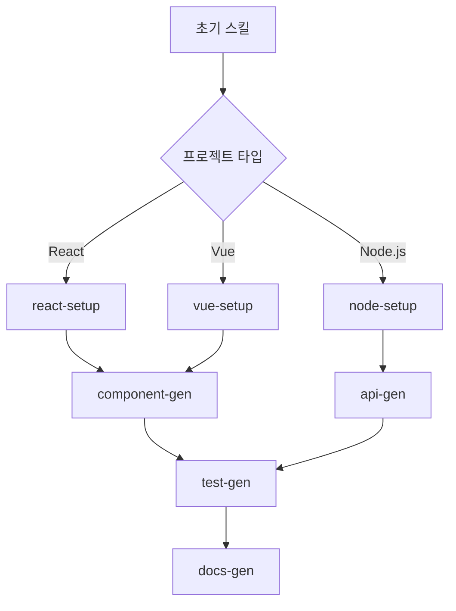

## 들어가며

Claude Code 스킬을 실제로 활용하다 보면 공식 문서에서 다루지 않는 수많은 노하우와 팁이 필요합니다. 이 글은 실전에서 스킬을 효과적으로 작성하고 운영하며 겪은 경험을 바탕으로 한 실용적인 팁 모음입니다.

스킬을 처음 만들 때부터 고급 최적화까지, 바로 적용할 수 있는 검증된 방법들을 소개합니다.

## 📚 목차

- [📝 스킬 작성 팁](#-스킬-작성-팁)
- [🔧 스킬 구조 최적화](#-스킬-구조-최적화)
- [🎯 성능 최적화 팁](#-성능-최적화-팁)
- [🔄 워크플로우 연결 팁](#-워크플로우-연결-팁)
- [🐛 자주 발생하는 문제와 해결법](#-자주-발생하는-문제와-해결법)
- [🎨 스킬 카테고리별 팁](#-스킬-카테고리별-팁)
- [📊 스킬 사용 추적과 개선](#-스킬-사용-추적과-개선)
- [🚀 고급 활용 팁](#-고급-활용-팁)
- [💡 실전 사례와 패턴](#-실전-사례와-패턴)
- [🔒 보안과 안정성](#-보안과-안정성)
- [📈 성과 측정과 개선](#-성과-측정과-개선)

## 📝 스킬 작성 팁

### 1. 명확하고 구체적인 이름과 설명 작성

```yaml
# ❌ 모호한 예시
name: helper
description: 도움이 되는 기능

# ✅ 명확한 예시
name: react-component-generator
description: TypeScript React 컴포넌트와 테스트 파일을 자동 생성
```

**팁**: 6개월 후에도 이해할 수 있을 정도로 구체적으로 작성하세요.

### 2. 효과적인 트리거 키워드 설정

```yaml
# ✅ 자연스러운 트리거 설정
triggers: [
  "컴포넌트 생성", "component create",
  "react comp", "새 컴포넌트"
]
```

**주의사항**:
- 너무 일반적인 키워드는 피하세요 (`create`, `make` 등)
- 한국어와 영어 모두 고려하세요
- 실제로 사용할 표현들을 넣으세요

### 3. 모델 선택 가이드라인

```yaml
# 빠른 작업용
model: haiku
# 일반적인 코딩 작업
model: sonnet
# 복잡한 아키텍처나 분석
model: opus
```

**실전 팁**:
- 파일 읽기/간단한 수정: `haiku`
- 코드 생성/리팩토링: `sonnet`
- 설계/복잡한 분석: `opus`

## 🔧 스킬 구조 최적화

### 4. 단계별 명령 구조화

```markdown
## Instructions

### Phase 1: 분석
1. 프로젝트 구조 파악
2. 기존 컴포넌트 패턴 분석
3. 요구사항 정리

### Phase 2: 생성
1. 컴포넌트 파일 생성
2. 타입 정의 추가
3. 스타일 파일 생성

### Phase 3: 검증
1. 테스트 파일 생성
2. 린트 검사 실행
3. 타입 체크 확인
```

**효과**: 에이전트가 체계적으로 작업을 진행할 수 있습니다.

### 5. 컨텍스트 정보 제공

```markdown
## Context Requirements

반드시 다음 정보를 확인하세요:
- `package.json`에서 React/TypeScript 버전
- `src/components/` 디렉토리의 기존 패턴
- `.prettierrc`, `eslint.config.js` 설정
- 테스트 프레임워크 (Jest/Vitest)

## File Templates

다음 템플릿을 기반으로 생성하세요:
...
```

## 🎯 성능 최적화 팁

### 6. 불필요한 파일 읽기 방지

```markdown
# ❌ 비효율적
모든 파일을 읽어서 패턴을 분석하세요.

# ✅ 효율적
다음 파일들만 확인하여 패턴을 파악하세요:
- `src/components/Button/Button.tsx` (기본 컴포넌트 예시)
- `src/components/index.ts` (export 패턴)
```

### 7. 조건부 실행 활용

```markdown
## Instructions

1. TypeScript 사용 여부 확인:
   - `tsconfig.json` 존재시: TypeScript 컴포넌트 생성
   - 없으면: JavaScript 컴포넌트 생성

2. 테스트 프레임워크 확인:
   - Jest 발견시: `.test.tsx` 파일 생성
   - Vitest 발견시: `.spec.tsx` 파일 생성
```

## 🔄 워크플로우 연결 팁

### 8. 파이프라인 설계

```yaml
# 연속 실행 스킬 설계
name: full-feature-pipeline
pipeline: [
  "feature-analysis",
  "code-generation",
  "test-creation",
  "documentation"
]
```

### 9. 결과 핸드오프 최적화

```yaml
# 다음 스킬에 결과 전달
handoff: .omc/artifacts/component-info.json
next-skill: component-documentation
```

**파일 구조 예시**:
```json
{
  "componentName": "UserProfile",
  "filePath": "src/components/UserProfile/UserProfile.tsx",
  "props": ["userId", "showAvatar"],
  "dependencies": ["@types/user"]
}
```

## 🐛 자주 발생하는 문제와 해결법

### 10. 스킬이 실행되지 않는 경우

```bash
# 디버깅 명령어
/oh-my-claudecode:skill list    # 스킬 목록 확인
/oh-my-claudecode:skill search react  # 키워드로 검색
```

**체크리스트**:
- [ ] `SKILL.md` 파일명 정확한가?
- [ ] frontmatter YAML 문법 오류 없나?
- [ ] 스킬 이름에 특수문자 없나?

### 11. 에이전트가 올바르게 동작하지 않는 경우

```markdown
# ❌ 모호한 지시
파일을 생성하세요.

# ✅ 구체적인 지시
다음 경로에 TypeScript React 컴포넌트를 생성하세요:
- 파일명: `src/components/{ComponentName}/{ComponentName}.tsx`
- export default로 컴포넌트 내보내기
- Props 인터페이스를 별도로 정의
```

### 12. 메모리 사용량 최적화

```markdown
## Performance Notes

큰 파일들은 한 번에 읽지 말고 필요한 부분만:
- `package.json`: dependencies와 scripts만
- 긴 파일: 처음 50줄 또는 특정 함수만
- 설정 파일: 해당 섹션만
```

## 🎨 스킬 카테고리별 팁

### 코드 생성 스킬

```yaml
# 코드 생성에 특화된 설정
model: sonnet
agent: executor

# 템플릿 기반 생성을 위한 헬퍼
templates-dir: .omc/templates/
```

### 분석 스킬

```yaml
# 분석에 특화된 설정
model: opus
agent: analyst

# 결과를 구조화하여 저장
output-format: json
save-analysis: .omc/analysis/
```

### 테스트 스킬

```yaml
# 테스트에 특화된 설정
model: sonnet
agent: test-engineer

# 커버리지 목표 설정
coverage-threshold: 80
test-patterns: ["**/*.test.*", "**/*.spec.*"]
```

## 📊 스킬 사용 추적과 개선

### 13. 사용 통계 활용

```bash
# 스킬 사용 빈도 확인
grep -r "skill.*invoke" .omc/logs/ | sort | uniq -c

# 자주 실패하는 스킬 식별
grep "SKILL_FAILED" .omc/logs/* | cut -d: -f3 | sort | uniq -c
```

### 14. A/B 테스팅으로 개선

```yaml
# 버전 A: 기본 접근법
name: component-gen-v1
model: sonnet

# 버전 B: 최적화된 접근법
name: component-gen-v2
model: haiku
agent: executor
templates-dir: .omc/templates/
```

## 🚀 고급 활용 팁

### 15. 동적 매개변수 처리

```markdown
## Dynamic Configuration

사용자 입력에 따라 동적으로 처리:

매개변수 파싱:
1. `--framework` 값에 따라 다른 템플릿 사용
2. `--lang` 값에 따라 파일 확장자 결정
3. `--test` 값에 따라 테스트 라이브러리 설정
```

**사용 예시**:
```bash
/my-skill --framework react --lang typescript --test jest
/my-skill --framework vue --lang javascript --test vitest
```

### 16. 조건부 에이전트 선택

```markdown
## Agent Selection Logic

프로젝트 크기에 따른 자동 에이전트 선택:
- 파일 수 < 50: `haiku` 모델의 `executor`
- 파일 수 50-200: `sonnet` 모델의 `architect`
- 파일 수 > 200: `opus` 모델의 `planner` → `executor`
```

### 17. 스킬 체이닝 최적화



## 💡 실전 사례와 패턴

### 18. 팀 워크플로우 표준화

```yaml
# 팀 공통 스킬 템플릿
name: team-feature-workflow
description: 우리 팀의 표준 기능 개발 워크플로우

# 회사 코딩 컨벤션 반영
conventions:
  naming: kebab-case
  commit-format: "[FEAT] 기능명: 상세 설명"
  branch-prefix: "feature/"
```

### 19. 프로젝트별 맞춤 설정

```markdown
## Project Context

이 프로젝트는 다음과 같은 특성을 가집니다:
- 마이크로서비스 아키텍처
- GraphQL API 사용
- Docker 컨테이너 기반 배포
- Jest + Testing Library 조합

생성하는 모든 코드는 위 환경에 맞춰야 합니다.
```

### 20. 레거시 코드 마이그레이션

```yaml
name: legacy-migration-helper
description: Class 컴포넌트를 함수형 컴포넌트로 변환

# 특별 처리 규칙
migration-rules:
  - componentDidMount → useEffect
  - this.state → useState
  - this.props → props parameter
```

## 🔒 보안과 안정성

### 21. 민감한 정보 보호

```markdown
## Security Guidelines

절대 다음 정보를 로그에 남기지 마세요:
- API 키, 토큰
- 비밀번호, 인증 정보
- 개인정보 (이메일, 이름)
- 내부 서버 정보

안전한 처리 방법:
- 환경 변수 이름만 로깅
- 값은 `[REDACTED]`로 마스킹
```

### 22. 에러 복구 전략

```markdown
## Error Recovery

실패시 자동 복구 순서:
1. 캐시 클리어 후 재시도
2. 더 간단한 모델로 다운그레이드
3. 사용자에게 수동 개입 요청
4. 부분 완료 상태 저장
```

## 📈 성과 측정과 개선

### 23. 스킬 효율성 측정

```bash
# 실행 시간 측정
echo "Skill started: $(date)" >> .omc/perf.log
# ... 스킬 실행 ...
echo "Skill completed: $(date)" >> .omc/perf.log

# 성공률 계산
awk '/SKILL_SUCCESS/ {s++} /SKILL_FAILED/ {f++} END {print "성공률:", s/(s+f)*100"%"}' .omc/logs/*
```

### 24. 사용자 만족도 수집

```markdown
## Post-Execution Survey

스킬 실행 후 간단한 피드백 수집:
```

**피드백 수집 스크립트**:
```bash
echo "이 스킬이 도움되었나요? (1-5): "
read rating
echo "$(date): 스킬명=$SKILL_NAME, 평점=$rating" >> .omc/feedback.log
```

## 🎯 마무리하며

### 핵심 요약

1. **명확성이 생명**: 모호한 지시보다 구체적이고 명확한 설명
2. **단계적 접근**: 큰 작업은 작은 단계로 나누어 처리
3. **컨텍스트 중요**: 프로젝트 환경과 패턴을 충분히 고려
4. **성능 최적화**: 불필요한 파일 읽기나 처리 최소화
5. **에러 대응**: 실패 상황을 미리 고려한 설계

### 지속적인 개선

스킬은 한 번 만들고 끝이 아닙니다:
- 사용 패턴 분석으로 개선점 발견
- 팀 피드백 반영하여 업데이트
- 새로운 도구나 프레임워크 지원 추가
- 성능 병목 지점 최적화

### 다음 단계

1. 간단한 스킬부터 시작해보세요
2. 실제 프로젝트에 적용하며 개선하세요
3. 팀원들과 스킬을 공유하고 피드백받으세요
4. 고급 기능들을 점진적으로 도입하세요

좋은 스킬은 단순히 작업을 자동화하는 것을 넘어, 팀의 생산성과 코드 품질을 동시에 향상시킵니다. 이 팁들을 바탕으로 여러분만의 강력한 워크플로우를 만들어보세요!

---

> **"완벽한 스킬은 존재하지 않습니다. 지속적으로 개선하는 스킬만 있을 뿐입니다."**

*다음 포스트에서는 Claude Code 스킬을 활용한 실제 프로젝트 사례를 다룰 예정입니다.*