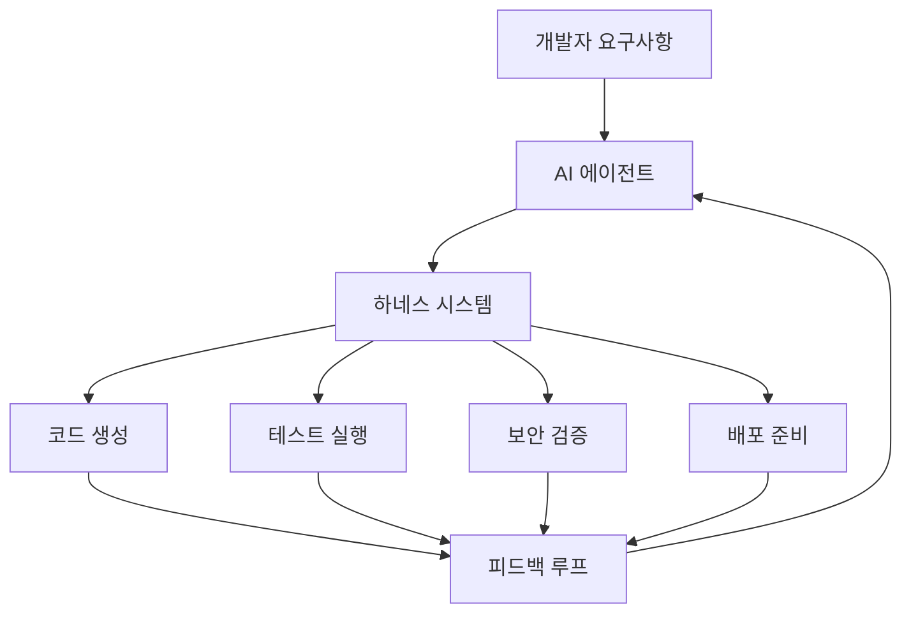
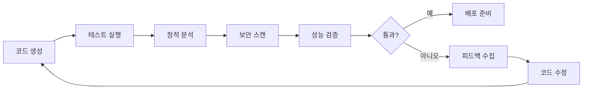
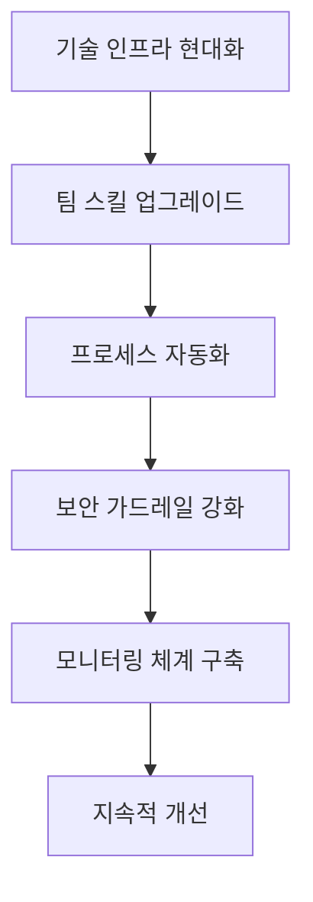

## 들어가며

2026년, AI는 코드 생성을 가속화했지만, 많은 조직이 테스트, 보안, 배포를 담당하는 전달 시스템을 현대화하지 못해 새로운 문제가 대두되고 있습니다. 이것이 바로 **"AI 속도 역설(AI Velocity Paradox)"**입니다.

빠른 코드 생성이 다운스트림 DevOps 프로세스의 약점을 드러내고 있으며, 자동화와 표준화가 따라가지 못하고 있습니다. AI 코딩 도구를 하루에 여러 번 사용하는 개발자 중 51%가 더 많은 코드 품질 문제를, 53%가 더 많은 보안 인시던트를 경험하고 있습니다.

이 글은 **AI 코딩 하네스(AI Coding Harness)**를 구축하여 이러한 문제를 해결하고, 개발자의 생산성을 극대화하면서도 안전하고 효율적인 소프트웨어 개발 워크플로우를 만드는 방법을 제시합니다.

## 📚 목차

- [🎯 AI 코딩 하네스란 무엇인가?](#-ai-코딩-하네스란-무엇인가)
- [📊 2026년 AI 코딩 도구 현황](#-2026년-ai-코딩-도구-현황)
- [🏗️ 하네스의 핵심 구성요소](#️-하네스의-핵심-구성요소)
- [🔧 주요 도구별 특징과 활용법](#-주요-도구별-특징과-활용법)
- [🛠️ 실전 구축 가이드](#️-실전-구축-가이드)
- [⚠️ 주요 문제점과 해결방안](#️-주요-문제점과-해결방안)
- [🚀 고급 최적화 전략](#-고급-최적화-전략)
- [🔮 미래 전망과 준비사항](#-미래-전망과-준비사항)

## 🎯 AI 코딩 하네스란 무엇인가?

### 정의와 개념

**AI 코딩 하네스**는 말 그대로 말의 고삐처럼, 강력하지만 예측하기 어려운 AI의 힘을 올바른 방향으로 이끌기 위한 완전한 장비 세트입니다. 여기에는 제약 조건, 피드백 루프, 문서화, 린터, 라이프사이클 관리가 포함됩니다.

### 하네스 엔지니어링의 등장

2026년 3월, OpenAI의 Codex 팀은 **100만 줄 이상의 코드를 가진 프로덕션 애플리케이션을 구축**했는데, 놀랍게도 **단 한 줄도 사람이 직접 작성하지 않았습니다**. 엔지니어들은 코드를 작성하는 대신, AI가 안정적으로 코드를 작성할 수 있는 시스템을 설계했습니다.



### 핵심 원칙

가장 중요한 원칙은 **"삭제를 염두에 두고 구축하기(Build to Delete)"**입니다. 다음 모델이 출시될 때마다 손으로 코딩한 모든 로직은 부채가 됩니다. 2024년에는 복잡한 파이프라인이 필요했던 프레임워크가 2026년에는 간단한 프롬프트로 작동합니다.

## 📊 2026년 AI 코딩 도구 현황

### 시장 판도의 변화

2026년 AI 코딩 도구 환경이 완전히 뒤바뀌었습니다. **Claude Code**가 8개월 만에 제로에서 1위 도구로 올라섰습니다. Claude Code는 2025년 5월 출시되어 2026년 초까지 개발자들 사이에서 46%의 "가장 사랑받는" 도구 평가를 받았습니다. 이에 비해 Cursor는 19%, GitHub Copilot은 9%였습니다.

### 채택률 통계

현재 **개발자의 95%**가 최소 주 단위로 AI 도구를 사용하고 있으며, **75%**가 코딩 작업의 절반 이상을 AI로 처리하고 있습니다.

### 세 가지 설계 철학

2026년에는 세 가지 뚜렷한 설계 철학이 경쟁하고 있습니다:

1. **IDE 네이티브 접근법**: Cursor가 가장 명확한 구현체
2. **플러그인/확장 접근법**: GitHub Copilot 방식
3. **터미널 네이티브 에이전틱 접근법**: Claude Code가 가장 순수한 표현

### 배포 영향도

AI 코딩 도구를 매우 자주 사용하는 개발자들의 **45%**가 매일 또는 더 빠르게 프로덕션에 코드를 배포합니다. 하지만 **69%**가 AI 생성 코드와 관련된 배포 문제를 항상, 거의 항상, 또는 자주 경험한다고 답했습니다.

## 🏗️ 하네스의 핵심 구성요소

### 1. 컨텍스트 엔지니어링

**컨텍스트 엔지니어링**은 에이전트가 적절한 시기에 적절한 정보를 가지도록 보장합니다. Claude Agent SDK는 컨텍스트 윈도우를 고갈시키지 않으면서 작업할 수 있게 하는 컴팩션과 같은 컨텍스트 관리 기능을 가진 강력한 에이전트 하네스입니다.

```yaml
# 컨텍스트 설정 예시
context:
  codebase_scope: "src/**/*.ts"
  documentation: "docs/api/"
  test_patterns: "**/*.test.ts"
  exclude_patterns:
    - "node_modules/**"
    - "dist/**"
```

### 2. 제약 조건과 가드레일

```yaml
constraints:
  max_file_changes: 10
  require_tests: true
  security_scan: mandatory
  code_review: automated
```

### 3. 피드백 루프



### 4. 도구 통합

```bash
# CLI 기반 하네스 예시
ai-harness init
ai-harness add-tool eslint
ai-harness add-tool prettier
ai-harness add-tool jest
ai-harness configure security-scan
```

## 🔧 주요 도구별 특징과 활용법

### Claude Code: 터미널 네이티브 에이전틱 파트너

**특징**:
- CLI 우선 접근법
- 전체 코드베이스 읽기
- 수십 개 파일에 걸친 자율적 계획, 편집, 테스트, 반복

**활용 시나리오**:
```bash
# 전체 기능 구현
claude "사용자 인증 시스템을 JWT로 구현해줘"

# 리팩토링
claude "이 컴포넌트들을 재사용 가능하게 리팩토링해줘"

# 버그 수정
claude "테스트 실패 원인을 찾아서 수정해줘"
```

### Cursor: 통합 IDE 경험

**특징**:
- 가장 큰 커뮤니티와 세련된 UX
- Composer 모드와 Shadow Workspaces
- 변경 사항을 백그라운드 환경에서 시뮬레이션

**활용 시나리오**:
- 대규모 코드베이스에서의 실시간 편집
- 복잡한 리팩토링 작업
- 멀티파일 변경사항 관리

### GitHub Copilot: 플러그인 접근법

**특징**:
- 2021년부터 AI 코딩 지원을 정규화
- 인라인 자동완성의 선구자
- 함수, 테스트, 설정 생성에 특화

**활용 시나리오**:
```javascript
// 함수 시그니처만 작성하면 자동완성
function calculateUserAge(birthDate) {
  // Copilot이 구현 제안
}
```

### 도구별 비교표

| 특징 | Claude Code | Cursor | GitHub Copilot |
|------|-------------|---------|----------------|
| 접근법 | 터미널/CLI | IDE 네이티브 | 플러그인 |
| 자율성 | 높음 | 중간 | 낮음 |
| 파일 범위 | 전체 코드베이스 | 프로젝트 | 현재 파일 |
| 학습 곡선 | 중간 | 낮음 | 매우 낮음 |
| 커스터마이징 | 높음 | 중간 | 낮음 |

## 🛠️ 실전 구축 가이드

### 1단계: 환경 설정

```bash
# Claude Code 설정
npm install -g claude-ai
claude auth login
claude config set model claude-sonnet-4

# 프로젝트 초기화
claude init --template=modern-js
```

### 2단계: 하네스 구성

```yaml
# .claude/harness.yml
name: "프로젝트 AI 하네스"
version: "1.0"

agents:
  - name: "code-generator"
    model: "claude-sonnet-4"
    tools: ["eslint", "prettier", "jest"]

  - name: "reviewer"
    model: "claude-opus-4"
    role: "security-reviewer"

workflows:
  feature-development:
    steps:
      - generate-code
      - run-tests
      - security-scan
      - code-review
      - deploy-staging
```

### 3단계: 팀 협업 설정

```bash
# 팀 하네스 설정
claude team create --name="development-team"
claude team add-member --email="dev@company.com"
claude team set-permissions --level="standard"
```

### 4단계: CI/CD 통합

```yaml
# .github/workflows/ai-harness.yml
name: AI Harness Workflow
on:
  push:
    branches: [main, develop]
  pull_request:
    branches: [main]

jobs:
  ai-validation:
    runs-on: ubuntu-latest
    steps:
      - uses: actions/checkout@v4
      - name: Run AI Code Review
        run: |
          claude review --severity=high
          claude security-scan --report=sarif
```

### 5단계: 모니터링 설정

```javascript
// monitoring/ai-metrics.js
const metrics = {
  codeQuality: await claude.analyze('quality'),
  testCoverage: await claude.analyze('coverage'),
  securityVulns: await claude.scan('security'),
  performance: await claude.benchmark()
};

// 대시보드에 전송
await dashboard.send(metrics);
```

## ⚠️ 주요 문제점과 해결방안

### 문제 1: 코드 품질 저하

**증상**: AI가 생성한 코드의 51%에서 품질 문제 발생

**해결방안**:
```yaml
quality_gates:
  - static_analysis: mandatory
  - code_complexity: max_10
  - test_coverage: min_80
  - security_scan: required
```

### 문제 2: 보안 취약점 증가

**증상**: AI 도구 사용자의 53%가 더 많은 보안 인시던트 경험

**해결방안**:
```bash
# 보안 중심 하네스 설정
claude config security --mode=strict
claude add-scanner --type=sast
claude add-scanner --type=dependency
claude set-policy --no-secrets --no-hardcoded-creds
```

### 문제 3: 배포 문제 빈발

**증상**: AI 코드 관련 배포 문제를 69%가 자주 경험

**해결방안**:
```yaml
deployment_pipeline:
  staging:
    auto_deploy: true
    smoke_tests: required
    rollback: automatic

  production:
    manual_approval: required
    blue_green: enabled
    health_checks: comprehensive
```

## 🚀 고급 최적화 전략

### Shadow Workspaces 활용

Cursor의 Composer 모드처럼 변경사항을 백그라운드에서 시뮬레이션:

```bash
# Claude Code에서 Shadow Workspace 활용
claude workspace create --shadow
claude simulate-changes --feature="user-auth"
claude validate --compile --test --security
claude apply-changes --if-valid
```

### 멀티 모델 앙상블

```yaml
# 다중 모델 전략
ensemble:
  code_generation:
    primary: claude-sonnet-4
    fallback: gpt-4-turbo

  code_review:
    models: [claude-opus-4, gpt-4]
    consensus: required

  security_scan:
    model: claude-opus-4
    specialized: true
```

### 컨텍스트 컴팩션 전략

```python
# 스마트 컨텍스트 관리
def optimize_context(codebase):
    relevant_files = ai.analyze_dependencies(current_task)
    compressed_context = ai.compact(relevant_files)
    return ai.maintain_context_window(compressed_context)
```

## 🔮 미래 전망과 준비사항

### 2026년 하반기 전망

1. **완전 자율 개발**: 코드 작성에서 배포까지 완전 자동화
2. **예측적 디버깅**: 버그 발생 전 사전 감지 및 수정
3. **적응형 아키텍처**: 요구사항 변화에 따른 자동 구조 개선

### 조직 준비사항



### 권장 액션 플랜

1. **즉시 실행** (1-2주):
   - AI 코딩 도구 평가 및 선정
   - 기본 하네스 구축
   - 팀 교육 시작

2. **단기 목표** (1-3개월):
   - CI/CD 파이프라인 통합
   - 보안 스캔 자동화
   - 성과 지표 모니터링

3. **장기 비전** (6개월-1년):
   - 완전 자율 개발 파이프라인
   - 크로스 팀 하네스 표준화
   - AI 기반 아키텍처 최적화

## 결론

AI 코딩 하네스는 단순히 코드 생성을 자동화하는 것을 넘어서, **개발 프로세스 전체를 혁신**하는 핵심 인프라입니다. 2026년의 AI 속도 역설을 해결하고, 안전하면서도 효율적인 소프트웨어 개발을 실현하기 위해서는 체계적이고 전략적인 하네스 구축이 필수입니다.

성공적인 AI 코딩 하네스 구축의 핵심은:

1. **올바른 도구 선택**: 팀의 워크플로우와 기술 스택에 맞는 도구
2. **단계적 구축**: 작게 시작해서 점진적으로 확장
3. **지속적 최적화**: 피드백을 통한 반복적 개선
4. **보안 우선**: 안전을 타협하지 않는 자동화

앞으로 AI가 더욱 발전할수록 하네스 엔지니어링의 중요성은 더욱 커질 것입니다. 지금부터 준비하여 미래의 개발 환경을 선도해보세요.

---

## Sources

- [Harness Report Reveals AI Coding Accelerates Development, DevOps Maturity in 2026 Isn't Keeping Pace](https://www.prnewswire.com/news-releases/harness-report-reveals-ai-coding-accelerates-development-devops-maturity-in-2026-isnt-keeping-pace-302710937.html)
- [Building AI Coding Agents for the Terminal: Scaffolding, Harness, Context Engineering, and Lessons Learned](https://arxiv.org/html/2603.05344v1)
- [The AI-Powered Dev Workflow: Reshaping Software Engineering in 2026](https://dev.to/devactivity/the-ai-powered-dev-workflow-reshaping-software-engineering-in-2026-1mk4)
- [Harness Engineering: The Complete Guide to Building Systems That Make AI Agents Actually Work (2026)](https://www.nxcode.io/resources/news/harness-engineering-complete-guide-ai-agent-codex-2026)
- [Anthropic - Effective Harnesses for Long-Running Agents](https://www.anthropic.com/engineering/effective-harnesses-for-long-running-agents)
- [Claude Code vs Cursor vs GitHub Copilot: The 2026 AI Coding Tool Showdown](https://dev.to/alexcloudstar/claude-code-vs-cursor-vs-github-copilot-the-2026-ai-coding-tool-showdown-53n4)
- [Best AI Coding Tools 2026: Complete Ranking by Real-World Performance](https://www.nxcode.io/resources/news/best-ai-for-coding-2026-complete-ranking)