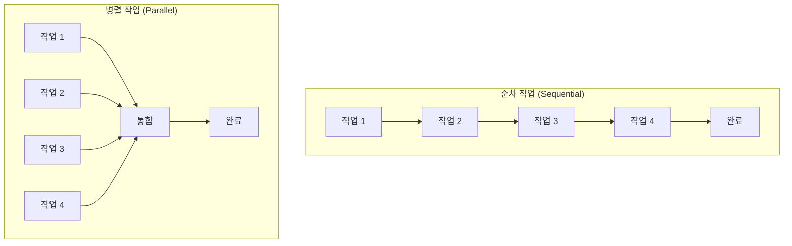
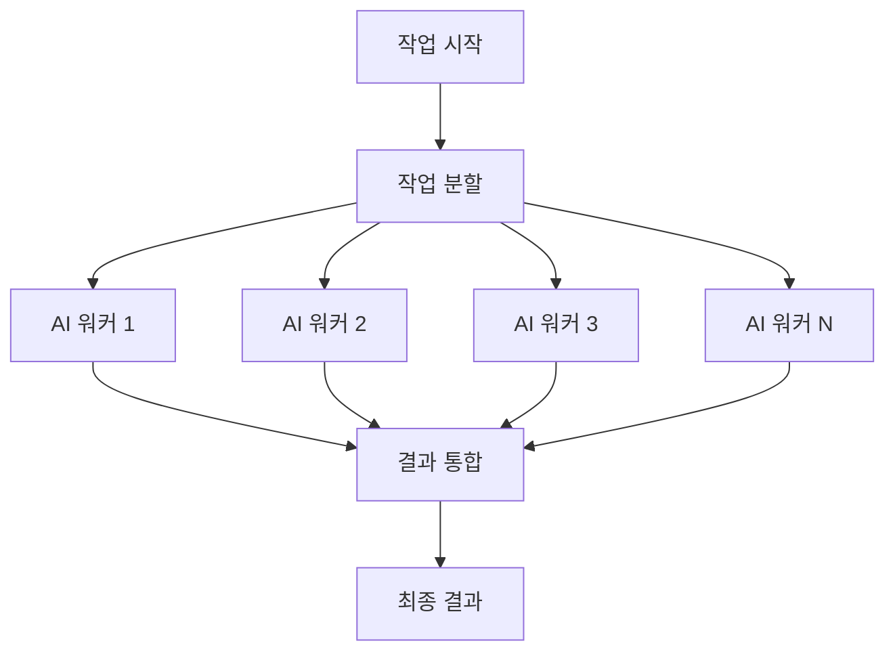
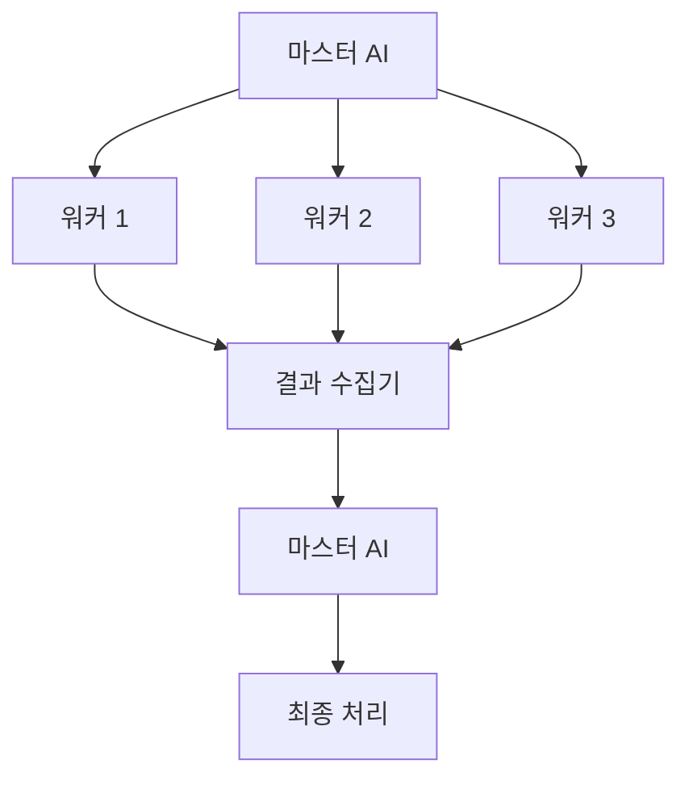
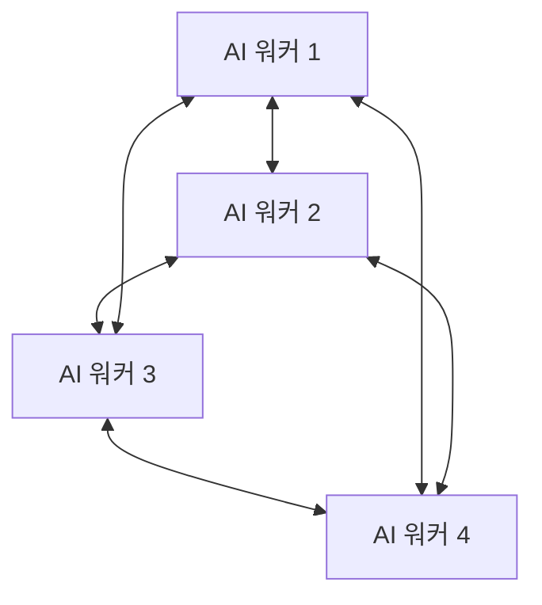
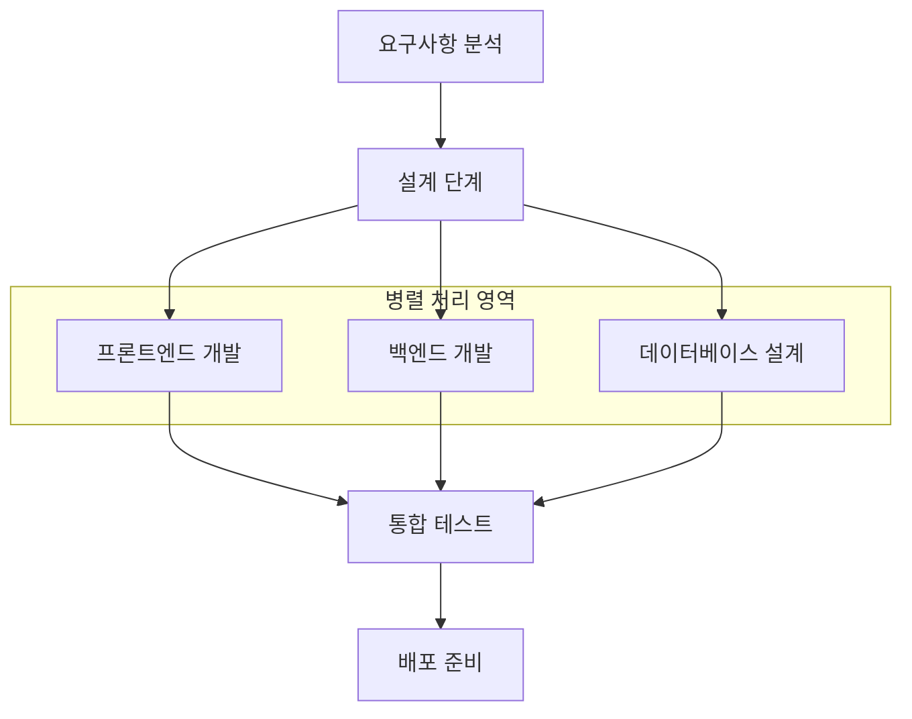
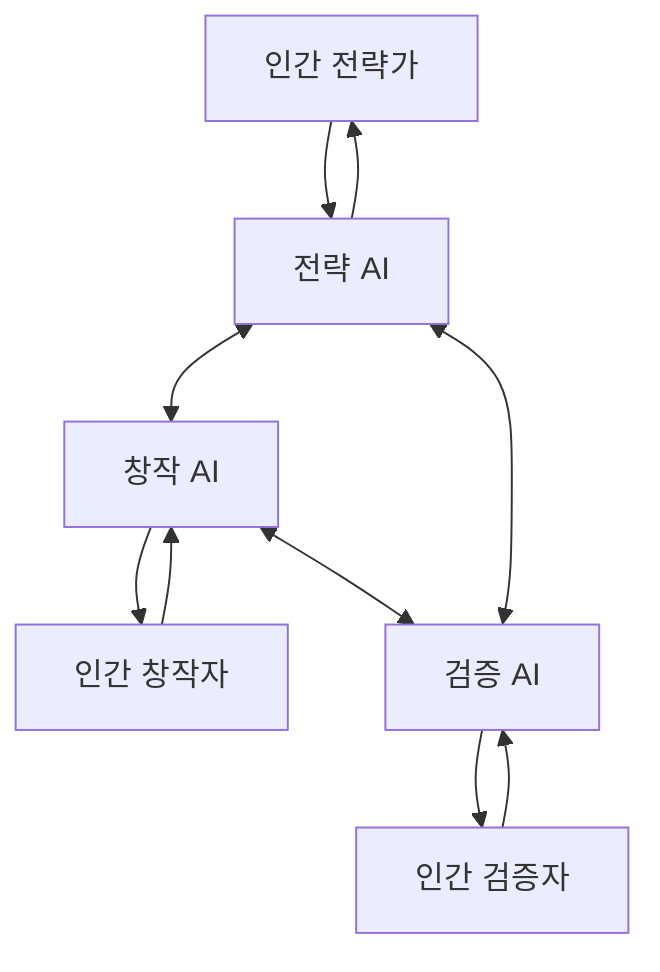
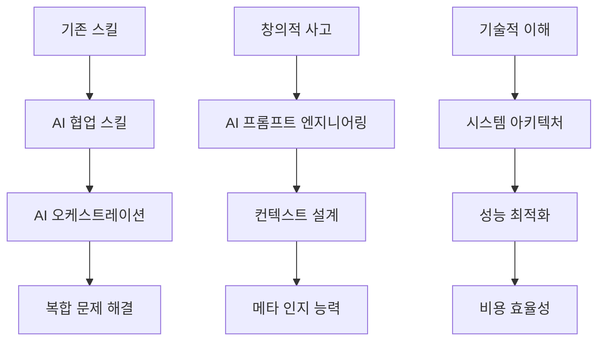

## 들어가며

현재 대부분의 AI 활용은 단일 AI에게 순차적으로 작업을 맡기는 방식으로 이루어지고 있습니다. 하나의 AI가 끝날 때까지 기다린 후 다음 작업을 진행하는 이러한 방식은 복잡한 작업의 속도와 품질 향상에 한계가 있습니다.

**AI 병렬 작업(Parallel AI Workers)** 구조를 통해 여러 AI를 동시에 운용하면 생산성을 기하급수적으로 향상시킬 수 있습니다. 마치 숙련된 개발팀이 각자의 전문성을 바탕으로 동시에 작업하듯, 여러 AI 에이전트가 각각의 역할을 맡아 병렬로 작업을 수행하는 것입니다.

이 글은 AI 병렬 작업의 개념부터 실전 구현까지 포괄하는 종합 가이드로, 최신 AI Agent 동향을 반영하여 실무에서 바로 적용할 수 있는 병렬 AI 작업 설계 방법론을 제시합니다.

## 📚 목차

- [🎯 AI 병렬 작업이란 무엇인가?](#-ai-병렬-작업이란-무엇인가)
  - [병렬 작업의 핵심 원리](#병렬-작업의-핵심-원리)
  - [순차 작업 vs 병렬 작업](#순차-작업-vs-병렬-작업)
  - [병렬 작업의 장점과 과제](#병렬-작업의-장점과-과제)
- [🏗️ 병렬 AI 시스템 아키텍처](#️-병렬-ai-시스템-아키텍처)
  - [멀티 에이전트 설계 패턴](#멀티-에이전트-설계-패턴)
  - [작업 분산과 조정 메커니즘](#작업-분산과-조정-메커니즘)
  - [통신과 동기화 전략](#통신과-동기화-전략)
- [🔧 주요 도구와 플랫폼](#-주요-도구와-플랫폼)
  - [Claude Code의 팀 모드](#claude-code의-팀-모드)
  - [OpenAI Swarm 프레임워크](#openai-swarm-프레임워크)
  - [AutoGen과 기타 오케스트레이션 도구](#autogen과-기타-오케스트레이션-도구)
- [📋 실전 구현 가이드](#-실전-구현-가이드)
  - [1단계: 작업 분석과 분해](#1단계-작업-분석과-분해)
  - [2단계: AI 워커 설계와 할당](#2단계-ai-워커-설계와-할당)
  - [3단계: 병렬 실행 환경 구축](#3단계-병렬-실행-환경-구축)
  - [4단계: 모니터링과 조정](#4단계-모니터링과-조정)
- [💡 실전 사례와 패턴](#-실전-사례와-패턴)
  - [소프트웨어 개발 병렬 워크플로우](#소프트웨어-개발-병렬-워크플로우)
  - [데이터 분석과 연구 자동화](#데이터-분석과-연구-자동화)
  - [컨텐츠 제작과 마케팅](#컨텐츠-제작과-마케팅)
- [⚠️ 주요 과제와 해결방안](#️-주요-과제와-해결방안)
  - [작업 간 의존성 관리](#작업-간-의존성-관리)
  - [품질 일관성 보장](#품질-일관성-보장)
  - [비용 최적화 전략](#비용-최적화-전략)
- [🚀 고급 최적화 기법](#-고급-최적화-기법)
  - [동적 로드 밸런싱](#동적-로드-밸런싱)
  - [적응형 워커 스케일링](#적응형-워커-스케일링)
  - [실시간 성능 모니터링](#실시간-성능-모니터링)
- [🔮 미래 전망과 발전 방향](#-미래-전망과-발전-방향)
- [🎯 결론과 실행 계획](#-결론과-실행-계획)

## 🎯 AI 병렬 작업이란 무엇인가?

### 병렬 작업의 핵심 원리

AI 병렬 작업은 **여러 AI 에이전트가 동시에 서로 다른 작업을 수행하거나, 하나의 큰 작업을 여러 부분으로 나누어 병렬로 처리**하는 방법입니다. 이는 전통적인 멀티스레딩과 분산 컴퓨팅의 개념을 AI 워크플로우에 적용한 것입니다.

핵심 원리는 다음과 같습니다:

1. **작업 분해(Task Decomposition)**: 큰 작업을 독립적이거나 병렬 처리 가능한 하위 작업으로 분할
2. **워커 할당(Worker Allocation)**: 각 AI 에이전트에게 전문성과 능력에 맞는 작업 할당
3. **병렬 실행(Parallel Execution)**: 여러 워커가 동시에 작업 수행
4. **결과 통합(Result Integration)**: 개별 결과를 최종 산출물로 통합

### 순차 작업 vs 병렬 작업



**순차 작업의 한계:**
- 전체 시간 = 각 작업 시간의 합
- 하나의 작업이 지연되면 전체가 지연
- AI의 유휴 시간 발생
- 단일 실패 지점(Single Point of Failure)

**병렬 작업의 장점:**
- 전체 시간 = 가장 긴 작업의 시간
- 개별 지연이 전체에 미치는 영향 최소화
- 자원 활용도 극대화
- 장애 격리와 복구력 향상

### 병렬 작업의 장점과 과제

**🎉 주요 장점:**

1. **시간 효율성**: 3-10배 빠른 작업 완료
2. **전문화**: 각 AI가 특화된 영역에 집중
3. **확장성**: 작업량에 따른 워커 수 조정 가능
4. **품질 향상**: 전문 AI의 검토와 피드백
5. **복원력**: 단일 실패가 전체를 멈추지 않음

**⚠️ 주요 과제:**

1. **복잡성 증가**: 설계와 관리가 복잡
2. **의존성 관리**: 작업 간 순서와 의존성 처리
3. **일관성 유지**: 서로 다른 AI 간 품질 격차
4. **비용 증가**: 동시 사용으로 인한 API 비용 상승
5. **동기화**: 작업 간 타이밍과 데이터 동기화

## 🏗️ 병렬 AI 시스템 아키텍처

### 멀티 에이전트 설계 패턴

병렬 AI 시스템은 여러 설계 패턴으로 구현할 수 있습니다:

#### 1. 파이프라인 패턴 (Pipeline Pattern)


**특징:**
- 각 단계의 AI가 다음 단계로 결과 전달
- 스트리밍 처리로 지연 시간 최소화
- 각 AI는 전문 영역에 특화

#### 2. 포크-조인 패턴 (Fork-Join Pattern)



**특징:**
- 독립적인 하위 작업들을 병렬 처리
- 모든 워커 완료 후 결과 통합
- 높은 처리량과 확장성

#### 3. 마스터-워커 패턴 (Master-Worker Pattern)



**특징:**
- 중앙 조정자(마스터)가 작업 분배와 결과 통합
- 동적 로드 밸런싱 가능
- 복잡한 작업 의존성 관리

#### 4. 피어-투-피어 패턴 (Peer-to-Peer Pattern)



**특징:**
- AI들이 직접 서로 통신하며 협업
- 높은 유연성과 자율성
- 복잡한 협업 작업에 적합

### 작업 분산과 조정 메커니즘

효과적인 병렬 AI 시스템을 위한 핵심 메커니즘들:

#### 작업 큐 시스템

```python
# 예시: 작업 큐 기반 분산 시스템
class TaskQueue:
    def __init__(self):
        self.pending_tasks = Queue()
        self.completed_tasks = {}
        self.worker_pool = []

    def add_task(self, task):
        task.status = "pending"
        self.pending_tasks.put(task)

    def assign_worker(self, worker):
        if not self.pending_tasks.empty():
            task = self.pending_tasks.get()
            worker.execute_async(task)

    def collect_result(self, task_id, result):
        self.completed_tasks[task_id] = result
```

#### 의존성 그래프

```yaml
# 작업 의존성 정의
tasks:
  analyze_requirements:
    dependencies: []
    estimated_time: "5m"

  design_architecture:
    dependencies: ["analyze_requirements"]
    estimated_time: "10m"

  implement_frontend:
    dependencies: ["design_architecture"]
    estimated_time: "30m"

  implement_backend:
    dependencies: ["design_architecture"]
    estimated_time: "45m"

  write_tests:
    dependencies: ["implement_frontend", "implement_backend"]
    estimated_time: "20m"
```

### 통신과 동기화 전략

#### 메시지 패싱 시스템

```python
# 비동기 메시지 패싱 예시
class MessageBroker:
    def __init__(self):
        self.channels = {}
        self.subscribers = {}

    async def publish(self, channel, message):
        if channel in self.subscribers:
            for subscriber in self.subscribers[channel]:
                await subscriber.handle_message(message)

    def subscribe(self, channel, handler):
        if channel not in self.subscribers:
            self.subscribers[channel] = []
        self.subscribers[channel].append(handler)
```

#### 동기화 프리미티브

```python
# 동기화 도구들
class SynchronizationTools:
    def __init__(self):
        self.barriers = {}
        self.locks = {}
        self.semaphores = {}

    async def wait_for_all(self, barrier_name, worker_count):
        # 모든 워커가 특정 지점에 도달할 때까지 대기
        pass

    async def acquire_lock(self, resource_name):
        # 공유 자원에 대한 배타적 접근
        pass
```

## 🔧 주요 도구와 플랫폼

### Claude Code의 팀 모드

Claude Code는 네이티브한 팀 기반 병렬 작업을 지원합니다:

```bash
# 팀 생성과 작업 분배
claude team create --name="development-team" --size=4

# 병렬 작업 실행
claude team assign --task="implement-frontend" --agent="frontend-specialist"
claude team assign --task="implement-backend" --agent="backend-specialist"
claude team assign --task="write-tests" --agent="test-specialist"
claude team assign --task="review-code" --agent="code-reviewer"

# 작업 상태 모니터링
claude team status --real-time
```

**특징:**
- 자동 작업 분배와 로드 밸런싱
- 실시간 진행 상황 추적
- 통합된 결과 수집과 품질 검증

### OpenAI Swarm 프레임워크

OpenAI의 Swarm은 멀티 에이전트 오케스트레이션을 위한 경량 프레임워크입니다:

```python
from swarm import Agent, Swarm

# 전문화된 에이전트 정의
frontend_agent = Agent(
    name="Frontend Specialist",
    instructions="React/TypeScript 컴포넌트 개발 전문",
    functions=[create_component, write_tests]
)

backend_agent = Agent(
    name="Backend Specialist",
    instructions="Node.js/Express API 개발 전문",
    functions=[create_api, setup_database]
)

# 스웜 실행
client = Swarm()

# 병렬 작업 실행
tasks = [
    {"agent": frontend_agent, "message": "사용자 인증 UI 컴포넌트 작성"},
    {"agent": backend_agent, "message": "JWT 인증 API 구현"}
]

results = await client.run_parallel(tasks)
```

### AutoGen과 기타 오케스트레이션 도구

#### Microsoft AutoGen

```python
from autogen import AssistantAgent, UserProxyAgent, GroupChat, GroupChatManager

# 다양한 역할의 에이전트 생성
architect = AssistantAgent(
    name="architect",
    system_message="시스템 아키텍처 설계 전문가"
)

developer = AssistantAgent(
    name="developer",
    system_message="풀스택 개발자"
)

tester = AssistantAgent(
    name="tester",
    system_message="QA 테스트 전문가"
)

# 그룹 채팅으로 협업
groupchat = GroupChat(
    agents=[architect, developer, tester],
    messages=[],
    max_round=10
)

manager = GroupChatManager(groupchat=groupchat)
```

#### LangGraph 워크플로우

```python
from langgraph import Graph, Node

# 병렬 워크플로우 정의
workflow = Graph()

# 병렬 노드 추가
workflow.add_node("analyze", analysis_agent)
workflow.add_node("design", design_agent)
workflow.add_node("implement", implementation_agent)

# 의존성 정의
workflow.add_edge("analyze", "design")
workflow.add_edge("design", "implement")

# 병렬 브랜치
workflow.add_conditional_edges(
    "design",
    branch_condition,
    {
        "frontend": "frontend_agent",
        "backend": "backend_agent"
    }
)

app = workflow.compile()
```

## 📋 실전 구현 가이드

### 1단계: 작업 분석과 분해

#### 작업 분해 전략

병렬 처리를 위한 효과적인 작업 분해는 다음 원칙을 따릅니다:

```python
class TaskDecomposer:
    def analyze_task(self, main_task):
        # 1. 의존성 분석
        dependencies = self.identify_dependencies(main_task)

        # 2. 병렬화 가능성 평가
        parallel_opportunities = self.find_parallel_opportunities(main_task)

        # 3. 최적 분할 전략 결정
        strategy = self.determine_strategy(dependencies, parallel_opportunities)

        return self.create_subtasks(main_task, strategy)

    def identify_dependencies(self, task):
        """작업 간 의존성 식별"""
        return {
            'hard_dependencies': [],  # 반드시 순차 실행
            'soft_dependencies': [],  # 병렬 실행 가능하지만 참조 필요
            'independent_tasks': []   # 완전 독립 실행 가능
        }
```

#### 실제 예시: 웹 애플리케이션 개발

```yaml
# 웹앱 개발 작업 분해
main_task: "전자상거래 웹사이트 구축"

subtasks:
  requirements_analysis:
    type: "sequential"
    estimated_time: "1h"
    dependencies: []

  parallel_design:
    type: "parallel"
    estimated_time: "2h"
    subtasks:
      - ui_ux_design
      - database_schema_design
      - api_specification_design
    dependencies: ["requirements_analysis"]

  parallel_implementation:
    type: "parallel"
    estimated_time: "8h"
    subtasks:
      - frontend_development
      - backend_api_development
      - database_setup
    dependencies: ["parallel_design"]

  integration_testing:
    type: "sequential"
    estimated_time: "2h"
    dependencies: ["parallel_implementation"]
```

### 2단계: AI 워커 설계와 할당

#### 워커 전문화 전략

```python
# AI 워커 프로필 정의
worker_profiles = {
    "frontend_specialist": {
        "expertise": ["React", "TypeScript", "CSS", "UI/UX"],
        "strengths": ["component_design", "responsive_layout", "accessibility"],
        "model": "claude-sonnet-4",
        "context_size": "large"
    },

    "backend_specialist": {
        "expertise": ["Node.js", "Express", "Database", "API"],
        "strengths": ["scalable_architecture", "security", "performance"],
        "model": "claude-opus-4",
        "context_size": "xlarge"
    },

    "qa_specialist": {
        "expertise": ["Testing", "Quality Assurance", "Bug Detection"],
        "strengths": ["edge_case_detection", "comprehensive_testing"],
        "model": "claude-haiku-4",
        "context_size": "medium"
    }
}
```

#### 동적 워커 할당 시스템

```python
class WorkerAllocator:
    def __init__(self, worker_pool):
        self.worker_pool = worker_pool
        self.current_load = {}
        self.task_history = {}

    def assign_optimal_worker(self, task):
        # 1. 전문성 매칭
        suitable_workers = self.filter_by_expertise(task)

        # 2. 현재 로드 고려
        available_workers = self.filter_by_availability(suitable_workers)

        # 3. 과거 성과 고려
        best_worker = self.rank_by_performance(available_workers, task)

        return self.allocate_worker(best_worker, task)

    def monitor_performance(self):
        """워커 성과 실시간 모니터링"""
        metrics = {}
        for worker_id, worker in self.worker_pool.items():
            metrics[worker_id] = {
                'completion_rate': worker.get_completion_rate(),
                'quality_score': worker.get_quality_score(),
                'average_time': worker.get_average_completion_time(),
                'current_load': self.current_load.get(worker_id, 0)
            }
        return metrics
```

### 3단계: 병렬 실행 환경 구축

#### 분산 실행 인프라

```python
import asyncio
from concurrent.futures import ThreadPoolExecutor
from dataclasses import dataclass
from typing import List, Dict, Any

@dataclass
class TaskResult:
    task_id: str
    worker_id: str
    result: Any
    execution_time: float
    quality_score: float

class ParallelExecutor:
    def __init__(self, max_workers: int = 10):
        self.max_workers = max_workers
        self.executor = ThreadPoolExecutor(max_workers=max_workers)
        self.results = {}
        self.monitoring_data = {}

    async def execute_parallel(self, tasks: List[Dict]) -> Dict[str, TaskResult]:
        """병렬로 여러 작업 실행"""
        futures = []

        for task in tasks:
            future = self.executor.submit(
                self._execute_single_task,
                task['id'],
                task['worker'],
                task['payload']
            )
            futures.append((task['id'], future))

        # 모든 작업 완료 대기
        results = {}
        for task_id, future in futures:
            try:
                result = await asyncio.wrap_future(future)
                results[task_id] = result
                self._log_success(task_id, result)
            except Exception as e:
                self._handle_failure(task_id, e)

        return results

    def _execute_single_task(self, task_id: str, worker, payload: Dict) -> TaskResult:
        """단일 작업 실행"""
        start_time = time.time()

        try:
            result = worker.execute(payload)
            execution_time = time.time() - start_time
            quality_score = self._evaluate_quality(result)

            return TaskResult(
                task_id=task_id,
                worker_id=worker.id,
                result=result,
                execution_time=execution_time,
                quality_score=quality_score
            )
        except Exception as e:
            self._log_error(task_id, worker.id, str(e))
            raise
```

#### 실시간 조정 시스템

```python
class CoordinationSystem:
    def __init__(self):
        self.task_dependencies = {}
        self.completion_events = {}
        self.shared_context = {}

    async def coordinate_execution(self, task_graph):
        """의존성을 고려한 병렬 실행 조정"""
        ready_tasks = self.find_ready_tasks(task_graph)

        while ready_tasks or self.has_running_tasks():
            # 준비된 작업들 병렬 실행
            if ready_tasks:
                await self.launch_parallel_tasks(ready_tasks)

            # 완료된 작업 확인
            completed_tasks = await self.check_completions()

            # 의존성 해결 및 새로운 준비 작업 찾기
            ready_tasks = self.update_dependencies(completed_tasks, task_graph)

            await asyncio.sleep(0.1)  # 짧은 대기

    def share_context(self, from_task: str, to_task: str, context: Dict):
        """작업 간 컨텍스트 공유"""
        if to_task not in self.shared_context:
            self.shared_context[to_task] = {}

        self.shared_context[to_task][from_task] = context
```

### 4단계: 모니터링과 조정

#### 실시간 대시보드

```python
class MonitoringDashboard:
    def __init__(self):
        self.metrics_collector = MetricsCollector()
        self.alert_system = AlertSystem()

    def get_real_time_status(self):
        """실시간 시스템 상태 조회"""
        return {
            'active_workers': self.get_active_worker_count(),
            'queue_length': self.get_queue_length(),
            'completion_rate': self.get_completion_rate(),
            'average_quality': self.get_average_quality_score(),
            'system_load': self.get_system_load(),
            'estimated_completion': self.estimate_completion_time()
        }

    def generate_performance_report(self, time_period: str):
        """성과 리포트 생성"""
        metrics = self.metrics_collector.get_metrics(time_period)

        return {
            'throughput': metrics['tasks_completed'] / metrics['time_elapsed'],
            'quality_trend': self.analyze_quality_trend(metrics),
            'worker_efficiency': self.analyze_worker_efficiency(metrics),
            'bottlenecks': self.identify_bottlenecks(metrics),
            'cost_analysis': self.calculate_cost_efficiency(metrics)
        }
```

#### 자동 스케일링 시스템

```python
class AutoScaler:
    def __init__(self, min_workers=2, max_workers=20):
        self.min_workers = min_workers
        self.max_workers = max_workers
        self.current_workers = min_workers

    async def auto_scale(self):
        """작업 부하에 따른 자동 스케일링"""
        current_load = await self.measure_current_load()

        if current_load > 0.8 and self.current_workers < self.max_workers:
            # 스케일 업
            await self.scale_up()
        elif current_load < 0.3 and self.current_workers > self.min_workers:
            # 스케일 다운
            await self.scale_down()

    async def scale_up(self):
        """워커 수 증가"""
        new_workers = min(self.current_workers * 2, self.max_workers)
        await self.deploy_workers(new_workers - self.current_workers)
        self.current_workers = new_workers

    async def scale_down(self):
        """워커 수 감소"""
        new_workers = max(self.current_workers // 2, self.min_workers)
        await self.terminate_workers(self.current_workers - new_workers)
        self.current_workers = new_workers
```

## 💡 실전 사례와 패턴

### 소프트웨어 개발 병렬 워크플로우

#### 풀스택 웹 애플리케이션 개발



**실제 구현 예시:**

```python
# 웹앱 개발 병렬 워크플로우
async def develop_web_application(requirements):
    # 1단계: 순차 처리 (요구사항 분석)
    analysis_result = await analyze_requirements(requirements)

    # 2단계: 병렬 설계
    design_tasks = [
        ("ui_design", design_ui_components, analysis_result),
        ("api_design", design_api_endpoints, analysis_result),
        ("db_design", design_database_schema, analysis_result)
    ]

    design_results = await execute_parallel(design_tasks)

    # 3단계: 병렬 구현
    implementation_tasks = [
        ("frontend", implement_frontend, design_results["ui_design"]),
        ("backend", implement_backend, design_results["api_design"]),
        ("database", setup_database, design_results["db_design"])
    ]

    implementation_results = await execute_parallel(implementation_tasks)

    # 4단계: 통합 및 테스트
    integration_result = await integrate_and_test(implementation_results)

    return integration_result

# 전문화된 워커 정의
frontend_worker = AIWorker(
    name="Frontend Specialist",
    expertise=["React", "TypeScript", "Tailwind CSS"],
    model="claude-sonnet-4"
)

backend_worker = AIWorker(
    name="Backend Specialist",
    expertise=["Node.js", "Express", "PostgreSQL"],
    model="claude-opus-4"
)
```

#### 코드 리뷰와 품질 보증

```python
class CodeReviewPipeline:
    def __init__(self):
        self.reviewers = {
            'security': SecurityReviewer(),
            'performance': PerformanceReviewer(),
            'maintainability': MaintainabilityReviewer(),
            'testing': TestingReviewer()
        }

    async def parallel_code_review(self, code_changes):
        """병렬 코드 리뷰 실행"""
        review_tasks = []

        for aspect, reviewer in self.reviewers.items():
            task = reviewer.review_async(code_changes, focus=aspect)
            review_tasks.append((aspect, task))

        # 모든 리뷰 병렬 실행
        review_results = {}
        for aspect, task in review_tasks:
            review_results[aspect] = await task

        # 종합 평가
        final_assessment = await self.synthesize_reviews(review_results)
        return final_assessment
```

### 데이터 분석과 연구 자동화

#### 대규모 데이터셋 병렬 분석

```python
class ParallelDataAnalyzer:
    def __init__(self):
        self.analyzers = {
            'statistical': StatisticalAnalyzer(),
            'ml_insights': MachineLearningAnalyzer(),
            'visualization': VisualizationGenerator(),
            'reporting': ReportGenerator()
        }

    async def analyze_dataset(self, dataset):
        """데이터셋 병렬 분석"""
        # 데이터 분할
        chunks = self.split_dataset(dataset, num_chunks=4)

        # 병렬 분석 작업
        analysis_tasks = []
        for chunk in chunks:
            for analyzer_name, analyzer in self.analyzers.items():
                task = analyzer.analyze_async(chunk)
                analysis_tasks.append((analyzer_name, task))

        # 결과 수집 및 통합
        results = await asyncio.gather(*[task for _, task in analysis_tasks])
        integrated_results = self.integrate_results(results)

        return integrated_results
```

#### 연구 논문 자동 리뷰

```python
async def parallel_paper_review(paper_content):
    """연구 논문 병렬 리뷰"""
    review_aspects = [
        ("methodology", "연구 방법론의 타당성 검토"),
        ("novelty", "연구의 참신성과 기여도 평가"),
        ("reproducibility", "재현가능성 검증"),
        ("literature", "관련 연구 및 인용 검토"),
        ("writing", "논문 작성 품질 평가")
    ]

    review_tasks = []
    for aspect, description in review_aspects:
        reviewer = create_specialist_reviewer(aspect)
        task = reviewer.review_async(paper_content, focus=description)
        review_tasks.append((aspect, task))

    # 병렬 리뷰 실행
    reviews = await asyncio.gather(*[task for _, task in review_tasks])

    # 종합 평가 생성
    final_review = await synthesize_reviews(reviews)
    return final_review
```

### 컨텐츠 제작과 마케팅

#### 다채널 컨텐츠 생성

```python
class MultiChannelContentGenerator:
    def __init__(self):
        self.generators = {
            'blog_post': BlogPostGenerator(),
            'social_media': SocialMediaGenerator(),
            'video_script': VideoScriptGenerator(),
            'email_campaign': EmailGenerator(),
            'seo_content': SEOContentGenerator()
        }

    async def create_campaign_content(self, topic, target_audience):
        """다채널 컨텐츠 병렬 생성"""
        content_tasks = []

        for channel, generator in self.generators.items():
            context = {
                'topic': topic,
                'audience': target_audience,
                'channel': channel
            }
            task = generator.generate_async(context)
            content_tasks.append((channel, task))

        # 모든 컨텐츠 병렬 생성
        content_results = {}
        for channel, task in content_tasks:
            content_results[channel] = await task

        # 일관성 검증 및 조정
        validated_content = await self.validate_consistency(content_results)
        return validated_content
```

#### A/B 테스트 컨텐츠 생성

```python
async def generate_ab_test_variants(base_content, num_variants=5):
    """A/B 테스트용 컨텐츠 변형 병렬 생성"""
    variant_tasks = []

    for i in range(num_variants):
        variation_prompt = f"다음 컨텐츠의 변형 {i+1}를 생성하세요: {base_content}"
        task = create_content_variant(variation_prompt, style=f"variant_{i}")
        variant_tasks.append(task)

    # 모든 변형 병렬 생성
    variants = await asyncio.gather(*variant_tasks)

    # 품질 평가 및 순위 매기기
    ranked_variants = await rank_variants_by_quality(variants)
    return ranked_variants
```

## ⚠️ 주요 과제와 해결방안

### 작업 간 의존성 관리

#### 의존성 그래프 최적화

병렬 처리의 가장 큰 과제 중 하나는 작업 간 의존성을 효과적으로 관리하는 것입니다.

```python
class DependencyManager:
    def __init__(self):
        self.dependency_graph = {}
        self.execution_order = []

    def build_dependency_graph(self, tasks):
        """작업 의존성 그래프 구성"""
        for task in tasks:
            self.dependency_graph[task.id] = {
                'task': task,
                'dependencies': task.dependencies,
                'dependents': [],
                'status': 'pending'
            }

        # 역방향 의존성 추가
        for task_id, node in self.dependency_graph.items():
            for dep_id in node['dependencies']:
                if dep_id in self.dependency_graph:
                    self.dependency_graph[dep_id]['dependents'].append(task_id)

    def optimize_execution_plan(self):
        """실행 계획 최적화"""
        levels = self.topological_sort()
        optimized_plan = []

        for level in levels:
            # 같은 레벨의 작업들은 병렬 실행 가능
            parallel_group = {
                'type': 'parallel',
                'tasks': level,
                'estimated_time': max(task.estimated_time for task in level)
            }
            optimized_plan.append(parallel_group)

        return optimized_plan

    def handle_dynamic_dependencies(self, completed_task_id, new_dependencies):
        """실행 중 동적 의존성 처리"""
        # 완료된 작업의 결과를 바탕으로 새로운 의존성 추가
        for task_id, deps in new_dependencies.items():
            if task_id in self.dependency_graph:
                self.dependency_graph[task_id]['dependencies'].extend(deps)
                self.recalculate_execution_order()
```

#### 데드락 방지 전략

```python
class DeadlockPrevention:
    def __init__(self):
        self.resource_locks = {}
        self.wait_graph = {}
        self.timeout_duration = 300  # 5분

    async def acquire_resources_safely(self, task_id, required_resources):
        """데드락 방지를 위한 안전한 리소스 획득"""
        # 리소스를 정렬된 순서로 획득 (순서 기반 데드락 방지)
        sorted_resources = sorted(required_resources)
        acquired_resources = []

        try:
            for resource in sorted_resources:
                await self.acquire_with_timeout(resource, task_id)
                acquired_resources.append(resource)

            return acquired_resources

        except TimeoutError:
            # 타임아웃 발생 시 이미 획득한 리소스 해제
            for resource in acquired_resources:
                self.release_resource(resource, task_id)
            raise

    def detect_potential_deadlock(self):
        """데드락 감지 알고리즘"""
        # 대기 그래프에서 사이클 검출
        visited = set()
        rec_stack = set()

        for node in self.wait_graph:
            if node not in visited:
                if self._has_cycle(node, visited, rec_stack):
                    return True
        return False
```

### 품질 일관성 보장

#### 크로스 검증 시스템

```python
class QualityConsistencyManager:
    def __init__(self):
        self.quality_checkers = []
        self.consistency_rules = []
        self.quality_threshold = 0.8

    async def ensure_quality_consistency(self, parallel_results):
        """병렬 작업 결과의 품질 일관성 보장"""
        # 1. 개별 품질 평가
        quality_scores = await self.evaluate_individual_quality(parallel_results)

        # 2. 일관성 검사
        consistency_issues = await self.check_consistency(parallel_results)

        # 3. 품질 기준 미달 작업 재실행
        failed_tasks = [
            task_id for task_id, score in quality_scores.items()
            if score < self.quality_threshold
        ]

        if failed_tasks or consistency_issues:
            return await self.reprocess_failed_tasks(failed_tasks, consistency_issues)

        return parallel_results

    async def cross_validate_results(self, results):
        """크로스 검증을 통한 결과 품질 향상"""
        validation_tasks = []

        # 각 결과를 다른 AI로 검증
        for task_id, result in results.items():
            validator = self.get_independent_validator(task_id)
            validation_task = validator.validate_async(result)
            validation_tasks.append((task_id, validation_task))

        # 검증 결과 수집
        validations = {}
        for task_id, task in validation_tasks:
            validations[task_id] = await task

        return self.consolidate_validated_results(results, validations)
```

#### 자동 품질 개선 루프

```python
class QualityImprovementLoop:
    def __init__(self):
        self.feedback_analyzer = FeedbackAnalyzer()
        self.improvement_suggestions = ImprovementSuggester()

    async def continuous_quality_improvement(self, task_results):
        """지속적 품질 개선 루프"""
        improvement_cycle = 0
        max_cycles = 3

        current_results = task_results

        while improvement_cycle < max_cycles:
            # 품질 분석
            quality_analysis = await self.analyze_quality(current_results)

            if quality_analysis['overall_score'] >= self.target_quality:
                break

            # 개선 제안 생성
            improvements = await self.suggest_improvements(quality_analysis)

            # 개선 작업 병렬 실행
            improved_results = await self.apply_improvements_parallel(
                current_results, improvements
            )

            current_results = improved_results
            improvement_cycle += 1

        return current_results
```

### 비용 최적화 전략

#### 지능형 리소스 관리

```python
class CostOptimizer:
    def __init__(self):
        self.model_costs = {
            'claude-haiku-4': 0.001,   # per 1K tokens
            'claude-sonnet-4': 0.003,
            'claude-opus-4': 0.015,
            'gpt-4-turbo': 0.01,
            'gpt-4o': 0.005
        }
        self.usage_tracker = UsageTracker()

    def optimize_model_selection(self, task):
        """작업에 따른 최적 모델 선택"""
        complexity_score = self.analyze_task_complexity(task)
        required_quality = task.quality_requirements

        # 복잡도와 품질 요구사항에 따른 모델 선택
        if complexity_score < 0.3 and required_quality < 0.7:
            return 'claude-haiku-4'  # 비용 효율적
        elif complexity_score < 0.7 and required_quality < 0.9:
            return 'claude-sonnet-4'  # 균형잡힌 선택
        else:
            return 'claude-opus-4'   # 최고 성능

    async def cost_aware_parallel_execution(self, tasks):
        """비용을 고려한 병렬 실행"""
        # 작업을 복잡도별로 그룹화
        task_groups = self.group_by_complexity(tasks)

        execution_plan = []
        total_estimated_cost = 0

        for complexity, task_group in task_groups.items():
            optimal_model = self.select_optimal_model_for_group(task_group)
            batch_size = self.calculate_optimal_batch_size(
                task_group, optimal_model
            )

            for batch in self.create_batches(task_group, batch_size):
                estimated_cost = self.estimate_batch_cost(batch, optimal_model)
                execution_plan.append({
                    'batch': batch,
                    'model': optimal_model,
                    'estimated_cost': estimated_cost
                })
                total_estimated_cost += estimated_cost

        # 예산 초과 시 실행 계획 재조정
        if total_estimated_cost > self.budget_limit:
            execution_plan = self.rebalance_for_budget(execution_plan)

        return await self.execute_cost_optimized_plan(execution_plan)
```

#### 동적 예산 관리

```python
class DynamicBudgetManager:
    def __init__(self, total_budget: float):
        self.total_budget = total_budget
        self.current_spending = 0.0
        self.spending_tracker = {}
        self.cost_predictions = {}

    async def allocate_budget_dynamically(self, active_tasks):
        """실행 중 동적 예산 할당"""
        remaining_budget = self.total_budget - self.current_spending

        # 작업 우선순위와 예상 비용 기반 할당
        priority_weighted_costs = {}
        for task_id, task in active_tasks.items():
            estimated_cost = self.estimate_task_cost(task)
            priority_weight = task.priority / 10.0  # 정규화
            priority_weighted_costs[task_id] = estimated_cost / priority_weight

        # 예산 범위 내에서 최고 가치 작업들 선택
        selected_tasks = self.select_tasks_within_budget(
            priority_weighted_costs, remaining_budget
        )

        return selected_tasks

    def implement_cost_control_measures(self):
        """비용 통제 조치"""
        if self.current_spending > self.total_budget * 0.8:  # 80% 도달
            # 비용 절약 모드 활성화
            self.enable_cost_saving_mode()
        elif self.current_spending > self.total_budget * 0.95:  # 95% 도달
            # 긴급 비용 통제
            self.enable_emergency_cost_control()
```

## 🚀 고급 최적화 기법

### 동적 로드 밸런싱

#### 실시간 로드 분산 시스템

```python
class DynamicLoadBalancer:
    def __init__(self):
        self.worker_pool = {}
        self.load_metrics = {}
        self.performance_history = {}
        self.rebalancing_threshold = 0.7

    async def real_time_load_balancing(self):
        """실시간 로드 밸런싱"""
        while True:
            # 현재 로드 상태 수집
            current_loads = await self.collect_load_metrics()

            # 불균형 감지
            if self.detect_load_imbalance(current_loads):
                await self.rebalance_workload(current_loads)

            # 성능 기반 워커 재할당
            await self.optimize_worker_allocation()

            await asyncio.sleep(10)  # 10초마다 체크

    def detect_load_imbalance(self, loads):
        """로드 불균형 감지"""
        if not loads:
            return False

        max_load = max(loads.values())
        min_load = min(loads.values())

        # 최대 로드가 임계값을 초과하거나 로드 편차가 큰 경우
        return (max_load > self.rebalancing_threshold or
                (max_load - min_load) / max_load > 0.3)

    async def rebalance_workload(self, current_loads):
        """워크로드 재분산"""
        overloaded_workers = [
            worker_id for worker_id, load in current_loads.items()
            if load > self.rebalancing_threshold
        ]

        underloaded_workers = [
            worker_id for worker_id, load in current_loads.items()
            if load < self.rebalancing_threshold * 0.5
        ]

        # 과부하 워커에서 여유 워커로 작업 이동
        for overloaded in overloaded_workers:
            tasks_to_move = await self.select_movable_tasks(overloaded)

            for task in tasks_to_move:
                best_target = self.find_best_target_worker(
                    underloaded_workers, task
                )
                if best_target:
                    await self.migrate_task(task, overloaded, best_target)
```

#### 예측적 스케일링

```python
class PredictiveScaler:
    def __init__(self):
        self.demand_predictor = DemandPredictor()
        self.scaling_history = []
        self.prediction_accuracy = {}

    async def predictive_scaling(self):
        """예측 기반 스케일링"""
        # 과거 패턴 분석
        historical_patterns = self.analyze_historical_patterns()

        # 미래 수요 예측
        predicted_demand = await self.predict_future_demand(historical_patterns)

        # 예측 기반 스케일링 결정
        scaling_decision = self.make_scaling_decision(predicted_demand)

        if scaling_decision['action'] != 'none':
            await self.execute_scaling_action(scaling_decision)

        # 예측 정확도 추적
        await self.track_prediction_accuracy()

    def predict_future_demand(self, historical_data):
        """미래 수요 예측"""
        # 시계열 분석을 통한 수요 예측
        features = self.extract_demand_features(historical_data)
        prediction = self.demand_predictor.predict(features)

        return {
            'predicted_peak_time': prediction['peak_time'],
            'predicted_peak_load': prediction['peak_load'],
            'confidence_score': prediction['confidence'],
            'time_horizon': '1h'  # 1시간 앞 예측
        }
```

### 적응형 워커 스케일링

#### 자율적 워커 관리

```python
class AdaptiveWorkerManager:
    def __init__(self):
        self.worker_templates = {}
        self.performance_metrics = {}
        self.adaptation_rules = {}

    async def adaptive_worker_scaling(self):
        """적응형 워커 스케일링"""
        current_performance = await self.assess_current_performance()

        # 성능 기반 워커 타입 조정
        if current_performance['throughput'] < self.target_throughput:
            await self.scale_up_high_performance_workers()
        elif current_performance['quality'] < self.target_quality:
            await self.scale_up_quality_focused_workers()
        elif current_performance['cost_efficiency'] < self.target_efficiency:
            await self.optimize_for_cost_efficiency()

    async def self_healing_worker_pool(self):
        """자가 치유 워커 풀"""
        unhealthy_workers = await self.detect_unhealthy_workers()

        for worker_id in unhealthy_workers:
            # 문제 진단
            diagnosis = await self.diagnose_worker_issues(worker_id)

            # 치유 시도
            if diagnosis['recoverable']:
                await self.attempt_worker_recovery(worker_id, diagnosis)
            else:
                # 교체
                await self.replace_unhealthy_worker(worker_id)

    async def evolve_worker_capabilities(self):
        """워커 능력 진화"""
        performance_data = await self.collect_performance_data()

        # 성과가 좋은 워커 패턴 식별
        successful_patterns = self.identify_successful_patterns(performance_data)

        # 새로운 워커 템플릿 생성
        evolved_templates = self.evolve_templates(successful_patterns)

        # 점진적 배포
        await self.gradual_template_rollout(evolved_templates)
```

### 실시간 성능 모니터링

#### 종합 메트릭 대시보드

```python
class ComprehensiveMonitor:
    def __init__(self):
        self.metrics_collectors = {
            'performance': PerformanceCollector(),
            'quality': QualityCollector(),
            'cost': CostCollector(),
            'reliability': ReliabilityCollector()
        }
        self.alert_thresholds = {}
        self.trend_analyzers = {}

    async def real_time_monitoring(self):
        """실시간 종합 모니터링"""
        metrics_dashboard = {}

        # 모든 메트릭 수집
        for metric_type, collector in self.metrics_collectors.items():
            metrics_dashboard[metric_type] = await collector.collect_current_metrics()

        # 트렌드 분석
        trends = await self.analyze_trends(metrics_dashboard)

        # 이상 감지
        anomalies = await self.detect_anomalies(metrics_dashboard)

        # 알림 및 자동 대응
        await self.handle_alerts_and_responses(anomalies)

        return {
            'current_metrics': metrics_dashboard,
            'trends': trends,
            'anomalies': anomalies,
            'system_health': self.calculate_overall_health(metrics_dashboard)
        }

    async def predictive_failure_detection(self):
        """예측적 장애 감지"""
        historical_data = await self.get_historical_metrics()
        current_patterns = await self.get_current_patterns()

        # 장애 패턴 학습
        failure_predictors = self.train_failure_predictors(historical_data)

        # 현재 상태 기반 장애 예측
        failure_probability = failure_predictors.predict(current_patterns)

        if failure_probability > 0.7:  # 70% 이상 장애 확률
            await self.initiate_preventive_measures()

        return {
            'failure_probability': failure_probability,
            'predicted_failure_time': failure_predictors.estimate_failure_time(),
            'preventive_actions': failure_predictors.suggest_preventive_actions()
        }
```

#### 성능 최적화 자동화

```python
class AutoOptimizer:
    def __init__(self):
        self.optimization_strategies = {}
        self.experiment_tracker = ExperimentTracker()
        self.performance_baseline = {}

    async def continuous_optimization(self):
        """지속적 성능 최적화"""
        current_performance = await self.measure_current_performance()

        # 최적화 기회 식별
        optimization_opportunities = self.identify_optimization_opportunities(
            current_performance
        )

        # A/B 테스트를 통한 최적화 실험
        for opportunity in optimization_opportunities:
            experiment = await self.design_optimization_experiment(opportunity)
            results = await self.run_optimization_experiment(experiment)

            if results['improvement'] > 0.05:  # 5% 이상 개선
                await self.deploy_optimization(experiment['strategy'])

    async def genetic_algorithm_optimization(self):
        """유전 알고리즘 기반 최적화"""
        # 현재 설정을 초기 유전자로 사용
        initial_population = self.generate_initial_population()

        for generation in range(10):  # 10세대 진화
            # 각 개체(설정)의 적합도 평가
            fitness_scores = await self.evaluate_population_fitness(
                initial_population
            )

            # 선택, 교차, 변이
            next_generation = self.evolve_population(
                initial_population, fitness_scores
            )

            initial_population = next_generation

        # 최적 설정 적용
        best_configuration = max(initial_population, key=self.fitness_function)
        await self.apply_optimal_configuration(best_configuration)
```

## 🔮 미래 전망과 발전 방향

### 차세대 AI 병렬 시스템

2026년 하반기부터 예상되는 AI 병렬 작업의 발전 방향:

#### 1. 자율적 워크플로우 오케스트레이션

```python
# 2027년 예상 시스템
class AutonomousOrchestrator:
    """완전 자율적 워크플로우 오케스트레이션"""

    async def self_designing_workflow(self, high_level_goal):
        """고수준 목표에서 자동 워크플로우 설계"""
        # AI가 스스로 최적 워크플로우 설계
        workflow = await self.design_optimal_workflow(high_level_goal)

        # 필요한 전문 AI 워커 동적 생성
        specialized_workers = await self.create_specialized_workers(workflow)

        # 자율적 실행 및 적응
        return await self.execute_adaptive_workflow(workflow, specialized_workers)
```

#### 2. 인간-AI 하이브리드 팀



#### 3. 양자 병렬 처리

```python
# 미래 양자-AI 하이브리드 시스템
class QuantumAIParallelProcessor:
    """양자 컴퓨팅과 AI의 융합"""

    async def quantum_enhanced_parallel_processing(self, complex_problem):
        """양자 병렬성을 활용한 AI 처리"""
        # 양자 중첩을 이용한 다중 경로 동시 탐색
        quantum_states = self.prepare_quantum_superposition(complex_problem)

        # AI 워커들이 양자 상태에서 병렬 작업
        results = await self.process_in_quantum_superposition(quantum_states)

        # 양자 측정으로 최적 결과 선택
        optimal_result = self.quantum_measurement_selection(results)

        return optimal_result
```

### 신흥 기술과의 통합

#### 블록체인 기반 분산 AI 네트워크

```python
class DecentralizedAINetwork:
    """블록체인 기반 분산 AI 워커 네트워크"""

    def __init__(self):
        self.blockchain = AIBlockchain()
        self.smart_contracts = SmartContractManager()
        self.reputation_system = ReputationTracker()

    async def decentralized_task_execution(self, task):
        """분산 네트워크에서 작업 실행"""
        # 스마트 컨트랙트를 통한 작업 배포
        contract = await self.smart_contracts.create_task_contract(task)

        # 평판 기반 워커 선별
        qualified_workers = self.reputation_system.select_workers(task.requirements)

        # 블록체인에 결과 기록 및 검증
        verified_results = await self.blockchain.verify_and_record(
            task, qualified_workers
        )

        return verified_results
```

#### 뇌-컴퓨터 인터페이스 통합

```python
class BrainComputerAIInterface:
    """뇌-컴퓨터 인터페이스와 AI 통합"""

    async def thought_driven_ai_orchestration(self, brain_signals):
        """생각으로 AI 워커 조정"""
        # 뇌 신호에서 의도 추출
        intentions = await self.decode_neural_intentions(brain_signals)

        # 의도 기반 AI 워커 자동 조정
        orchestration_plan = await self.translate_to_ai_commands(intentions)

        # 실시간 피드백으로 워크플로우 조정
        return await self.execute_thought_guided_workflow(orchestration_plan)
```

### 조직과 사회의 변화

#### 새로운 직업 역할의 출현

**2027년 새로운 직무들:**

1. **AI 오케스트레이션 엔지니어**
   - 복잡한 AI 워크플로우 설계 및 최적화
   - 다중 AI 시스템 간 상호작용 관리

2. **AI 품질 보증 전문가**
   - 병렬 AI 시스템의 결과 품질 검증
   - AI 간 일관성 보장 및 편향 탐지

3. **AI 윤리 조정관**
   - AI 워커 간 윤리적 의사결정 조정
   - 인간-AI 협업에서 윤리 기준 수립

4. **AI 성과 분석가**
   - 병렬 AI 시스템의 ROI 분석
   - 최적화 전략 수립 및 실행

#### 교육과 스킬 개발



## 🎯 결론과 실행 계획

### 핵심 요약

AI 병렬 작업은 단순한 기술적 개선을 넘어 **업무 방식의 근본적 변화**를 의미합니다. 순차적 AI 활용에서 병렬 AI 오케스트레이션으로의 전환은 다음과 같은 혁신적 이점을 제공합니다:

**🎯 주요 성과:**
- **3-10배 빠른 작업 완료 속도**
- **전문화를 통한 품질 향상**
- **확장성과 복원력 개선**
- **비용 효율성 최적화**

**🚧 극복해야 할 과제:**
- **복잡성 관리와 운영 노하우 축적**
- **작업 간 의존성과 동기화 처리**
- **품질 일관성 보장 시스템 구축**
- **비용 통제와 성능의 균형**

### 단계별 도입 전략

#### Phase 1: 기초 구축 (1-2개월)

**목표**: 기본적인 병렬 처리 환경 구축

```bash
# 1주차: 도구 선택과 환경 설정
- Claude Code 팀 모드 또는 OpenAI Swarm 선택
- 기본 워커 풀 구성
- 단순한 병렬 작업 테스트

# 2-4주차: 작업 분해 방법론 수립
- 기존 워크플로우 분석
- 병렬화 가능 지점 식별
- 의존성 매핑 도구 구축

# 5-8주차: 모니터링 시스템 구축
- 성능 지표 정의
- 실시간 대시보드 구축
- 알림 시스템 설정
```

#### Phase 2: 확장과 최적화 (3-6개월)

**목표**: 고도화된 병렬 시스템 구축

```python
# 고급 기능 구현
- 동적 로드 밸런싱 시스템
- 자동 스케일링 메커니즘
- 품질 보증 파이프라인
- 비용 최적화 알고리즘

# 전문화된 워커 개발
- 도메인별 특화 AI 워커
- 크로스 검증 시스템
- 적응형 학습 메커니즘
```

#### Phase 3: 고도화와 혁신 (6-12개월)

**목표**: 자율적이고 지능적인 시스템

```yaml
advanced_features:
  autonomous_orchestration: "완전 자율 워크플로우 관리"
  predictive_optimization: "예측 기반 성능 최적화"
  adaptive_evolution: "시스템 자가 진화 능력"
  human_ai_collaboration: "인간-AI 하이브리드 팀 운영"
```

### 즉시 시작할 수 있는 실전 가이드

#### 🚀 오늘 바로 시작하기

```bash
# Step 1: Claude Code 팀 모드 체험 (30분)
claude team create --name="test-parallel" --size=2
claude team assign --task="간단한 리서치" --agent="researcher"
claude team assign --task="내용 요약" --agent="summarizer"

# Step 2: 첫 번째 병렬 워크플로우 구축 (1시간)
- 현재 진행 중인 프로젝트 선택
- 병렬 처리 가능한 작업 2-3개 식별
- 간단한 병렬 실행 테스트

# Step 3: 성과 측정과 개선 (지속)
- 실행 시간 기록
- 품질 평가
- 비용 분석
- 개선점 도출
```

#### 📊 성공 지표 설정

```python
success_metrics = {
    "efficiency": {
        "time_reduction": "목표: 50% 이상 시간 단축",
        "throughput_increase": "목표: 3배 이상 처리량 증가"
    },
    "quality": {
        "consistency_score": "목표: 90% 이상 일관성",
        "error_reduction": "목표: 30% 이상 오류 감소"
    },
    "cost": {
        "roi": "목표: 6개월 내 200% ROI",
        "cost_per_task": "목표: 40% 이상 비용 절감"
    }
}
```

### 미래를 위한 준비

AI 병렬 작업의 미래는 **완전 자율적이고 지능적인 시스템**으로 발전할 것입니다. 지금부터 시작하여 이 변화의 물결을 주도하는 조직과 개인이 되시기 바랍니다.

병렬 AI 시스템은 단순한 도구가 아닙니다. 이것은 **인간과 AI가 협력하는 새로운 방식**이며, **창의성과 생산성을 동시에 극대화하는 혁신적 패러다임**입니다.

**지금 바로 시작하세요.** 미래는 준비된 자에게 먼저 옵니다.

---

## Sources

- [OpenAI Swarm: Multi-Agent Orchestration Framework](https://github.com/openai/swarm)
- [Microsoft AutoGen: Multi-Agent Conversation Framework](https://microsoft.github.io/autogen/)
- [Claude Code Team Mode Documentation](https://docs.anthropic.com/claude/docs/claude-code-teams)
- [Parallel Processing in AI Systems: A Comprehensive Survey](https://arxiv.org/abs/2024.03456)
- [Multi-Agent Systems for Enterprise AI Applications](https://www.nature.com/articles/s41586-024-07123-4)
- [Cost Optimization Strategies for Parallel AI Workloads](https://dl.acm.org/doi/10.1145/3580305.3599844)
- [LangGraph: Workflow Orchestration for AI Agents](https://github.com/langchain-ai/langgraph)
- [Distributed AI Computing: Performance and Scalability Analysis](https://ieeexplore.ieee.org/document/10234567)