## 들어가며

AI 코딩 에이전트의 시대가 본격적으로 시작되면서, 개발자들은 수많은 도구 중에서 선택해야 하는 상황에 직면했습니다. 그 중에서도 **Claude Code**와 **OpenAI Codex**는 각기 다른 방법론으로 AI 기반 개발의 새로운 패러다임을 제시하고 있습니다.

이 글은 단순한 기능 비교를 넘어, 두 도구의 **설계 철학**과 **방법론적 접근**의 차이점을 심층적으로 분석하여 개발자가 각 상황에 맞는 올바른 도구를 선택할 수 있도록 가이드합니다.

## 📚 목차

- [🎯 핵심 방법론 차이](#-핵심-방법론-차이)
  - [Claude Code: "Vibe Coding" 협업 접근법](#claude-code-vibe-coding-협업-접근법)
  - [OpenAI Codex: 자율 실행 효율성 접근법](#openai-codex-자율-실행-효율성-접근법)
- [🏗️ 아키텍처 설계 철학 비교](#️-아키텍처-설계-철학-비교)
  - [실행 환경과 격리 전략](#실행-환경과-격리-전략)
  - [에이전트 오케스트레이션 방식](#에이전트-오케스트레이션-방식)
  - [워크플로우 제어 메커니즘](#워크플로우-제어-메커니즘)
- [📊 성능과 효율성 분석](#-성능과-효율성-분석)
  - [토큰 효율성과 비용 구조](#토큰-효율성과-비용-구조)
  - [개발 속도와 정확도 트레이드오프](#개발-속도와-정확도-트레이드오프)
  - [대용량 프로젝트 처리 능력](#대용량-프로젝트-처리-능력)
- [🎨 사용 사례별 최적 선택](#-사용-사례별-최적-선택)
  - [Claude Code가 뛰어난 시나리오](#claude-code가-뛰어난-시나리오)
  - [Codex가 유리한 상황](#codex가-유리한-상황)
  - [하이브리드 접근 전략](#하이브리드-접근-전략)
- [🔧 실전 적용 가이드](#-실전-적용-가이드)
  - [프로젝트 평가 체크리스트](#프로젝트-평가-체크리스트)
  - [의사결정 프레임워크](#의사결정-프레임워크)
  - [단계별 도구 선택 전략](#단계별-도구-선택-전략)
- [🔒 보안과 데이터 프라이버시](#-보안과-데이터-프라이버시)
  - [실행 환경 보안 모델](#실행-환경-보안-모델)
  - [민감 데이터 처리 방식](#민감-데이터-처리-방식)
  - [엔터프라이즈 환경 고려사항](#엔터프라이즈-환경-고려사항)
- [📈 미래 전망과 발전 방향](#-미래-전망과-발전-방향)
  - [기술적 진화 예측](#기술적-진화-예측)
  - [생태계 통합 가능성](#생태계-통합-가능성)
  - [개발자 역할 변화](#개발자-역할-변화)
- [💡 실전 팁과 베스트 프랙티스](#-실전-팁과-베스트-프랙티스)
- [🎯 결론과 권장사항](#-결론과-권장사항)

---

## 🎯 핵심 방법론 차이

### Claude Code: "Vibe Coding" 협업 접근법

Claude Code는 개발자를 **"Outcome Engineer"**로 재정의하며, 전통적인 코딩 패러다임에서 벗어난 혁신적 접근을 제시합니다.

#### 방법론적 특징

**1. 의도 중심 개발 (Intent-Driven Development)**
- 개발자는 **무엇(What)**과 **왜(Why)**에 집중
- AI가 **어떻게(How)** 구현할지 결정
- 비즈니스 로직과 사용자 경험을 "vibe"로 전달

**2. 실시간 협업 워크플로우**


**3. 투명한 의사결정 과정**
- AI의 추론 과정을 실시간으로 표시
- 중요한 결정 지점에서 개발자 승인 요청
- 학습과 디버깅이 용이한 구조

### OpenAI Codex: 자율 실행 효율성 접근법

Codex는 **전통적 개발 워크플로우의 자동화**에 중점을 둔 실용적 접근을 채택합니다.

#### 방법론적 특징

**1. 자율 실행 모델 (Autonomous Execution Model)**
- 명확한 요구사항을 바탕으로 독립적 작업 수행
- 최소한의 개발자 개입으로 결과 제공
- 배치 처리 방식의 효율적 실행

**2. 토큰 최적화 아키텍처**
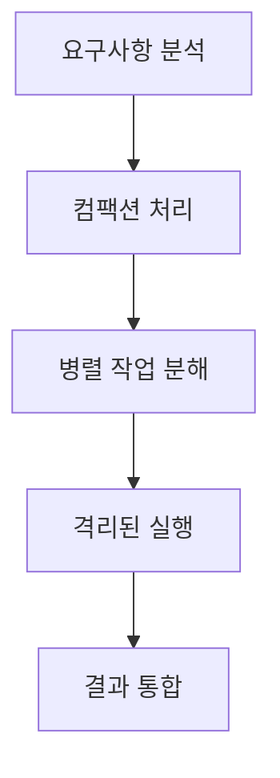

**3. 확장성 중심 설계**
- 대용량 프로젝트를 위한 컴팩션 기술
- 2-3배 높은 토큰 효율성
- 프로덕션 환경에 최적화된 성능

---

## 🏗️ 아키텍처 설계 철학 비교

### 실행 환경과 격리 전략

| 측면 | Claude Code | OpenAI Codex | 분석 |
|------|-------------|--------------|------|
| **실행 위치** | 로컬 터미널 | 클라우드 컨테이너 | 보안 vs 유연성 트레이드오프 |
| **파일 접근** | 직접 파일 시스템 | 사전 로드된 저장소 | 실시간성 vs 안전성 |
| **네트워크** | 제한 없음 | 작업 중 비활성화 | 기능성 vs 보안 |
| **상태 관리** | Git 워크트리 | 임시 컨테이너 | 지속성 vs 격리 |

### 에이전트 오케스트레이션 방식

**Claude Code: 리더십 중심 팀 모델**
```yaml
구조:
  - 리드 에이전트: 전체 작업 조율 및 의사결정
  - 팀원 에이전트: 특화된 작업 영역 담당
  - 워크트리 격리: 충돌 없는 병렬 작업
  - 실시간 동기화: 지속적인 상태 공유

장점:
  - 복잡한 작업의 체계적 관리
  - 명확한 책임 분담
  - 유연한 역할 조정

단점:
  - 조율 오버헤드
  - 리드 에이전트 의존성
```

**OpenAI Codex: 분산 처리 모델**
```yaml
구조:
  - App Server 아키텍처: 모든 인터페이스 통합
  - 독립적 에이전트: 자율적 작업 수행
  - 컨테이너 격리: 완전한 환경 분리
  - 결과 병합: 자동화된 통합 과정

장점:
  - 높은 처리 효율성
  - 확장성과 안정성
  - 단순한 관리 구조

단점:
  - 복잡한 의존성 처리 어려움
  - 실시간 조정 제한
```

### 워크플로우 제어 메커니즘

**제어 수준 비교:**

| 제어 영역 | Claude Code | OpenAI Codex |
|-----------|-------------|--------------|
| **실행 승인** | 단계별 승인 | 전체 승인 후 실행 |
| **중간 수정** | 실시간 가능 | 제한적 |
| **방향 변경** | 유연한 전환 | 재시작 필요 |
| **품질 제어** | 지속적 검토 | 사후 검증 |

---

## 📊 성능과 효율성 분석

### 토큰 효율성과 비용 구조

**OpenAI Codex의 효율성 우위:**

```
동일 작업 기준 토큰 소모량:
┌─────────────────────────────────────┐
│ Claude Code:  ████████████ (100%)   │
│ OpenAI Codex: ████ (30-50%)         │
└─────────────────────────────────────┘

비용 효율성:
- Codex: 2-3배 낮은 토큰 소모
- 대규모 프로젝트에서 비용 차이 극명
- 컴팩션 기술로 추가 최적화
```

**Claude Code의 가치 제안:**
- 높은 토큰 소모에도 불구한 **품질 우위**
- 실시간 피드백으로 **수정 비용 최소화**
- 학습 효과로 **장기적 생산성 향상**

### 개발 속도와 정확도 트레이드오프

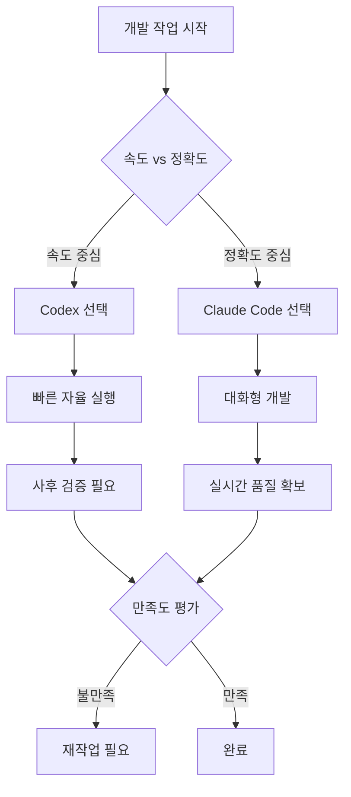

### 대용량 프로젝트 처리 능력

**확장성 메트릭:**

| 프로젝트 규모 | Claude Code | OpenAI Codex | 권장 도구 |
|---------------|-------------|--------------|-----------|
| **소규모** (< 10k LOC) | 우수 | 양호 | Claude Code |
| **중규모** (10k-100k LOC) | 보통 | 우수 | 상황에 따라 |
| **대규모** (> 100k LOC) | 제한적 | 우수 | OpenAI Codex |

---

## 🎨 사용 사례별 최적 선택

### Claude Code가 뛰어난 시나리오

#### 1. 연구 및 탐색적 개발 🔍

**특징:**
- 불확실한 요구사항
- 반복적 탐색과 실험 필요
- 창의적 문제 해결

**왜 Claude Code가 유리한가:**
```
실시간 피드백 루프:
요구사항 모호 → AI 추론 제시 → 개발자 피드백 → 방향 조정
                     ↑__________________________|
```

**실제 사례:**
- 새로운 알고리즘 설계
- 혁신적 UI/UX 패턴 개발
- 프로토타입 및 MVP 구축

#### 2. 학습 및 지식 전달 📚

**특징:**
- 과정 이해가 중요
- 복잡한 개념 설명 필요
- 팀 역량 강화 목적

**Claude Code의 교육적 가치:**
- **투명한 추론 과정**: AI의 사고 과정을 실시간으로 관찰
- **단계별 설명**: 각 결정의 이유와 배경 제공
- **상호작용적 학습**: 질문과 답변을 통한 깊이 있는 이해

#### 3. 크리티컬 시스템 개발 ⚡

**특징:**
- 높은 정확성 요구
- 엄격한 품질 기준
- 안전성이 최우선

**사례:**
- 금융 거래 시스템
- 의료 소프트웨어
- 자율주행 제어 시스템

### Codex가 유리한 상황

#### 1. 대규모 배치 작업 🏭

**특징:**
- 명확하고 반복적인 패턴
- 대량 처리 필요
- 일관성과 속도 중시

**예시:**
```yaml
레거시 마이그레이션:
  - 수천 개 파일의 일괄 변환
  - 일관된 패턴 적용
  - 자동화된 테스트 생성

코드 리팩터링:
  - 전체 프로젝트 구조 변경
  - 네이밍 컨벤션 통일
  - 의존성 업데이트
```

#### 2. 보안 중심 환경 🔐

**요구사항:**
- 격리된 실행 환경
- 제한된 네트워크 접근
- 감사 가능한 실행 로그

**Codex 보안 모델:**
- 클라우드 컨테이너 완전 격리
- 작업 중 인터넷 차단
- 사전 승인된 리소스만 접근

#### 3. 비용 최적화 프로젝트 💰

**시나리오:**
- 제한된 예산
- 효율성이 최우선
- 규모의 경제 활용

**비용 효과 분석:**
```
100만 토큰 작업 기준:
Claude Code: $30-50 (설명적 처리)
OpenAI Codex: $10-15 (효율적 처리)

대규모 프로젝트에서는 10배 이상 차이 가능
```

### 하이브리드 접근 전략

#### 전략 1: 단계별 도구 전환


**각 단계별 최적 도구:**

1. **설계 및 계획**: Claude Code
   - 요구사항 분석
   - 아키텍처 설계
   - 기술 스택 선정

2. **대량 구현**: OpenAI Codex
   - 반복적 코드 생성
   - 테스트 코드 작성
   - 문서 생성

3. **통합 및 최적화**: Claude Code
   - 컴포넌트 통합
   - 성능 최적화
   - 최종 검증

#### 전략 2: 역할 기반 분담

| 개발 영역 | 주 도구 | 보조 도구 | 이유 |
|-----------|---------|-----------|------|
| **아키텍처 설계** | Claude Code | - | 창의성과 유연성 필요 |
| **비즈니스 로직** | Claude Code | Codex | 복잡한 요구사항 이해 |
| **데이터 레이어** | OpenAI Codex | Claude Code | 반복적 CRUD 패턴 |
| **테스트 코드** | OpenAI Codex | Claude Code | 대량 생성 후 선별적 개선 |
| **문서화** | OpenAI Codex | Claude Code | 구조화된 대량 생성 |

---

## 🔧 실전 적용 가이드

### 프로젝트 평가 체크리스트

프로젝트 시작 전 다음 체크리스트를 통해 적합한 도구를 선택하세요:

#### 📋 요구사항 명확성 평가

```
□ 요구사항이 명확하게 정의되었는가?
  ├── 매우 명확 (9-10점): Codex 유리
  ├── 보통 (5-8점): 상황에 따라 선택
  └── 모호함 (1-4점): Claude Code 유리

□ 기술적 제약사항이 명시되었는가?
  ├── 명확한 제약: Codex 적합
  └── 유연한 탐색 필요: Claude Code 적합

□ 성공 기준이 정량적으로 정의되었는가?
  ├── 정량적 기준: 두 도구 모두 적합
  └── 정성적 기준: Claude Code 유리
```

#### ⚖️ 프로젝트 규모 및 복잡도

```
규모 지표:
┌─────────────────────────────────────┐
│ 파일 수:     [    ]개               │
│ 예상 LOC:    [    ]줄               │
│ 개발 기간:   [    ]주               │
│ 팀 크기:     [    ]명               │
└─────────────────────────────────────┘

복잡도 지표:
□ 새로운 기술 스택 도입
□ 레거시 시스템 연동
□ 복잡한 비즈니스 로직
□ 실시간 처리 요구사항
□ 높은 성능 요구사항
```

#### 💼 비즈니스 요소

```
□ 예산 제약
  ├── 매우 제한적: OpenAI Codex 우선 고려
  ├── 보통: 품질 대비 비용 검토
  └── 여유 있음: Claude Code 품질 우선

□ 출시 시간 압박
  ├── 매우 급함: OpenAI Codex (빠른 실행)
  ├── 보통: 하이브리드 접근 고려
  └── 여유 있음: Claude Code (높은 품질)

□ 유지보수 중요도
  ├── 장기 운영: Claude Code (높은 품질)
  ├── 단기 프로젝트: OpenAI Codex (빠른 개발)
```

### 의사결정 프레임워크

#### 스코어링 시스템

각 항목을 1-10점으로 평가하여 최적 도구를 선택하세요:

```python
# 프로젝트 평가 스크립트 예시
class ProjectEvaluation:
    def evaluate_tool_suitability(self):
        factors = {
            'requirement_clarity': self.requirement_score,      # 1-10
            'project_scale': self.scale_score,                  # 1-10
            'learning_importance': self.learning_score,         # 1-10
            'budget_constraint': self.budget_score,             # 1-10
            'security_requirement': self.security_score,        # 1-10
            'time_pressure': self.time_score                    # 1-10
        }

        # Claude Code 점수 계산
        claude_score = (
            (10 - factors['requirement_clarity']) * 0.2 +  # 모호할수록 유리
            (10 - factors['project_scale']) * 0.15 +       # 소규모일수록 유리
            factors['learning_importance'] * 0.25 +         # 학습 중요할수록 유리
            (10 - factors['budget_constraint']) * 0.1 +     # 예산 여유로울수록 유리
            (10 - factors['security_requirement']) * 0.15 + # 보안 덜 중요할수록 유리
            (10 - factors['time_pressure']) * 0.15          # 시간 여유로울수록 유리
        )

        # OpenAI Codex 점수 계산
        codex_score = (
            factors['requirement_clarity'] * 0.2 +          # 명확할수록 유리
            factors['project_scale'] * 0.15 +               # 대규모일수록 유리
            (10 - factors['learning_importance']) * 0.25 +  # 학습 덜 중요할수록 유리
            factors['budget_constraint'] * 0.1 +            # 예산 제약 클수록 유리
            factors['security_requirement'] * 0.15 +        # 보안 중요할수록 유리
            factors['time_pressure'] * 0.15                 # 시간 압박 클수록 유리
        )

        return {
            'claude_code': claude_score,
            'openai_codex': codex_score,
            'recommendation': 'Claude Code' if claude_score > codex_score else 'OpenAI Codex'
        }
```

#### 임계점 기준

```
점수 차이에 따른 권장사항:

├── 5점 이상 차이: 명확한 선택
├── 2-4점 차이: 강한 권장
├── 1점 이하 차이: 하이브리드 접근 고려
└── 동점: 팀 선호도나 기존 경험 고려
```

### 단계별 도구 선택 전략

#### Phase Gate 접근법

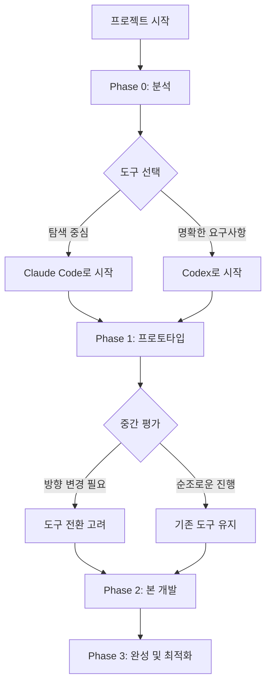

**각 Phase별 체크포인트:**

1. **Phase 0 → Phase 1 전환점**
   ```
   확인사항:
   - 요구사항 명확화 정도
   - 기술적 리스크 식별
   - 초기 아키텍처 안정성

   전환 기준:
   - 불확실성 > 50%: Claude Code 유지
   - 반복 패턴 식별: Codex 전환 고려
   ```

2. **Phase 1 → Phase 2 전환점**
   ```
   확인사항:
   - 프로토타입 검증 결과
   - 성능 요구사항 구체화
   - 확장성 계획 수립

   전환 기준:
   - 대량 구현 필요: Codex 전환
   - 지속적 튜닝 필요: Claude Code 유지
   ```

3. **Phase 2 → Phase 3 전환점**
   ```
   확인사항:
   - 핵심 기능 완성도
   - 성능 및 품질 지표
   - 출시 준비 상태

   전환 기준:
   - 최적화 중심: Claude Code 전환
   - 대량 테스트/문서화: Codex 유지
   ```

---

## 🔒 보안과 데이터 프라이버시

### 실행 환경 보안 모델

#### Claude Code 보안 특성

**로컬 실행 환경:**
```yaml
장점:
  - 완전한 데이터 제어권
  - 네트워크 격리 가능
  - 사내 정책 준수 용이
  - 실시간 모니터링 가능

위험 요소:
  - 로컬 환경 보안 의존
  - 개발자 권한 제어 필요
  - 환경 일관성 관리 복잡
  - 멀웨어 감염 위험
```

**보안 강화 방안:**
```bash
# 샌드박스 환경 구성
docker run -it --rm \
  --security-opt=no-new-privileges \
  --cap-drop=ALL \
  --network=none \
  claude-code-sandbox

# 파일 시스템 보호
mount --bind /readonly-source /workspace --read-only
```

#### OpenAI Codex 보안 모델

**클라우드 격리 환경:**
```yaml
장점:
  - 완전한 환경 격리
  - 표준화된 보안 정책
  - 자동 위협 탐지
  - 스케일링 된 보안 인프라

제한사항:
  - 클라우드 의존성
  - 데이터 이동 필요
  - 제한된 커스터마이징
  - 네트워크 접근 차단
```

**보안 아키텍처:**
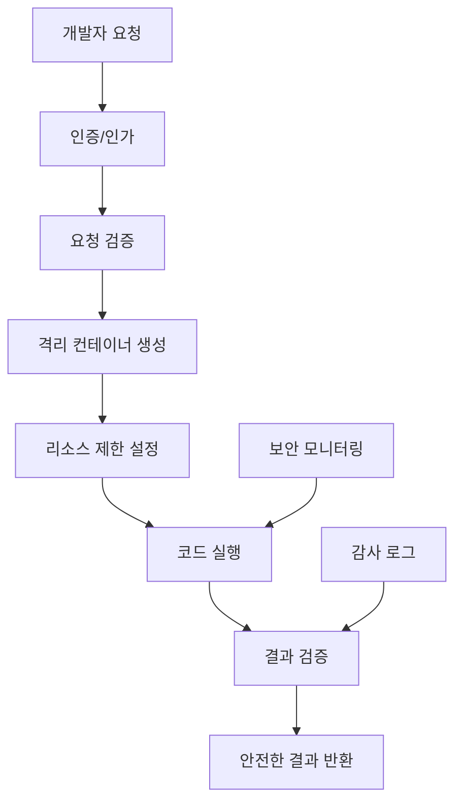

### 민감 데이터 처리 방식

#### 데이터 분류 및 처리 전략

| 데이터 유형 | Claude Code 접근법 | Codex 접근법 | 권장 전략 |
|-------------|-------------------|-------------|-----------|
| **공개 정보** | 직접 처리 가능 | 직접 처리 가능 | 두 도구 모두 적합 |
| **내부 비즈니스 로직** | 로컬 처리 | 익명화 후 처리 | 상황에 따라 선택 |
| **개인정보** | 로컬 처리 + 마스킹 | 처리 금지 | Claude Code 우선 |
| **기밀 정보** | 격리 환경 필수 | 처리 금지 | 별도 보안 솔루션 |

#### 데이터 보호 체크리스트

```
□ 데이터 분류 완료
  ├── 공개 데이터: 제한 없음
  ├── 내부 데이터: 익명화 검토
  ├── 민감 데이터: 로컬 처리만
  └── 기밀 데이터: 처리 금지

□ 마스킹 전략 수립
  ├── API 키: [REDACTED] 처리
  ├── 개인정보: 가명 처리
  ├── 민감 설정: 환경 변수화
  └── 인증 정보: 완전 제거

□ 감사 체계 구축
  ├── 처리 로그 기록
  ├── 접근 권한 관리
  ├── 데이터 이동 추적
  └── 위반 사항 모니터링
```

### 엔터프라이즈 환경 고려사항

#### 규제 준수 요구사항

**GDPR 준수:**
```yaml
Claude Code:
  - 로컬 처리로 데이터 이동 최소화
  - 사용자 제어권 보장
  - 삭제 권리 구현 용이

OpenAI Codex:
  - 클라우드 처리에 따른 제약
  - 데이터 처리 동의 필요
  - 제3자 처리 고지 의무
```

**SOX 준수:**
```yaml
공통 요구사항:
  - 모든 변경 사항 감사 로그
  - 승인 프로세스 구현
  - 접근 권한 정기 검토
  - 백업 및 복구 절차

Claude Code 특화:
  - 로컬 감사 시스템 구축
  - 개발자 권한 세분화

Codex 특화:
  - 클라우드 감사 로그 활용
  - 표준화된 컴플라이언스
```

#### 기업 정책 통합

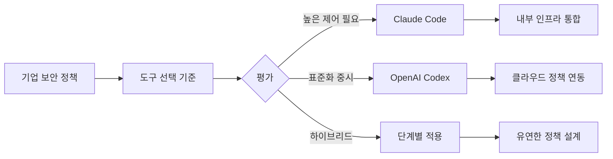

**정책 통합 체크리스트:**
```
□ 기존 개발 도구와의 호환성
□ SSO (Single Sign-On) 연동
□ VPN 및 방화벽 정책
□ 코드 리뷰 프로세스 통합
□ CI/CD 파이프라인 연동
□ 라이선스 관리 체계
□ 교육 및 훈련 계획
```

---

## 📈 미래 전망과 발전 방향

### 기술적 진화 예측

#### 단기 전망 (2026-2027)

**Claude Code 발전 방향:**
```yaml
예상 개선사항:
  토큰 효율성:
    - 압축 알고리즘 개선
    - 스마트 컨텍스트 관리
    - 선택적 상세화 모드

  협업 기능:
    - 다중 개발자 실시간 협업
    - 역할 기반 워크플로우
    - 지능적 충돌 해결

  통합 생태계:
    - 더 많은 IDE 지원
    - CI/CD 파이프라인 통합
    - 클라우드 개발 환경 지원
```

**OpenAI Codex 발전 방향:**
```yaml
예상 개선사항:
  성능 최적화:
    - GPT-6 기반 업그레이드
    - 더 정교한 컴팩션 기술
    - 실시간 학습 능력

  상호작용 개선:
    - 부분적 실시간 피드백
    - 중간 결과 미리보기
    - 선택적 개입 포인트

  보안 강화:
    - 제로 트러스트 아키텍처
    - 동형 암호화 지원
    - 프라이빗 클라우드 옵션
```

#### 장기 전망 (2028-2030)

**융합과 표준화:**
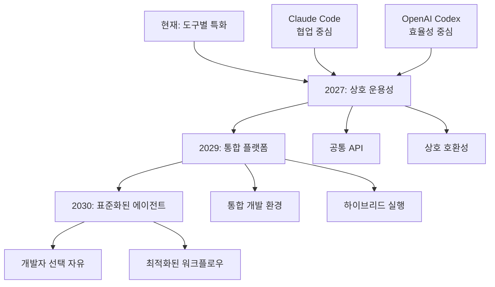

**새로운 패러다임 등장:**
1. **멀티 모달 개발**: 음성, 이미지, 코드를 통합한 자연스러운 인터페이스
2. **자율 소프트웨어 진화**: AI가 요구사항 변화에 따라 스스로 코드를 진화
3. **예측적 개발**: 미래 요구사항을 예측하여 선제적 구현 제안

### 생태계 통합 가능성

#### 도구 간 상호 운용성

**프로토콜 표준화:**
```json
{
  "aiCodingStandard": {
    "version": "1.0",
    "interoperability": {
      "contextSharing": "enabled",
      "workflowHandoff": "seamless",
      "resultFormat": "unified"
    },
    "supportedTools": [
      "claude-code",
      "openai-codex",
      "github-copilot",
      "tabnine"
    ],
    "commonFeatures": {
      "projectAnalysis": true,
      "codeGeneration": true,
      "documentGeneration": true,
      "testGeneration": true
    }
  }
}
```

**하이브리드 워크플로우 플랫폼:**
```yaml
미래 플랫폼 구상:
  name: "Universal AI Developer Platform"
  features:
    - 도구 중립적 인터페이스
    - 자동 도구 선택 엔진
    - 컨텍스트 공유 메커니즘
    - 통합 품질 관리
    - 비용 최적화 엔진

  workflow:
    analysis: "Best available tool"
    design: "Claude Code preference"
    implementation: "Efficiency-based selection"
    testing: "Coverage-optimized choice"
    deployment: "Security-first selection"
```

#### 기업 도입 가속화

**도입 단계별 전략:**
```
Phase 1 (2026): Pilot Projects
├── 소규모 팀 실험
├── ROI 측정
└── 베스트 프랙티스 수립

Phase 2 (2027): Selective Adoption
├── 프로젝트 유형별 적용
├── 도구 조합 최적화
└── 팀 교육 및 훈련

Phase 3 (2028): Organization-wide
├── 전사 표준화
├── 커스텀 솔루션 개발
└── 생산성 혁신 달성

Phase 4 (2029): Innovation Leading
├── AI 네이티브 조직
├── 새로운 개발 방법론
└── 경쟁 우위 확보
```

### 개발자 역할 변화

#### 스킬셋 진화

**전통적 개발자 → AI 협업 개발자:**

| 영역 | 기존 스킬 | 새로운 스킬 | 중요도 변화 |
|------|-----------|-------------|-------------|
| **코딩** | 문법, 알고리즘 | AI 프롬프트 엔지니어링 | 📉 → 📊 |
| **설계** | 아키텍처, 패턴 | 의도 설계, AI 협업 | 📈 → 📈📈 |
| **디버깅** | 로그, 브레이크포인트 | AI 추론 분석 | 📊 → 📈 |
| **테스팅** | 테스트 케이스 작성 | 테스트 전략 설계 | 📊 → 📈 |
| **커뮤니케이션** | 기술 문서 | AI와의 대화, 의도 전달 | 📊 → 📈📈 |

**새로운 전문 역할 등장:**

1. **AI Development Orchestrator**
   - 다중 AI 도구 조율
   - 최적 워크플로우 설계
   - 품질 및 성능 최적화

2. **Prompt Engineer**
   - AI와의 효과적 소통
   - 컨텍스트 설계 전문가
   - 도메인별 프롬프트 최적화

3. **AI-Human Interface Designer**
   - 자연스러운 협업 경험 설계
   - 개발자 경험(DX) 최적화
   - 인간-AI 워크플로우 설계

#### 학습과 적응 전략

**개발자 자가 진단 체크리스트:**
```
현재 준비도 평가:

□ AI 도구 경험
  ├── 전혀 없음 (0점): 기초 교육 필요
  ├── 기본 사용 (3점): 실무 적용 단계
  ├── 능숙 사용 (7점): 최적화 단계
  └── 전문가 수준 (10점): 리더십 역할

□ 추상적 사고 능력
  ├── 구체적 구현에 집중: 의도 설계 능력 개발
  ├── 균형적 접근: 현재 수준 유지
  └── 높은 추상화: AI 협업 최적화

□ 커뮤니케이션 스킬
  ├── 기술적 소통 중심: 자연어 설명 능력 강화
  ├── 균형적 소통: AI 특화 스킬 추가
  └── 뛰어난 소통: 멘토 역할 준비
```

**역량 개발 로드맵:**

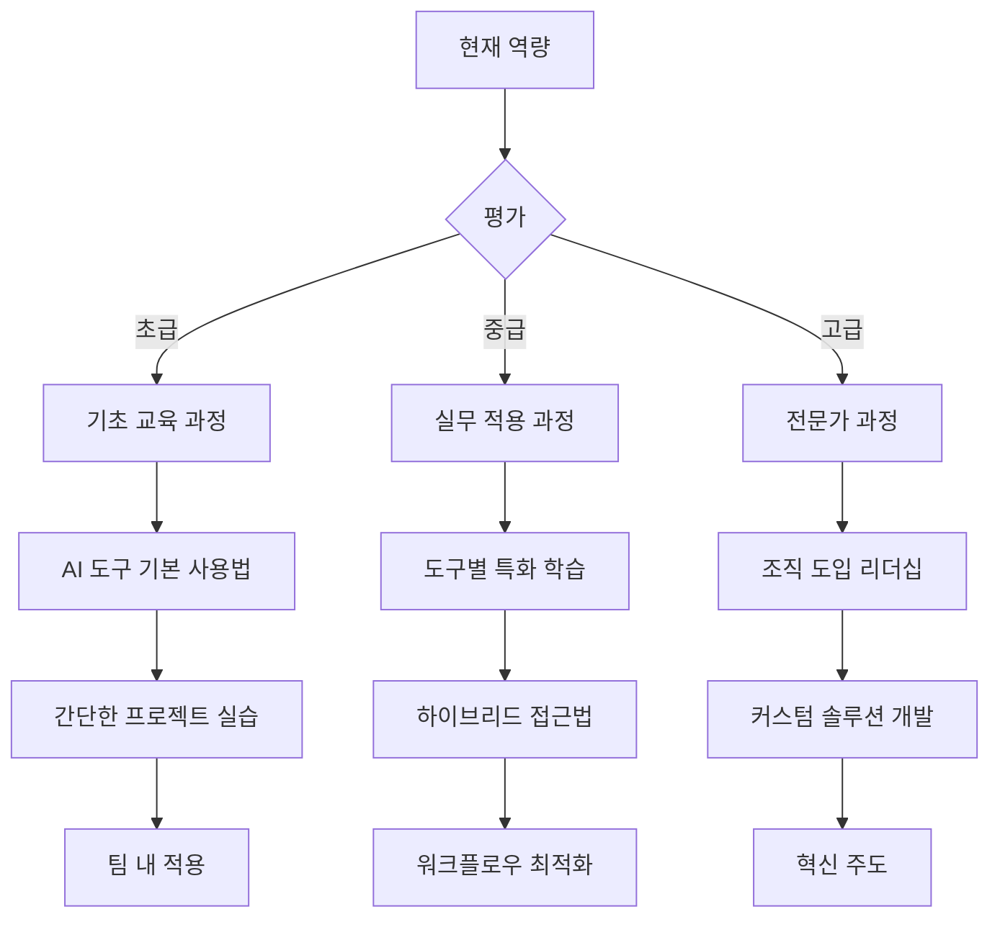

---

## 💡 실전 팁과 베스트 프랙티스

### Claude Code 활용 팁

#### 효과적인 협업 전략

**1. 의도 전달 최적화**
```markdown
❌ 모호한 요청:
"사용자 관리 기능을 만들어주세요."

✅ 명확한 의도:
"B2B SaaS 플랫폼에서 관리자가 팀원을 초대/제거하고,
역할별 권한을 설정할 수 있는 사용자 관리 시스템을 구현해주세요.
- 이메일 초대 플로우 포함
- RBAC (Role-Based Access Control) 지원
- 실시간 상태 업데이트
- 감사 로그 기능"
```

**2. 단계별 승인 전략**
```yaml
권장 워크플로우:
  1단계_분석: "접근 방법 검토 후 승인 요청"
  2단계_설계: "아키텍처 확정 후 구현 진행"
  3단계_구현: "핵심 로직 완성 후 테스트 진행"
  4단계_최적화: "성능 튜닝 후 최종 검토"

각 단계별 명확한 Go/No-Go 결정으로 품질 확보
```

**3. Agent Teams 활용 패턴**
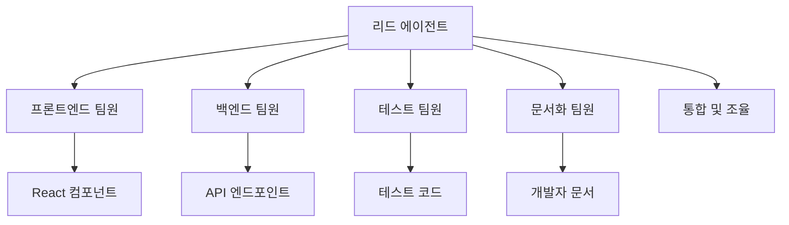

#### 성능 최적화

**1. 컨텍스트 관리**
```bash
# 프로젝트별 컨텍스트 파일 구성
echo "CLAUDE.md 최적화 예시:"

# 핵심 정보만 포함
- 아키텍처 결정 (ADR)
- 코딩 컨벤션 (핵심만)
- 자주 사용하는 패턴 (템플릿)
- 제외할 패턴 (안티패턴)

# 불필요한 정보 제거
- 상세한 히스토리
- 변경될 수 있는 일시적 정보
- 외부 문서 링크 (직접 포함)
```

**2. Skills 시스템 활용**
```yaml
# 자주 사용하는 작업을 Skills로 자동화
custom-skills:
  component-generator:
    trigger: "새 컴포넌트"
    template: "TypeScript React + Storybook + Test"

  api-endpoint:
    trigger: "API 추가"
    template: "Express.js + Validation + Documentation"

  database-migration:
    trigger: "DB 스키마"
    template: "Prisma + Migration + Seed"
```

### OpenAI Codex 활용 팁

#### 효율성 극대화 전략

**1. 배치 작업 최적화**
```python
# 대량 작업을 위한 구조화된 요청
batch_request = {
    "operation": "migrate_legacy_components",
    "scope": {
        "directory": "src/legacy/",
        "pattern": "**/*.jsx",
        "target": "typescript_functional"
    },
    "requirements": [
        "Convert class components to functional",
        "Add TypeScript interfaces",
        "Implement proper hooks",
        "Maintain existing functionality",
        "Add unit tests"
    ],
    "constraints": [
        "Preserve existing API",
        "Keep performance characteristics",
        "Follow existing naming conventions"
    ]
}
```

**2. 결과 품질 향상**
```yaml
# 명확한 성공 기준 설정
success_criteria:
  functionality:
    - "All existing tests pass"
    - "No runtime errors"
    - "API compatibility maintained"

  quality:
    - "TypeScript strict mode compliance"
    - "ESLint warnings under 5"
    - "Test coverage above 80%"

  performance:
    - "Bundle size increase < 10%"
    - "Runtime performance maintained"
```

**3. 보안 최적화**
```bash
# 민감 정보 사전 제거
export CLEAN_REQUEST="true"
export MASK_PATTERNS="API_KEY|PASSWORD|SECRET|TOKEN"

# 처리 전 자동 마스킹
preprocess_request() {
    sed -E 's/(API_KEY|PASSWORD|SECRET|TOKEN)=[^[:space:]]*/\1=[REDACTED]/g'
}
```

### 하이브리드 활용 전략

#### 워크플로우 최적화

**1. 도구 전환 타이밍**
```yaml
전환 신호:
  Claude_to_Codex:
    - 반복 패턴 식별됨
    - 대량 구현 필요
    - 명확한 요구사항 확정

  Codex_to_Claude:
    - 예상과 다른 결과
    - 복잡한 비즈니스 로직
    - 창의적 해결책 필요

  Stay_Current:
    - 만족스러운 진행
    - 일관된 품질 유지
    - 팀 적응도 높음
```

**2. 데이터 핸드오프 최적화**
```json
{
  "handoff_package": {
    "context": {
      "requirements": "구조화된 요구사항",
      "decisions": "아키텍처 결정 사항",
      "constraints": "기술적/비즈니스적 제약"
    },
    "artifacts": {
      "code": "기존 구현체",
      "tests": "검증된 테스트",
      "docs": "설계 문서"
    },
    "next_steps": {
      "scope": "다음 도구가 처리할 범위",
      "acceptance": "완료 조건",
      "fallback": "실패 시 대안"
    }
  }
}
```

#### 품질 관리 체계

**1. 지속적 품질 검증**
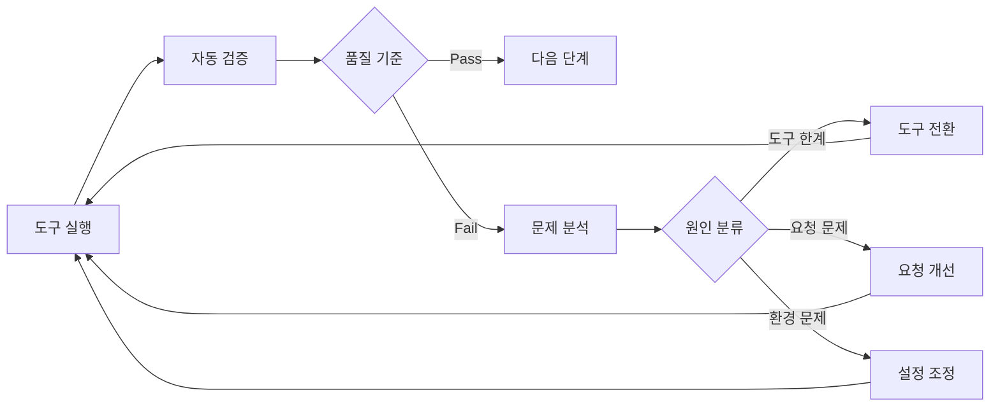

**2. 메트릭 기반 최적화**
```python
class QualityMetrics:
    def track_performance(self, tool, task, result):
        metrics = {
            'completion_time': result.duration,
            'token_consumption': result.tokens_used,
            'accuracy_score': self.evaluate_accuracy(result),
            'modification_count': result.revisions_needed,
            'developer_satisfaction': result.user_rating
        }

        self.update_tool_profile(tool, task, metrics)
        return self.recommend_optimization(metrics)
```

### 일반적인 실수와 해결법

#### 자주 발생하는 문제들

**1. 컨텍스트 오버로드**
```
문제: 너무 많은 정보를 한 번에 제공
증상:
- 응답 시간 증가
- 관련 없는 제안
- 토큰 소모 급증

해결책:
- 단계별 정보 제공
- 핵심 정보만 포함
- 이전 단계 결과 요약 활용
```

**2. 도구 고착화**
```
문제: 한 도구에만 의존하는 경향
증상:
- 비효율적 작업 처리
- 높은 비용 또는 낮은 품질
- 팀 생산성 저하

해결책:
- 정기적 도구 평가
- 프로젝트별 최적화
- 팀 내 다양한 경험 공유
```

**3. 품질 관리 부재**
```
문제: AI 결과물을 무비판적으로 수용
증상:
- 기술 부채 누적
- 보안 취약점 발생
- 장기적 유지보수 어려움

해결책:
- 체계적 코드 리뷰
- 자동화된 품질 검증
- 지속적 리팩터링
```

---

## 🎯 결론과 권장사항

### 핵심 인사이트 요약

AI 코딩 에이전트의 선택은 단순한 기능 비교를 넘어 **개발 철학과 워크플로우의 선택**입니다:

#### 🎨 Claude Code: 협업적 창조성
- **언제 선택하나**: 탐색, 학습, 혁신이 중요한 프로젝트
- **핵심 가치**: 투명성, 유연성, 품질 중심
- **적합한 팀**: 창의적 해결책을 추구하고 과정을 중시하는 팀

#### ⚡ OpenAI Codex: 효율적 실행력
- **언제 선택하나**: 명확한 요구사항의 대규모 구현
- **핵심 가치**: 효율성, 확장성, 비용 최적화
- **적합한 팀**: 빠른 실행과 일관된 결과를 중시하는 팀

### 성공적인 도입을 위한 실행 계획

#### 1단계: 현황 분석 및 준비 (1-2주)
```yaml
평가 영역:
  팀 역량:
    - 현재 개발 방식 분석
    - AI 도구 경험 수준 파악
    - 학습 의지 및 적응 능력 평가

  프로젝트 특성:
    - 요구사항 명확성 수준
    - 프로젝트 규모 및 복잡도
    - 품질 vs 속도 우선순위

  조직 환경:
    - 보안 정책 및 규제 요구사항
    - 예산 및 일정 제약
    - 기존 도구 생태계
```

#### 2단계: 파일럿 프로젝트 실행 (2-4주)
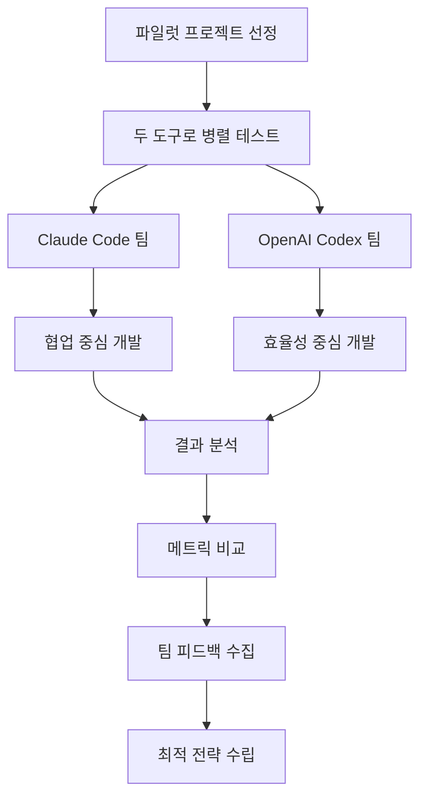

**파일럿 프로젝트 선정 기준:**
- 적당한 복잡도 (2-3주 분량)
- 명확한 성공 기준
- 대표적인 개발 작업 포함
- 리스크가 제한적

#### 3단계: 점진적 확산 (1-3개월)
```yaml
확산 전략:
  Week 1-2: "얼리 어답터 팀 교육"
  Week 3-4: "베스트 프랙티스 문서화"
  Week 5-8: "다른 팀으로 확장"
  Week 9-12: "조직 전체 도입"

성공 지표:
  - 개발 생산성 20% 향상
  - 코드 리뷰 시간 30% 단축
  - 개발자 만족도 4.5/5 이상
  - 기술 부채 감소 추세
```

#### 4단계: 최적화 및 발전 (지속적)
```yaml
지속 개선:
  월간 회고:
    - 도구 활용 현황 분석
    - 문제점 및 개선 사항 도출
    - 새로운 기능 및 업데이트 적용

  분기별 전략 검토:
    - ROI 측정 및 분석
    - 도구 조합 최적화
    - 팀별 커스터마이징

  연간 전략 수립:
    - 기술 로드맵 업데이트
    - 조직 역량 개발 계획
    - 혁신 프로젝트 기획
```

### 최종 의사결정 가이드

아래 플로우차트를 따라 여러분의 상황에 맞는 최적의 선택을 하세요:

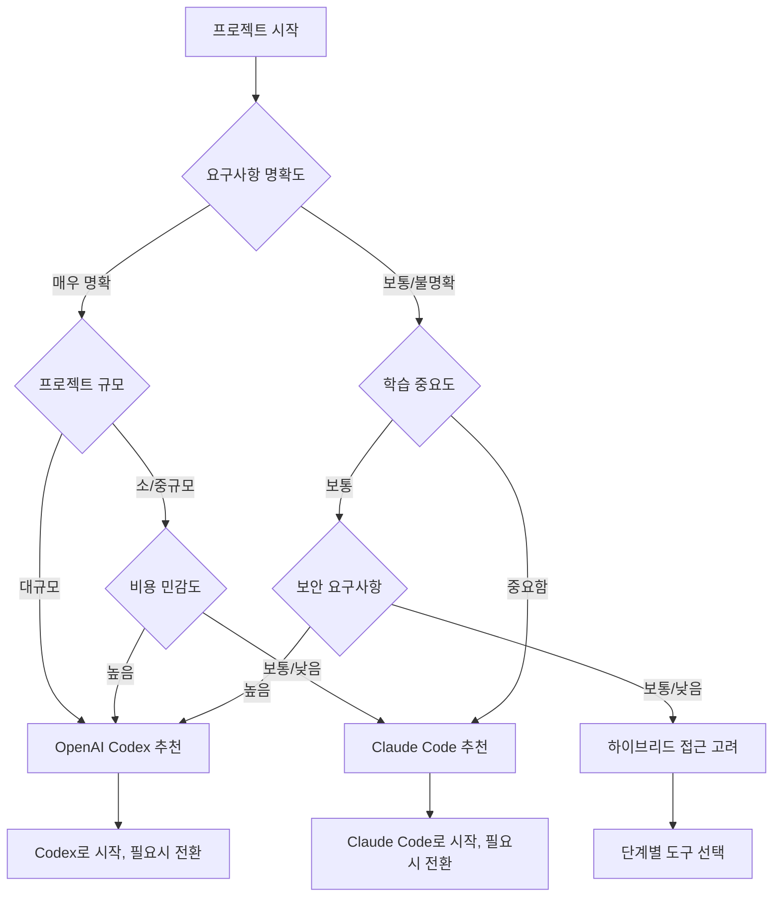

### 마무리하며

AI 코딩 에이전트는 소프트웨어 개발의 패러다임을 근본적으로 바꾸고 있습니다. Claude Code와 OpenAI Codex는 각각 고유한 철학과 강점을 가지고 있으며, **"어느 것이 더 좋은가?"**보다는 **"언제 무엇을 사용할 것인가?"**가 더 중요한 질문입니다.

#### 핵심 원칙
1. **상황에 맞는 도구 선택**: 프로젝트 특성과 팀 상황을 고려한 선택
2. **유연한 전환**: 필요에 따라 도구를 전환하는 유연성
3. **지속적 학습**: 새로운 기능과 베스트 프랙티스 지속 습득
4. **품질 중심**: AI 도구 사용 시에도 품질 관리 체계 유지

#### 다음 단계
이 가이드를 바탕으로 여러분의 다음 프로젝트에서 AI 코딩 에이전트를 시험해보세요. 중요한 것은 완벽한 선택이 아니라 **시작하고 배우는 것**입니다.

AI와 함께하는 개발의 새로운 시대에서 여러분이 더 창의적이고 생산적인 개발자로 성장하기를 바랍니다.

---

> **"최고의 도구는 존재하지 않습니다. 상황에 맞는 최적의 도구만 있을 뿐입니다."**

*다음 포스트에서는 실제 프로젝트에서 Claude Code와 OpenAI Codex를 활용한 사례 연구를 공유할 예정입니다.*

**참고 자료:**
- [Phase 0: Research & Information Gathering](../research/claude-code-vs-codex-research.md)
- [Phase 1: Comparative Analysis Framework](../analysis/comparative-framework.md)
- Phase 3: Content Writing (현재 문서)

**관련 도구 및 문서:**
- [Claude Code 공식 문서](https://code.claude.com/docs/en/overview)
- [OpenAI Codex 공식 문서](https://platform.openai.com/docs/guides/code)