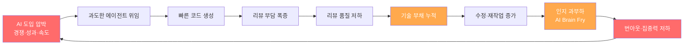

## 들어가며

"AI가 코드를 짜주니 개발자는 편해질 것이다." 2025년 초 AI 코딩 도구가 폭발적으로 확산될 때 많은 사람들이 품었던 기대다. 그리고 2026년 5월, 현실은 조금 다른 이야기를 하고 있다.

코드 생성 속도는 빨라졌다. 그러나 **개발자의 인지 부하는 줄지 않았다.** 오히려 새로운 형태의 피로가 조용히 쌓이고 있다. 에이전트를 감시하는 피로, AI가 만든 코드를 리뷰하는 피로, 맥락을 끊임없이 이어붙이는 피로. 이 글에서는 이 현상을 **바이브 코딩 피로(Vibe Coding Fatigue)** 라는 이름으로 진단하고, 실증적 데이터와 운영 경험을 바탕으로 완화 전략을 정리한다.

---

## 1. 2025년의 제안, 2026년의 전환점

### Karpathy의 "Vibe Coding"

2025년 2월, Andrej Karpathy는 X(구 트위터)에 짧은 글을 올렸다.

> "There's a new kind of coding I call 'vibe coding', where you fully give in to the vibes, embrace exponentials, and forget that the code even exists."[^karpathy]

[^karpathy]: Andrej Karpathy, X post, February 2025. <https://x.com/karpathy/status/1886192184808149289>

LLM에게 의도만 전달하고, 세부 구현은 모델에게 맡기는 이 방식은 즉각적인 반향을 일으켰다. GitHub Copilot, Cursor, Claude Code, Codex CLI 등 도구들이 줄지어 "에이전트 모드"를 출시하면서 vibe coding은 실험에서 일상으로 전환됐다.

### 2026년: 도구 포화와 전환점

2026년 초에 이르자 상황이 달라졌다. 단일 저장소에 Claude Code 워크트리, Codex CLI 세션, Cursor 에디터가 동시에 열려 있는 개발 환경이 흔해졌다. 도구는 넘쳐났고, **무엇을 언제 어느 도구에 맡길지** 결정하는 메타 작업 자체가 새로운 병목이 됐다.

GitLab의 2025 DevSecOps 보고서는 AI 도구를 "매일 여러 번" 사용하는 개발자 중 **51%가 코드 품질 문제가 증가했다**고 답했음을 보여준다.[^gitlab] 빠른 생성이 다운스트림 부채로 전환되는 속도가 개발자의 소화 능력을 앞질렀다.

[^gitlab]: GitLab, *2025 Global DevSecOps Report*, 2025.

이것이 바이브 코딩 피로가 등장하는 배경이다.

---

## 2. 피로의 세 가지 분류

바이브 코딩 피로는 단일 현상이 아니다. 발현 경로에 따라 세 가지 유형으로 구분할 수 있다.

### Agentic Fatigue — 에이전트 관리 피로

자율 에이전트는 일을 대신해주지만, 동시에 **감시·조율·재시도** 라는 새로운 작업을 만들어낸다. 에이전트가 3개를 넘으면 개발자는 코드보다 에이전트 상태를 관찰하는 데 더 많은 시간을 쓰기 시작한다. 병렬 에이전트가 서로 충돌하거나 컨텍스트를 오염시키면 디버깅은 기하급수적으로 복잡해진다.

> [바이브 코딩에서 병렬 에이전트를 안전하게 운용하는 방법은 [AI 병렬 작업 구축 가이드](/posts/ai-parallel-workers-guide/)에서 다뤘다.]
{: .prompt-tip }

### AI Brain Fry — 인지 과부하

AI가 제안하는 코드 조각을 끊임없이 읽고, 평가하고, 맥락에 맞게 수정하는 과정은 겉보기에 단순해 보이지만 인지적으로 매우 고비용이다. 특히 자신이 잘 모르는 도메인에서 AI 출력을 검토할 때 **"이게 맞는지 모르지만 맞는 것 같다"** 는 불확실한 상태가 장시간 지속되면 정신적 소진이 빠르게 온다.

Simon Willison은 이를 "AI Brain Fry"라고 불렀다.[^willison] AI 없이는 일하기 어렵고, AI와 함께하면 뇌가 녹아내리는 느낌.

[^willison]: Simon Willison, *"AI Brain Fry"*, blog post, 2025. <https://simonwillison.net>

### Review Fatigue — 리뷰 피로

AI가 생성한 코드는 자신이 작성한 코드보다 리뷰하기 어렵다. 맥락 없이 등장한 500줄짜리 PR은 승인 버튼을 누르고 싶은 충동을 자극한다. **리뷰 품질이 낮아질수록 기술 부채는 빠르게 쌓이고**, 그 부채를 다시 AI에게 수리시키는 악순환이 시작된다.

---

## 3. 번아웃 패러독스와 이중 구속

### BCG의 경고

Boston Consulting Group은 2025년 AI 업무 활용 연구에서 역설적인 결과를 발표했다.[^bcg] AI 도구를 가장 적극적으로 활용한 집단이 단기 생산성은 높았지만, **6개월 후 번아웃 지표와 직무 만족도에서 가장 나쁜 수치**를 보였다. AI가 일을 줄여준 게 아니라, 처리할 수 있는 일의 총량을 늘려 개발자를 더 많이 일하게 만든 것이다.

[^bcg]: Boston Consulting Group, *"AI at Work" Research Series*, 2025.

### 이중 구속 사이클

바이브 코딩 피로의 핵심에는 **이중 구속(Double Bind)** 구조가 있다. AI를 덜 쓰면 경쟁에서 뒤처지고, AI를 더 쓰면 번아웃이 온다. 어느 쪽을 선택해도 손해인 상황이 개발자를 옥죄고 있다.

이 사이클에서 개발자가 스스로 빠져나오기 어려운 이유는 **각 단계에서의 선택이 합리적**으로 보이기 때문이다. 에이전트를 더 쓰는 것은 합리적이다. 리뷰를 빠르게 통과시키는 것도 합리적이다. 그러나 합리적 선택들이 모여 비합리적인 결과를 만든다.

> **이중 구속 탈출의 핵심은 속도를 늦추는 것이 아니라, 사이클의 어느 고리를 끊을지 선택하는 것이다.**
{: .prompt-warning }

---

## 4. 실증 데이터: 우리가 직면한 현실

### 보안 취약점 2.74배

Snyk의 2025년 State of Open Source Security 보고서에 따르면 AI 도구를 적극적으로 활용하는 팀의 코드베이스에서 보안 취약점이 비활용 팀 대비 **2.74배** 많이 발견됐다.[^snyk] 특히 SQL injection, SSRF, 하드코딩된 시크릿이 상위 패턴으로 확인됐다.

[^snyk]: Snyk, *State of Open Source Security 2025*, 2025.

AI는 과거 코드 패턴으로 훈련됐기 때문에 취약점 패턴도 그대로 생성한다. "이 코드가 작동한다"와 "이 코드가 안전하다"는 전혀 다른 명제다.

### 코드 리뷰 부하 증가

Stack Overflow Developer Survey 2025 데이터는 AI 도구 도입 후 코드 리뷰 시간이 평균 **37% 증가**했음을 보여준다.[^stackoverflow] 생성 속도가 리뷰 속도를 앞지른 결과다.

[^stackoverflow]: Stack Overflow, *Developer Survey 2025*, 2025.

### "AI 속도 역설"의 반복

[AI 코딩 하네스 구축 가이드](/posts/ai-coding-harness-guide/)에서도 다룬 "AI 속도 역설"은 2026년에도 해소되지 않았다. 코드는 빠르게 생성되지만, 테스트·보안·배포 파이프라인이 그 속도를 따라가지 못하면 전체 리드타임은 오히려 늘어난다.

---

## 5. 한국 개발자의 목소리

### NDS "8년차 AI 엔지니어"의 회고

국내 NDS 블로그에서 화제가 된 "8년차 AI 엔지니어의 2026년 회고"는 바이브 코딩 피로를 실감나게 묘사한다. 저자는 Claude Code를 사용해 하루 수백 줄의 코드를 생성하던 중 **"내가 짠 게 아닌 코드를 내가 관리해야 하는 이질감"** 이 점점 커졌다고 고백한다. 결국 에이전트 사용을 절반으로 줄이고, 코드를 직접 이해한 것만 머지하는 원칙을 세웠다.

### Jonghan의 Substack 분석

개발자 Jonghan은 Substack에서 AI 코딩 피로를 두 축으로 분석한다.[^jonghan] **"통제감"과 "이해도"** — AI에게 위임할수록 두 지표가 동시에 낮아지고, 그것이 번아웃의 선행 지표로 작동한다는 것이다. 그는 주간 단위로 "수동 코딩 비율"을 추적하면서 자신의 AI 사용량이 건강한 범위에 있는지 모니터링한다고 쓴다.

[^jonghan]: Jonghan, *"AI 코딩 번아웃의 두 축: 통제감과 이해도"*, Substack, 2025.

### 공통 패턴

두 사례에서 공통적으로 등장하는 회복 전략은 단순하다: **의도적인 속도 조절**과 **이해 없는 코드는 머지하지 않는 원칙**. 기술적 해법이 아닌 태도의 변화가 핵심이다.

---

## 6. 운영 원칙: AQ 경험에서 도출한 완화 전략

AI-Quartermaster(AQ) 워크플로우를 운용하면서 바이브 코딩 피로를 줄이기 위해 실험하고 검증한 원칙들을 공유한다.

### ① 에이전트 수 제한 — "3 에이전트 규칙"

동시에 활성화된 에이전트를 3개 이하로 제한한다. 이 숫자를 넘으면 감시 비용이 생산 이득을 초과하기 시작한다. 각 에이전트에는 명확한 **종료 조건**을 부여하고, 완료되지 않은 에이전트가 있으면 새 에이전트를 시작하지 않는다.

### ② Read/Write 분리

탐색·조사 작업(Read)과 코드 작성 작업(Write)을 동일 에이전트에 섞지 않는다. 특히 리뷰 에이전트가 코드도 수정하게 두면 **자기 승인(self-approval)** 이 발생한다. 코드를 쓴 에이전트와 코드를 검토하는 에이전트는 반드시 분리한다.

### ③ 컨텍스트 위생 (Context Hygiene)

긴 컨텍스트 창은 편리하지만 에이전트의 집중도를 떨어뜨린다. 태스크 단위로 컨텍스트를 초기화하고, 이전 대화 흔적이 다음 작업에 개입하지 않도록 한다. CLAUDE.md에 "오늘의 범위"를 명시하면 에이전트가 불필요한 탐색을 줄인다.

### ④ 리뷰 우선순위화 — 보안 → 로직 → 스타일

AI 생성 코드의 리뷰 순서를 고정한다: 보안 취약점 → 비즈니스 로직 → 코드 스타일. 시간이 없으면 스타일 리뷰는 건너뛰어도 되지만, 보안과 로직은 반드시 사람이 확인한다. Chirpy 블로그처럼 간단한 정적 사이트라도 이 순서는 유효하다.

### ⑤ CLAUDE.md / 스킬 / 훅으로 가드레일 구성

`CLAUDE.md`에 프로젝트 컨벤션, 금지 패턴, 변경 범위를 명시해두면 에이전트가 스스로 범위를 일탈하는 경우를 줄일 수 있다. oh-my-claudecode의 훅(hook) 기능을 활용하면 도구 호출 전후에 검증 로직을 삽입할 수 있어 에이전트 감시 부담을 낮춘다.

### ⑥ AQ 운용 경험: "느리게 가야 빠르다"

AQ 워크플로우에서 가장 역설적으로 효과적이었던 접근은 **플래닝 단계를 길게 가져가는 것**이었다. 에이전트에게 바로 구현을 맡기기 전에 `planner` → `architect` → `executor` 순서를 지키면 수정 사이클이 줄고, 결과적으로 전체 시간이 단축됐다. "빠른 vibe"보다 "느린 계획"이 총 소요 시간을 줄인다.

---

## 7. 결론: Vibe에서 Discipline으로

### AI Coding Hygiene

바이브 코딩이 틀린 것은 아니다. 빠른 프로토타이핑, 초기 아이디어 검증, 반복적인 보일러플레이트 생성에는 vibe coding이 강력하다. 문제는 그것이 유일한 모드가 될 때다.

성숙한 AI 코딩 워크플로우는 **AI Coding Hygiene**, 즉 위생 개념을 포함한다.

- 하루 AI 세션 수 제한
- 이해하지 못한 코드 머지 금지
- 리뷰 없는 푸시 금지
- 에이전트 상태 주기적 정리
- 수동 코딩 비율 의도적 유지

이것은 생산성을 낮추는 것이 아니다. **지속 가능한 속도를 찾는 것**이다.

### Discipline이 새로운 경쟁력이다

2025년의 경쟁력이 "얼마나 많은 AI 도구를 쓰느냐"였다면, 2026년의 경쟁력은 **"얼마나 절제되게 AI를 쓰느냐"** 로 이동하고 있다. Karpathy의 vibe coding 제안은 가능성의 문을 열었다. 이제 우리는 그 문을 어떻게, 얼마나 열어둘지 결정해야 할 단계에 와 있다.

피로는 신호다. 속도를 더 높이라는 신호가 아니라, **운영 방식을 점검하라는 신호**다.

---

*관련 글:*
- [AI 병렬 작업 구축 가이드 — 여러 AI를 동시에 운용하여 생산성 극대화하기](/posts/ai-parallel-workers-guide/)
- [AI 코딩 하네스 구축 가이드 — 2026년 자동화 워크플로우 완전 정복](/posts/ai-coding-harness-guide/)
