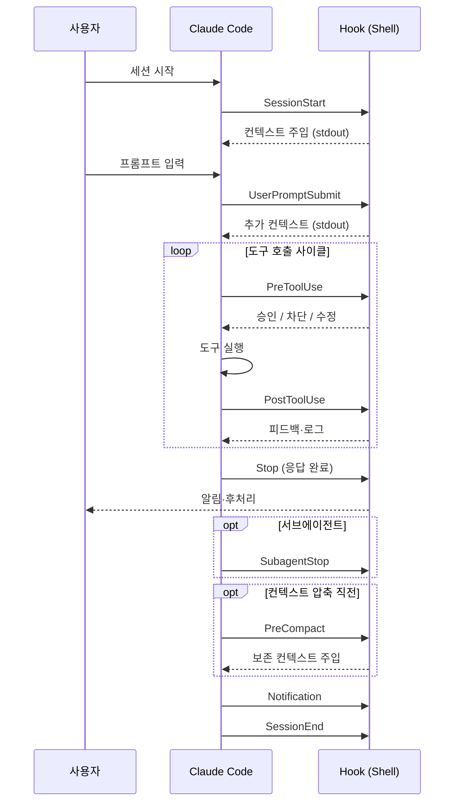
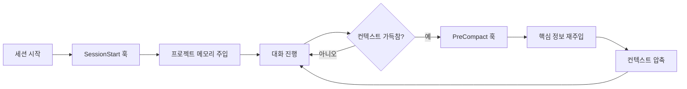
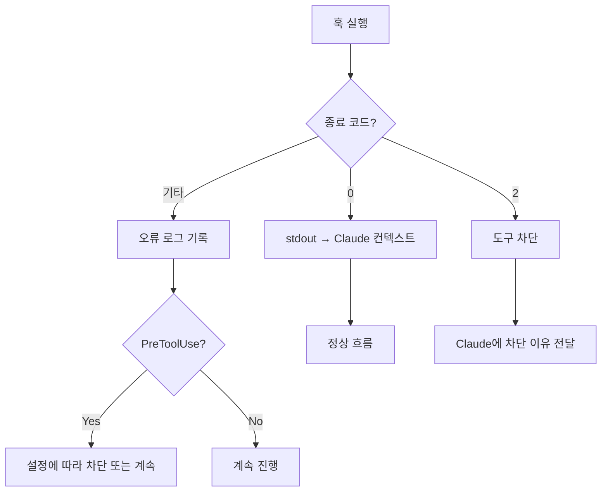

## 들어가며

Claude Code를 에이전틱 개발에 쓰다 보면 이런 순간들을 마주친다.

- `rm -rf` 명령을 실행하려는 에이전트를 사전에 차단하고 싶다
- 매 세션 시작마다 프로젝트 컨텍스트를 자동으로 주입하고 싶다
- 파일을 저장할 때마다 자동으로 포매터를 실행하고 싶다
- 컨텍스트 압축 직전에 핵심 정보를 보존하고 싶다

이 모든 것을 가능하게 하는 것이 **Claude Code Hooks**다.

스킬(Skills)이나 서브에이전트가 "Claude에게 무엇을 할지 지시하는" 방식이라면, Hooks는 **Claude의 라이프사이클 이벤트에 직접 개입하는** 방식이다. 스킬은 Claude(AI)가 실행하고, Hook은 클라이언트(쉘)가 실행한다. 이 차이가 핵심이다.

| | 스킬 (Skills) | 훅 (Hooks) |
|:--|:--|:--|
| 실행 주체 | Claude (AI) | 클라이언트 (쉘) |
| 실행 시점 | 명시적 호출 | 이벤트 자동 트리거 |
| 목적 | 워크플로우 지시 | 결정론적 차단·기록·트리거 |
| 실패 처리 | AI가 핸들링 | 프로세스 종료 코드로 제어 |

훅은 AI의 판단에 의존하지 않는다. 쉘 스크립트가 직접 실행되고, 종료 코드와 stdout으로 결과를 전달한다. 보안 가드레일, 자동 포맷팅, 감사 로그처럼 **예측 가능하고 결정론적이어야 하는 작업**에 적합하다.

---

## 라이프사이클 이벤트 전체 흐름

Claude Code는 세션 시작부터 종료까지 여러 라이프사이클 이벤트를 노출한다.[^hooks-docs] 각 이벤트마다 쉘 명령을 등록할 수 있고, 훅의 stdout 출력은 Claude의 컨텍스트로 전달된다.



### 이벤트 분류표

| 이벤트 | 타이밍 | 주요 활용 |
|:---|:---|:---|
| `SessionStart` | 세션 최초 시작 시 | 프로젝트 메모리 주입 |
| `UserPromptSubmit` | 사용자 프롬프트 제출 시 | 프롬프트 보강·필터링 |
| `PreToolUse` | 도구 실행 직전 | 보안 차단·승인·수정 |
| `PostToolUse` | 도구 실행 직후 | 포맷팅·로깅·후처리 |
| `Stop` | Claude 응답 완료 시 | 알림·후처리 |
| `SubagentStop` | 서브에이전트 완료 시 | 서브에이전트 결과 처리 |
| `PreCompact` | 컨텍스트 압축 직전 | 핵심 정보 보존 |
| `Notification` | Claude가 알림 생성 시 | 외부 알림 시스템 연동 |
| `SessionEnd` | 세션 종료 시 | 세션 로그 저장 |

---

## settings.json 구조

모든 훅은 `settings.json`에 등록한다.[^settings-docs] 전역 설정(`~/.claude/settings.json`)과 프로젝트 설정(`.claude/settings.json`) 두 곳이 있으며, **프로젝트 설정이 전역 설정보다 우선 적용**된다.

```json
{
  "hooks": {
    "PreToolUse": [
      {
        "matcher": "Bash",
        "hooks": [
          {
            "type": "command",
            "command": "~/.claude/hooks/bash-guard.sh"
          }
        ]
      }
    ],
    "PostToolUse": [
      {
        "matcher": "Write|Edit",
        "hooks": [
          {
            "type": "command",
            "command": "~/.claude/hooks/auto-format.sh"
          }
        ]
      }
    ],
    "SessionStart": [
      {
        "hooks": [
          {
            "type": "command",
            "command": "cat .claude/project-memory.md"
          }
        ]
      }
    ]
  }
}
```

### 주요 필드

- **`matcher`**: 이벤트 대상 도구를 필터링하는 정규식. `"Bash"`, `"Write|Edit"`, `".*"` 등. `PreToolUse`와 `PostToolUse`에서만 사용하며, 생략 시 모든 도구에 적용된다.
- **`type`**: 현재 `"command"`만 지원한다.
- **`command`**: 실행할 쉘 명령어. 인라인 명령어, 쉘 스크립트, Node.js·Python 스크립트 모두 가능하다.

### 환경 변수

훅 실행 시 Claude Code는 환경 변수를 제공한다.

```bash
CLAUDE_SESSION_ID          # 현재 세션 ID (모든 이벤트)
CLAUDE_TOOL_NAME           # 실행된 도구 이름 (PreToolUse, PostToolUse)
```

`PreToolUse`와 `PostToolUse`에서는 도구의 입출력 내용이 **stdin으로 JSON 형태로 전달**된다.

> `PostToolUse`에서 도구의 실행 결과는 stdin JSON의 `output` 필드로 전달된다. 훅의 stdout 출력은 Claude의 대화 컨텍스트에 추가된다.
{: .prompt-info }

---

## PreToolUse 심층 — 보안 가드의 핵심

`PreToolUse`는 Claude Code Hooks 중 가장 강력한 이벤트다. 도구 실행 전에 훅이 실행되어 **차단(block), 승인(approve), 또는 수정**을 결정할 수 있다.

### 차단 메커니즘

훅이 도구를 차단하려면 JSON을 stdout에 출력한다.

```bash
#!/bin/bash
# ~/.claude/hooks/bash-guard.sh

INPUT=$(cat)  # stdin에서 도구 입력 읽기
COMMAND=$(echo "$INPUT" | jq -r '.command // empty')

# rm -rf 패턴 차단
if echo "$COMMAND" | grep -qE 'rm\s+(-[a-zA-Z]*r[a-zA-Z]*\s+-[a-zA-Z]*f|-[a-zA-Z]*f[a-zA-Z]*\s+-[a-zA-Z]*r|--recursive.*--force|--force.*--recursive)'; then
  echo '{"decision": "block", "reason": "rm -rf 명령은 보안 정책으로 차단됩니다. 삭제할 파일을 명시적으로 지정하세요."}'
  exit 0
fi

# git push --force 차단
if echo "$COMMAND" | grep -qE 'git\s+push\s+.*--force|git\s+push\s+.*-f(\s|$)'; then
  echo '{"decision": "block", "reason": "git push --force는 원격 이력을 파괴할 수 있습니다. --force-with-lease 사용을 권장합니다."}'
  exit 0
fi

# 승인
echo '{"decision": "approve"}'
exit 0
```

### 응답 스키마

```json
{
  "decision": "block",
  "reason": "차단 이유 — Claude에게 전달되어 사용자에게 설명됨"
}
```

```json
{
  "decision": "approve"
}
```

> `reason` 필드는 Claude가 직접 읽는다. 왜 차단됐는지 사용자에게 자연스럽게 설명하게 되므로, 명확하고 구체적으로 작성하는 것이 좋다.
{: .prompt-tip }

### 파일 보호 룰

```bash
#!/bin/bash
# ~/.claude/hooks/file-guard.sh

INPUT=$(cat)
FILE=$(echo "$INPUT" | jq -r '.file_path // .path // empty')

if [ -z "$FILE" ]; then
  echo '{"decision": "approve"}'
  exit 0
fi

PROTECTED_PATTERNS=(
  '\.env$'
  '\.env\.'
  'secrets/'
  'credentials\.'
  '_key\.'
  '\.pem$'
  '\.p12$'
  '\.pfx$'
)

for pattern in "${PROTECTED_PATTERNS[@]}"; do
  if echo "$FILE" | grep -qE "$pattern"; then
    echo "{\"decision\": \"block\", \"reason\": \"보호된 파일입니다: $FILE — 민감한 파일은 직접 수정하세요.\"}"
    exit 0
  fi
done

echo '{"decision": "approve"}'
exit 0
```

### Matcher 정규식 패턴

여러 `matcher`를 독립적으로 등록할 수 있다. 동일 도구에 여러 matcher가 매칭되면 **모두 순차 실행**되며, 하나라도 차단하면 도구 실행이 중단된다.

```json
{
  "hooks": {
    "PreToolUse": [
      {
        "matcher": "Bash",
        "hooks": [{ "type": "command", "command": "~/.claude/hooks/bash-guard.sh" }]
      },
      {
        "matcher": "Write|Edit|MultiEdit",
        "hooks": [{ "type": "command", "command": "~/.claude/hooks/file-guard.sh" }]
      },
      {
        "matcher": ".*",
        "hooks": [{ "type": "command", "command": "~/.claude/hooks/audit-log.sh" }]
      }
    ]
  }
}
```

| 패턴 예시 | 매칭 도구 |
|:---|:---|
| `"Bash"` | Bash 도구만 |
| `"Write\|Edit"` | Write 또는 Edit 도구 |
| `"Write\|Edit\|MultiEdit"` | 파일 수정 관련 도구 전체 |
| `".*"` | 모든 도구 |

---

## PostToolUse — 포맷팅·로깅 자동화

`PostToolUse`는 도구 실행 후에 자동으로 후처리를 수행한다. AI의 판단 없이 쉘 스크립트가 직접 실행되므로 **일관성이 보장**된다.

### 자동 포맷팅

```bash
#!/bin/bash
# ~/.claude/hooks/auto-format.sh

INPUT=$(cat)
FILE=$(echo "$INPUT" | jq -r '.file_path // empty')

if [ -z "$FILE" ] || [ ! -f "$FILE" ]; then exit 0; fi

# JS/TS 파일: Prettier 적용
if echo "$FILE" | grep -qE '\.(js|ts|jsx|tsx|json|css|md)$'; then
  npx prettier --write "$FILE" 2>/dev/null || true
fi

# Python 파일: Black 적용
if echo "$FILE" | grep -qE '\.py$'; then
  python -m black "$FILE" 2>/dev/null || true
fi

# Ruby 파일: RuboCop 적용
if echo "$FILE" | grep -qE '\.rb$'; then
  bundle exec rubocop --autocorrect "$FILE" 2>/dev/null || true
fi

exit 0
```

### ESLint 자동 수정

```bash
#!/bin/bash
# ~/.claude/hooks/auto-lint.sh

INPUT=$(cat)
FILE=$(echo "$INPUT" | jq -r '.file_path // empty')

if [ -z "$FILE" ]; then exit 0; fi

if echo "$FILE" | grep -qE '\.(js|ts|jsx|tsx)$'; then
  npx eslint --fix "$FILE" 2>/dev/null || true
fi

exit 0
```

### 감사 로그 (모든 도구 호출 기록)

```bash
#!/bin/bash
# ~/.claude/hooks/audit-log.sh

INPUT=$(cat)
TOOL=$(echo "$INPUT" | jq -r '.tool_name // "unknown"')
TIMESTAMP=$(date -u +"%Y-%m-%dT%H:%M:%SZ")
LOG_DIR="${HOME}/.claude/audit"

mkdir -p "$LOG_DIR"
echo "{\"timestamp\": \"$TIMESTAMP\", \"tool\": \"$TOOL\", \"session\": \"${CLAUDE_SESSION_ID:-unknown}\"}" \
  >> "$LOG_DIR/tools.jsonl"

exit 0
```

> `PostToolUse` 훅은 실패해도 도구 실행 결과 자체에는 영향을 주지 않는다. 포맷팅 실패가 코드 저장을 막지 않으므로, 훅 내부 오류를 `|| true`로 처리해두는 것이 일반적이다.
{: .prompt-warning }

---

## SessionStart · PreCompact — 메모리와 컨텍스트 보존

### SessionStart: 프로젝트 메모리 주입

`SessionStart` 훅의 stdout 출력은 세션 초기 컨텍스트로 Claude에게 전달된다. 이를 활용하면 매 세션마다 별도 지시 없이도 프로젝트 규칙과 상태를 자동으로 주입할 수 있다.

```bash
#!/bin/bash
# ~/.claude/hooks/session-start.sh

# 프로젝트 메모리 주입
if [ -f ".omc/project-memory.md" ]; then
  echo "=== 프로젝트 메모리 ==="
  cat .omc/project-memory.md
  echo ""
fi

# 현재 브랜치와 최근 커밋 정보
BRANCH=$(git branch --show-current 2>/dev/null)
LAST_COMMIT=$(git log -1 --oneline 2>/dev/null)
if [ -n "$BRANCH" ]; then
  echo "현재 브랜치: $BRANCH"
  echo "최근 커밋: $LAST_COMMIT"
fi

exit 0
```

### oh-my-claudecode의 system-reminder 주입 패턴

oh-my-claudecode(OMC)는 `SessionStart` 훅을 활용해 `<system-reminder>` 태그 블록을 주입한다. Claude Code는 이 형태의 XML 태그를 시스템 메시지로 처리해 Claude의 초기 컨텍스트에 포함시킨다.

```bash
# OMC SessionStart 훅 출력 예시
<system-reminder>
<project-memory-context>

[PROJECT MEMORY]
- Ruby | pkg:bundler

</project-memory-context>
</system-reminder>
```

이 덕분에 매 세션마다 별도 지시 없이도 프로젝트 규칙, 기술 스택, 팀 컨벤션이 자동으로 주입된다. OMC를 사용하면서 대화 초반에 보이는 `[PROJECT MEMORY]` 블록이 바로 이 훅의 결과다.

### PreCompact: 컨텍스트 압축 직전 핵심 정보 보존

컨텍스트 창이 가득 차면 Claude Code는 오래된 대화를 압축한다. `PreCompact`는 이 직전에 실행되어 **압축 후에도 유지할 정보를 Claude에게 다시 주입**할 수 있다.

```bash
#!/bin/bash
# ~/.claude/hooks/pre-compact.sh

# 현재 작업 중인 태스크 상태 보존
if [ -f ".omc/state/current-task.md" ]; then
  echo "=== [압축 전 보존] 현재 태스크 상태 ==="
  cat .omc/state/current-task.md
  echo ""
fi

# 핵심 아키텍처 결정 사항
if [ -f ".omc/decisions.md" ]; then
  echo "=== [압축 전 보존] 최근 아키텍처 결정 ==="
  tail -30 .omc/decisions.md
fi

# 프로젝트 메모리 재주입
if [ -f ".omc/project-memory.md" ]; then
  echo "=== [압축 전 보존] 프로젝트 메모리 ==="
  cat .omc/project-memory.md
fi

exit 0
```

OMC의 `PreCompact` 훅은 `.omc/project-memory.json`의 내용을 압축 직전에 재주입해, 압축 후에도 핵심 프로젝트 컨텍스트가 새 컨텍스트 창의 앞부분에 남아있게 한다. 장기 세션에서도 Claude가 초반의 컨텍스트를 "잊지 않게" 하는 핵심 메커니즘이다.



---

## 디버깅

### 종료 코드 의미

| 종료 코드 | 의미 |
|:---|:---|
| `0` | 정상 종료. stdout 내용을 Claude에게 전달 |
| `2` | 명시적 차단 신호 (주로 `PreToolUse`에서 사용) |
| 기타 비零 | 오류. stderr 내용이 로그에 기록됨 |

> `PreToolUse`에서 도구를 차단할 때는 종료 코드 `2`보다 `{"decision": "block", "reason": "..."}` JSON 응답과 함께 `exit 0`을 사용하는 방식이 권장된다. 차단 이유를 Claude에게 명확히 전달할 수 있기 때문이다.
{: .prompt-tip }

### stderr 처리

훅의 stderr 출력은 Claude Code 로그에만 기록되고 Claude의 컨텍스트에는 포함되지 않는다. 디버깅 정보를 stderr에 출력하면 컨텍스트 오염 없이 확인할 수 있다.

```bash
#!/bin/bash
echo "DEBUG: 훅 실행됨, 도구: $CLAUDE_TOOL_NAME" >&2   # stderr → 로그만
echo "DEBUG: stdin: $(cat /dev/stdin | head -c 200)" >&2
echo '{"decision": "approve"}'                          # stdout → Claude에게 전달
exit 0
```

### 훅 실패 시 절차



1. **로그 확인**: `~/.claude/logs/` 디렉터리의 최신 로그 파일을 열어 stderr 출력 확인
2. **stderr 추가**: 훅 스크립트에 `echo "DEBUG: ..." >&2` 추가 후 재실행
3. **수동 테스트**: 터미널에서 훅 스크립트를 직접 실행해 동작 확인
4. **JSON 유효성 검사**: stdout 출력이 유효한 JSON인지 확인 (`echo '...' | jq .`)
5. **권한 확인**: `chmod +x` 로 실행 권한 부여 여부 확인

---

## 전역 보안 설정 예시

실전에서 바로 사용할 수 있는 전역 훅 설정의 예시다.

```json
{
  "hooks": {
    "PreToolUse": [
      {
        "matcher": "Bash",
        "hooks": [
          {
            "type": "command",
            "command": "~/.claude/hooks/bash-guard.sh"
          }
        ]
      },
      {
        "matcher": "Write|Edit|MultiEdit",
        "hooks": [
          {
            "type": "command",
            "command": "~/.claude/hooks/file-guard.sh"
          }
        ]
      },
      {
        "matcher": ".*",
        "hooks": [
          {
            "type": "command",
            "command": "~/.claude/hooks/audit-log.sh"
          }
        ]
      }
    ],
    "PostToolUse": [
      {
        "matcher": "Write|Edit|MultiEdit",
        "hooks": [
          {
            "type": "command",
            "command": "~/.claude/hooks/auto-format.sh"
          }
        ]
      }
    ],
    "SessionStart": [
      {
        "hooks": [
          {
            "type": "command",
            "command": "~/.claude/hooks/session-start.sh"
          }
        ]
      }
    ],
    "PreCompact": [
      {
        "hooks": [
          {
            "type": "command",
            "command": "~/.claude/hooks/pre-compact.sh"
          }
        ]
      }
    ],
    "Stop": [
      {
        "hooks": [
          {
            "type": "command",
            "command": "~/.claude/hooks/notify.sh"
          }
        ]
      }
    ]
  }
}
```

`~/.claude/hooks/notify.sh` 예시 — `Stop` 이벤트로 macOS 알림 전송:

```bash
#!/bin/bash
osascript -e 'display notification "Claude 응답 완료" with title "Claude Code"' 2>/dev/null || true
exit 0
```

---

## 마치며

Claude Code Hooks는 AI 에이전트를 **예측 가능하고 안전하게** 운영하기 위한 기반이다. 스킬이 "무엇을 할지" 지시한다면, 훅은 "어떤 조건에서 제어할지"를 결정한다.

핵심 요약:

- **`PreToolUse`**: 결정론적 보안 가드. `{"decision": "block", "reason": "..."}` JSON으로 차단 이유를 Claude에게 전달
- **`PostToolUse`**: 부작용 없는 자동화. 포매터, 린터, 감사 로그를 AI 판단 없이 실행
- **`SessionStart`**: 매 세션 컨텍스트 일관성 보장. 프로젝트 메모리와 규칙 자동 주입
- **`PreCompact`**: 장기 세션에서도 핵심 맥락 유지. 압축 직전 재주입
- **`Stop`**: 응답 완료 후 알림·후처리
- **`settings.json`**: 프로젝트 설정이 전역 설정보다 우선

훅을 잘 설계하면 AI 에이전트가 범하기 쉬운 실수들을 사전에 차단하면서도, 반복 작업을 자동화해 개발자의 실질적 생산성을 높일 수 있다. AI의 창의성은 살리되, 결정론적으로 제어해야 하는 영역은 훅으로 확보하는 것이 핵심이다.

---

## 참고

[^hooks-docs]: Anthropic, *Claude Code — Hooks*, 공식 문서. <https://docs.anthropic.com/en/docs/claude-code/hooks>

[^settings-docs]: Anthropic, *Claude Code — Settings*, 공식 문서. <https://docs.anthropic.com/en/docs/claude-code/settings>
