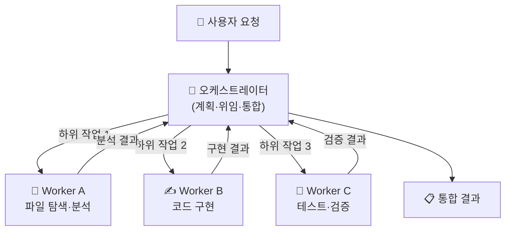
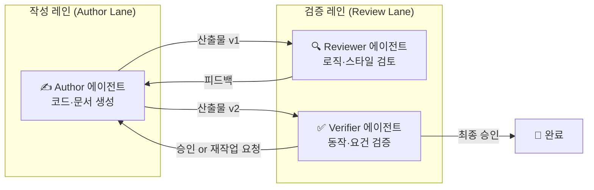
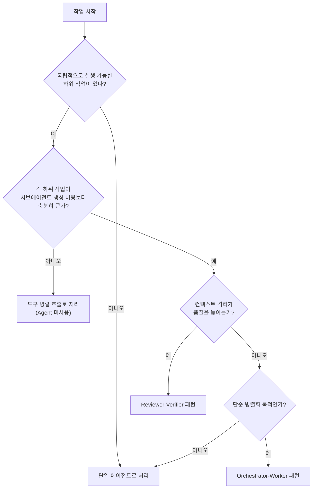

## 들어가며 — 공식 문서가 채우지 못한 빈자리

Claude Code의 `Agent` 도구는 강력합니다. 한 줄 호출로 독립적인 서브에이전트를 생성하고, 컨텍스트를 격리하며, 병렬로 작업을 처리할 수 있습니다. 그런데 Anthropic의 공식 문서를 읽고 나면 이런 의문이 남습니다.

> "알겠어, 서브에이전트를 쓰면 좋다는 거잖아. 근데 **언제** 써야 하고, **어떻게** 쪼개야 하지?"

Anthropic의 ["Building Effective Agents"](https://www.anthropic.com/research/building-effective-agents) 블로그 포스트는 에이전트 패턴의 골격을 잘 정리해두었지만, "이 상황에서는 이렇게 쪼개라"는 실용적 분리 기준은 비어 있습니다. 이 포스트는 그 빈자리를 채우는 **실전 판단 가이드**입니다.

> **이 글에서 다루는 것**: 서브에이전트 분리의 5가지 휴리스틱, Orchestrator-Worker 패턴, Reviewer-Verifier 패턴, 그리고 오히려 손해가 되는 안티패턴.
{: .prompt-info }

관련 배경 지식은 이 블로그의 다른 포스트에서 보강할 수 있습니다:
- [AI 병렬 작업 구축 가이드](/posts/ai-parallel-workers-guide/) — 병렬 AI 시스템 아키텍처 전반
- [Claude Code 스킬 작성 완전 가이드](/posts/claude-code-skills-guide/) — 스킬 단위 자동화 설계
- [Claude Code vs Codex 방법론 비교](/posts/claude-code-vs-codex-ai/) — 에이전트 철학 비교

---

## 📦 서브에이전트 기초: Claude Code의 Agent 도구 이해

### Agent 도구가 하는 일

Claude Code의 `Agent` 도구를 호출하면 새로운 Claude 인스턴스가 **독립적인 컨텍스트 창**을 가지고 실행됩니다. 이 인스턴스는:

- 부모 에이전트의 대화 히스토리를 **공유하지 않습니다**
- 파일 시스템과 셸 도구에 독립적으로 접근합니다
- 작업이 완료되면 결과를 **단일 메시지로** 부모에게 돌려줍니다

```
Agent({
  description: "서브에이전트 작업 설명",
  subagent_type: "executor",   // 선택: 전문 에이전트 타입
  prompt: "수행할 작업 지시"
})
```

### 핵심 특성 3가지

| 특성 | 설명 | 실무 의미 |
|------|------|-----------|
| **컨텍스트 격리** | 부모와 완전히 분리된 컨텍스트 | 오염·혼선 없이 독립 작업 가능 |
| **병렬 실행** | 여러 에이전트를 동시에 실행 가능 | 독립 작업을 N배 속도로 처리 |
| **비용 투명성** | 각 에이전트가 별도 토큰 소비 | 쪼갤수록 비용도 함께 증가 |

> **주의**: 서브에이전트는 강력하지만, 잘못 쪼개면 오버헤드가 더 큽니다. 다음 섹션의 휴리스틱이 핵심입니다.
{: .prompt-warning }

---

## 🔍 언제 쪼갤 것인가 — 5가지 분리 휴리스틱

Anthropic의 Building Effective Agents 포스트는 에이전트 패턴을 분류하면서 이렇게 밝힙니다[^bea]:

> "Workflows are systems where LLMs and tools are orchestrated through predefined code paths. Agents, on the other hand, are systems where LLMs dynamically direct their own processes and tool usage."

즉, **에이전트 분리의 전제조건은 각 단위가 독립적으로 방향을 결정할 수 있는가**입니다. 이 기준을 실무에 적용할 수 있는 5가지 휴리스틱으로 정리했습니다.

### 휴리스틱 1: 컨텍스트 오염 위험이 있을 때

한 작업이 누적한 정보가 다른 작업의 판단을 흐릴 때입니다.

**분리해야 하는 신호:**
- 에이전트가 "이전에 A라고 했으니 B로 결론 내야 한다"는 식의 추론을 한다
- 코드 리뷰어가 자신이 방금 작성한 코드를 검토한다
- 탐색 단계의 중간 결과물이 구현 판단에 영향을 미친다

```bash
# 나쁜 예: 같은 컨텍스트에서 작성 후 리뷰
claude "auth.ts 파일을 작성하고, 작성한 코드를 리뷰해줘"

# 좋은 예: 컨텍스트 격리
# 1단계: 작성 에이전트
# 2단계: 별도 리뷰 에이전트 (작성 과정을 모름)
```

### 휴리스틱 2: 병렬화 가능한 독립 작업들

서로 의존성이 없는 작업들은 직렬 실행할 이유가 없습니다.

**분리해야 하는 신호:**
- 작업 A의 결과가 없어도 작업 B를 시작할 수 있다
- 3개 이상의 파일을 각기 다른 관점으로 분석해야 한다
- 같은 데이터에 대해 독립적인 리서치/분석을 원한다

```
# 독립 작업 → 병렬 실행 적합
분석 대상: [auth.ts, api.ts, database.ts]
각 파일의 보안 취약점을 동시에 분석 → 3개 서브에이전트
```

### 휴리스틱 3: 전문 역할 분리가 품질을 높일 때

같은 모델이라도 **역할을 다르게 주입**하면 결과가 다릅니다. 서로 다른 페르소나가 충돌해야 가치가 생기는 경우입니다.

**분리해야 하는 신호:**
- 설계자 관점과 구현자 관점이 충돌해야 좋은 결과가 나온다
- 공격자 시각(적대적 리뷰)이 필요하다
- 보안, 성능, 유지보수성을 각각 전문적으로 검토해야 한다

### 휴리스틱 4: 컨텍스트 윈도우 과부하 위험

대규모 코드베이스 분석, 긴 문서 처리, 대형 PR 리뷰 등 단일 컨텍스트에 담기 어려운 작업입니다.

**분리해야 하는 신호:**
- 작업에 필요한 파일 수가 10개를 넘는다
- 대화 히스토리가 이미 길어서 초기 지시가 희석될 우려가 있다
- 전체 작업의 중간 결과물이 새 작업의 컨텍스트를 차지한다

> **실용 임계값**: 파일 기준 5–8개, 코드 기준 ~2000줄을 넘어서면 서브에이전트 분리를 고려하세요.
{: .prompt-tip }

### 휴리스틱 5: 실패 격리와 재시도 효율

한 단계의 실패가 전체 작업을 처음부터 다시 해야 하는 상황은 비효율적입니다.

**분리해야 하는 신호:**
- 특정 단계(예: 빌드)가 자주 실패한다
- 실패한 단계만 재실행해도 충분하다
- 각 단계의 결과를 체크포인트로 저장하고 싶다

---

## 🏗️ Orchestrator-Worker 패턴

에이전트 분리의 가장 대표적인 패턴입니다. Anthropic의 Building Effective Agents 포스트에서 다음과 같이 정의합니다[^bea]:

> "In the orchestrator-workers workflow, a central LLM dynamically breaks down tasks, delegates them to worker agents, and synthesizes their results."

### 구조



### 오케스트레이터의 역할

오케스트레이터는 **계획·위임·통합** 세 가지 역할만 합니다. 직접 파일을 편집하거나 테스트를 돌리지 않습니다.

```
오케스트레이터 프롬프트 구조:
1. 요청 분해: "이 작업을 독립적인 하위 작업 N개로 나눠라"
2. 위임: Agent() 호출로 각 Worker에게 명확한 지시 전달
3. 통합: 모든 결과를 수신 후 종합 판단
```

### Claude Code에서의 구현 예시

```python
# 오케스트레이터가 병렬로 3개 Worker 실행
results = await Promise.all([
    Agent({
        description: "security analysis",
        subagent_type: "security-reviewer",
        prompt: f"다음 파일의 보안 취약점을 분석하세요:\n{code}"
    }),
    Agent({
        description: "performance analysis",
        subagent_type: "architect",
        prompt: f"다음 코드의 성능 병목을 찾으세요:\n{code}"
    }),
    Agent({
        description: "test coverage analysis",
        subagent_type: "test-engineer",
        prompt: f"다음 코드의 테스트 커버리지를 평가하세요:\n{code}"
    })
])
# 오케스트레이터: 세 결과를 통합해 최종 리포트 작성
```

### 언제 이 패턴을 쓸까

| 상황 | 적합도 |
|------|--------|
| 독립적인 파일 N개를 동시에 분석 | ✅ 최적 |
| 대형 리팩터링의 단계별 실행 | ✅ 적합 |
| 단일 파일 수정 | ❌ 과잉 |
| 순차 의존성이 강한 작업 | ❌ 부적합 |

---

## 🔄 Reviewer-Verifier 패턴

CLAUDE.md 및 oh-my-claudecode 가이드에서 강조하는 원칙이 있습니다[^omc]:

> "Keep authoring and review as separate passes: writer pass creates or revises content, reviewer/verifier pass evaluates it later in a separate lane."
> "Never self-approve in the same active context."

이 원칙을 구조화한 것이 Reviewer-Verifier 패턴입니다.

### 구조



### 왜 별도 컨텍스트가 필요한가

같은 에이전트가 코드를 작성하고 리뷰하면 두 가지 편향이 생깁니다:

1. **확증 편향**: 자신이 작성한 코드를 "이렇게 의도했으니 맞다"고 해석
2. **컨텍스트 오염**: 작성 과정의 고민·선택이 리뷰 판단을 흐림

Reviewer 에이전트는 **작성 과정을 전혀 모릅니다**. 오직 산출물만 보고 독립적으로 판단합니다.

### Verifier와 Reviewer의 차이

| 역할 | 초점 | 질문 |
|------|------|------|
| **Reviewer** | 코드 품질, 로직, 스타일 | "이 코드가 잘 작성되었나?" |
| **Verifier** | 요건 충족, 동작 보증 | "이 코드가 의도한 대로 동작하나?" |

```bash
# 실전: oh-my-claudecode의 verifier 에이전트 활용
Agent({
    subagent_type: "oh-my-claudecode:verifier",
    description: "구현 완료 검증",
    prompt: "다음 변경사항이 요건을 충족하는지 검증하세요. 테스트 실행 포함."
})
```

### 패턴 적용 범위

이 패턴은 코드뿐 아니라 **블로그 포스트 작성, 기술 문서, PR 설명** 등 "생성 + 검토"가 필요한 모든 작업에 적용됩니다.

---

## ⚠️ 안티패턴: 쪼개면 오히려 손해인 경우

서브에이전트가 항상 정답은 아닙니다. 다음 상황에서는 쪼개지 않는 것이 낫습니다.

### 안티패턴 1: 과잉 오케스트레이션

```
나쁜 예:
오케스트레이터
 └── Worker 1: 파일 1개 읽기 (10줄)
 └── Worker 2: 파일 1개 읽기 (10줄)
 └── Worker 3: 파일 1개 읽기 (10줄)
```

**파일 3개 읽기**는 단일 에이전트가 `Read` 도구를 병렬 호출하는 것이 훨씬 빠릅니다. 서브에이전트 생성 오버헤드(네트워크, 컨텍스트 초기화)가 작업 자체보다 클 때는 분리하지 마세요.

> **판단 기준**: 서브에이전트 생성 비용 > 작업 비용이면 하지 말 것.
{: .prompt-tip }

### 안티패턴 2: 촘촘한 의존성 무시

```
순차 의존성이 강한 경우:
A → B → C → D (각 단계가 이전 결과에 완전 의존)

이걸 병렬로 실행하면:
A, B, C, D 동시 실행 → B, C, D는 의미 있는 입력 없이 실행
```

단계별 의존성이 강하다면 파이프라인은 순차적으로 유지하되, 각 단계 내부를 병렬화하세요.

### 안티패턴 3: 컨텍스트 파편화

서브에이전트에게 "전체 시스템을 이해하고 이 파일만 수정해"라고 지시하는 경우입니다. 서브에이전트는 자신이 받은 프롬프트의 정보만 알고 있습니다. **컨텍스트 격리는 장점이자 제약**입니다.

```
나쁜 지시:
Agent({ prompt: "이 프로젝트의 패턴을 따라 UserService에 메서드 추가해줘" })
# 서브에이전트는 '이 프로젝트의 패턴'을 모름

좋은 지시:
Agent({ prompt: f"""
  이 프로젝트에서 사용하는 패턴:
  - 에러 처리: Result<T, E> 패턴
  - 로깅: getLogger() 사용
  - DI: constructor injection
  
  위 패턴을 따라 UserService에 다음 메서드를 추가하세요: ...
""" })
```

### 안티패턴 4: 검증 없는 자동 신뢰

서브에이전트의 결과를 오케스트레이터가 그대로 신뢰하는 경우입니다. 에이전트는 "의도한 것"을 보고하지, "실제 한 것"을 보장하지 않습니다.

```
오케스트레이터 필수 검증 항목:
- 서브에이전트가 "완료했다"고 해도 직접 확인
- 파일이 실제로 변경되었는지 git status 확인
- 테스트가 통과했는지 결과 직접 검토
```

---

## ✅ 실전 판단 체크리스트

### 서브에이전트 분리 결정 트리



### 패턴 선택 요약표

| 상황 | 권장 패턴 |
|------|-----------|
| 독립적인 파일/모듈 N개 동시 분석 | Orchestrator-Worker (병렬) |
| 단계별 의존성이 있는 복잡한 구현 | Orchestrator-Worker (순차) |
| 작성 후 검토가 필요한 모든 작업 | Reviewer-Verifier |
| 파일 3개 미만 단순 읽기·수정 | 단일 에이전트 도구 병렬 호출 |
| 실패 격리와 체크포인트가 필요 | 단계별 Worker 분리 |
| 한 컨텍스트에서 자기 리뷰 | ❌ 안티패턴 — 반드시 분리 |

### 분리 전 확인 체크리스트

- [ ] 각 서브에이전트에게 필요한 컨텍스트를 명시적으로 전달할 수 있나?
- [ ] 하위 작업들이 진짜 독립적인가 (숨겨진 의존성 없는가)?
- [ ] 서브에이전트 결과를 어떻게 검증할 것인가?
- [ ] 분리로 얻는 이득(병렬화, 격리)이 오버헤드보다 큰가?
- [ ] 실패 시 재시도 전략이 있는가?

---

## 마치며

서브에이전트 분리의 핵심 원칙을 한 문장으로 압축하면:

> **"독립적으로 판단할 수 있을 때, 그리고 격리가 품질을 높일 때만 쪼갠다."**

공식 문서가 "에이전트를 쓰면 좋다"는 방향을 제시한다면, 실무에서 필요한 건 "이 상황에서는 쪼개지 말아야 한다"는 판단력입니다. 5가지 휴리스틱과 4가지 안티패턴을 기준으로 삼으면, 불필요한 복잡성 없이 에이전트의 힘을 제대로 활용할 수 있습니다.

병렬 AI 시스템 전반에 대해서는 [AI 병렬 작업 구축 가이드](/posts/ai-parallel-workers-guide/)를, 스킬 기반 자동화 패턴은 [Claude Code 스킬 작성 완전 가이드](/posts/claude-code-skills-guide/)를 참고하세요.

---

## 출처

[^bea]: Anthropic. (2024, December). [Building Effective Agents](https://www.anthropic.com/research/building-effective-agents). *Anthropic Research Blog*. — 에이전트 패턴 분류(Orchestrator-Workers, Evaluator-Optimizer 등) 및 워크플로우 vs. 에이전트 구분의 공식 정의 출처. **A등급** (Anthropic 공식 발행물).

[^omc]: oh-my-claudecode. (2025). `CLAUDE.md` — Global Execution Protocols. — "Keep authoring and review as separate passes", "Never self-approve in the same active context" 원칙 출처. **A등급** (본 환경의 직접 적용 지침).

### 추가 참고 자료

- [Claude Code 공식 문서 — Subagents](https://docs.anthropic.com/en/docs/claude-code/sub-agents) — Claude Code의 `Agent` 도구 파라미터와 동작 명세. **B등급**
- [Anthropic Cookbook — Multi-Agent Orchestration](https://github.com/anthropics/anthropic-cookbook) — 오케스트레이터-워커 패턴 코드 예제 모음. **B등급**
