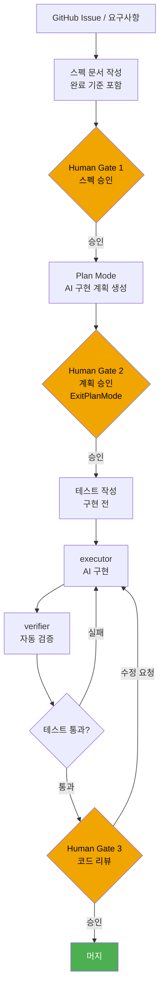

## 들어가며

[이전 글](/posts/vibe-coding-fatigue/)에서 바이브 코딩 피로(Vibe Coding Fatigue)를 진단했다. 피로의 원인은 AI 도구가 아니라 **스펙 없이 AI에게 일을 맡기는 방식** 그 자체에 있다는 결론이었다.

이 글은 그 다음 질문에 답한다: 피로를 줄이면서도 AI 코딩의 이점을 유지하는 방법은 무엇인가?

2026년 현재 실무에서 검증된 답은 **Spec-Driven Development(SDD)** 로 수렴하고 있다. 기계가 읽을 수 있는 스펙을 중심에 놓고, AI 에이전트는 그 스펙을 실행하는 역할에 집중시키는 방식이다. 이 글은 이론 소개가 아니라, Claude Code와 oh-my-claudecode(OMC) 워크플로우에서 실제로 동작하는 패턴을 정리한 실무 가이드다.

---

## 1. Vibe Coding이 전제한 조건

### Karpathy의 원래 맥락

2025년 2월 Andrej Karpathy가 X에 올린 vibe coding 소개글[^karpathy]은 빠르게 확산됐다. 그러나 그 글의 맥락을 함께 읽은 사람은 많지 않다. LLM에 완전히 몸을 맡기고 코드의 존재 자체를 잊는다는 묘사는 흥미롭지만, 그것이 적용되는 전제 조건이 있다. 바로 **버려도 되는 코드(throwaway code)** 또는 품질보다 속도가 절대적으로 우선되는 상황이다.

[^karpathy]: Andrej Karpathy, X post, February 2025. <https://x.com/karpathy/status/1886192184808149289>

프로덕션 서비스, 팀 공유 코드베이스, 장기 유지보수가 필요한 프로젝트에서 이 조건 없이 vibe coding을 그대로 적용하면 [이전 글에서 다룬 피로 패턴](/posts/vibe-coding-fatigue/)이 반드시 등장한다.

### 구조적 한계 세 가지

vibe coding이 반복적 문제를 일으키는 이유는 방식의 문제가 아니라 **적용 범위의 문제**다.

- **스펙 없음** — 무엇을 만들어야 하는지 기준이 없으므로, AI가 만든 결과물이 올바른지 판단할 근거가 없다.
- **리뷰 기준 없음** — 스펙이 없으면 코드 리뷰는 작동 여부 확인에 그친다. 올바름 여부는 묻기 어렵다.
- **회귀 감지 불가** — 다음번 AI 변경이 이전 의도를 깨뜨려도 알아챌 방법이 없다.

이 세 가지를 해결하는 구조가 SDD다.

---

## 2. Spec-Driven Development란

### 정의

Spec-Driven Development는 **기계가 읽을 수 있는 스펙(machine-readable spec)을 진실의 원천(source of truth)으로 삼고, AI 에이전트와 개발자 모두 그 스펙을 기준으로 움직이는 개발 방식**이다.

여기서 기계가 읽을 수 있다는 말은 형식 요건이 엄격하다는 뜻이 아니다. YAML이든 JSON Schema든 Markdown이든, **AI 에이전트가 파싱하고 실행 계획에 반영할 수 있는 형식**이면 충분하다. 잘 구조화된 GitHub Issue 본문도 훌륭한 스펙이 된다.

### Vibe vs Spec 비교표

| 항목 | Vibe Coding | Spec-Driven Development |
|------|------------|------------------------|
| 시작점 | 아이디어·프롬프트 | 문서화된 스펙 |
| AI 입력 | 자연어 의도 | 스펙 + 컨텍스트 고정 |
| 완료 기준 | 작동하면 OK | 스펙 통과 + 테스트 통과 |
| 리뷰 기준 | 코드 자체 | 스펙 대비 코드 |
| 변경 영향 | 추적 어려움 | 스펙 이력으로 추적 |
| 최적 상황 | 프로토타입, throwaway | 프로덕션, 팀 공유 코드 |

> **핵심 전환**: vibe coding에서 AI는 의도를 추측한다. SDD에서 AI는 스펙을 실행한다.
{: .prompt-info }

---

## 3. Claude Code에서의 SDD 실천 흐름

### 전체 사이클



### 컨텍스트 고정: CLAUDE.md / AGENTS.md

SDD의 핵심 인프라는 **컨텍스트 고정**이다. AI 에이전트가 세션마다 같은 전제에서 시작하려면, 그 전제가 파일로 존재해야 한다.

- **`CLAUDE.md`**: 프로젝트 컨벤션, 금지 패턴, 변경 범위 제한, 코드 품질 규칙. AI가 매 세션마다 읽는 헌법이다.
- **`AGENTS.md`**: 에이전트 역할 분담, 워크플로우 순서, 검증 기준. 멀티에이전트 조율 시 특히 중요하다.

이 파일들은 프롬프트가 아니다. 한 번 잘 작성해두면 에이전트가 매번 같은 맥락에서 시작한다.

> 프로젝트 루트에 `CLAUDE.md`가 없다면 지금 당장 만드는 것이 SDD 전환의 첫 번째 단계다.
{: .prompt-tip }

### Plan Mode — 실행 전 계획 승인

Claude Code의 Plan Mode는 SDD의 핵심 도구다. AI가 실행 계획을 먼저 제시하고, 사람이 승인한 후에야 실행이 시작된다.

```
사용자 → AI: "이 기능을 구현해"
AI → 사용자: [Plan Mode] "다음 순서로 진행하겠습니다: ..."
사용자 → AI: ExitPlanMode  ← 승인
AI: 실행 시작
```

vibe coding에서 AI는 즉시 실행한다. SDD에서 AI는 계획을 제시하고 승인을 기다린다. 이 단순한 차이가 범위 일탈과 예상치 못한 회귀를 크게 줄인다.

### 테스트 우선 (Test-First)

스펙이 있으면 구현 전에 테스트를 작성할 수 있다. 테스트 우선 방식의 실질적 이점은 세 가지다.

1. 스펙의 모호한 부분이 테스트 작성 시점에 드러난다.
2. AI 구현의 완료 기준이 코드로 표현된다.
3. 다음 변경에서 회귀가 자동으로 감지된다.

`verifier` 에이전트는 구현 후 테스트 통과 여부를 확인하고, 실패하면 `executor`에게 재작업을 지시한다. 이 루프가 자동화되면 사람은 최종 게이트에만 집중하면 된다.

---

## 4. 휴먼 게이트 — 사람이 반드시 있어야 할 세 지점

### 게이트 구조


게이트는 AI를 불신해서 두는 것이 아니다. **책임과 의도를 명확히 하기 위해** 둔다. AI 에이전트는 스펙을 실행하는 데 탁월하지만, 스펙이 올바른지 판단하는 것은 여전히 사람의 몫이다.

### Gate 1: 스펙 승인

구현을 시작하기 전, 스펙 문서를 사람이 검토한다. 확인 항목:

- 완료 기준(Acceptance Criteria)이 명확한가?
- 범위가 이 이슈 하나에 집중되어 있는가?
- 모호한 표현이 없는가?

이 게이트를 건너뛰면 AI가 올바른 방식으로 틀린 일을 할 위험이 생긴다.

### Gate 2: 계획 승인 (ExitPlanMode)

AI가 Plan Mode에서 구현 계획을 제시하면, 사람이 검토 후 `ExitPlanMode`로 실행을 허가한다. 확인 항목:

- 계획이 스펙의 범위를 벗어나지 않는가?
- 수정 대상 파일 목록이 예상 범위 안에 있는가?
- 접근 방식에 명백한 위험 신호가 없는가?

### Gate 3: 코드 리뷰 + 머지

구현 완료 후 최종 코드 리뷰를 수행한다. AI 생성 코드는 보안 → 로직 → 스타일 순서로 검토한다. [이전 글에서 다뤘듯](/posts/vibe-coding-fatigue/), AI 생성 코드에서 SQL injection·SSRF·하드코딩된 시크릿 같은 취약점 패턴이 반복 관측되므로 보안 리뷰는 생략할 수 없다.

> **self-approval 금지**: 코드를 작성한 에이전트가 코드를 검토하게 두지 마라. 작성과 검토는 반드시 분리한다.
{: .prompt-warning }

---

## 5. SDD의 함정

### spec-light: 스펙이 너무 얇을 때

"GitHub Issue에 한 줄 적었으니 스펙이 있다"는 착각. 완료 기준이 없는 스펙은 AI에게 암묵적 해석 권한을 준다. AI는 빈칸을 창의적으로 채운다 — 원하지 않는 방식으로.

spec-light의 징후:
- 완료 기준(Acceptance Criteria)이 없다
- AI 구현 결과물마다 매번 다른 해석이 나온다
- 리뷰 기준이 "일단 작동하면 OK"에 머문다

### spec-heavy: 스펙이 너무 두꺼울 때

반대 극단도 함정이다. 스펙 작성에 구현보다 더 많은 시간을 쓰거나, 스펙이 코드 수준의 세부사항을 담기 시작하면 SDD의 이점이 사라진다.

spec-heavy의 징후:
- 스펙이 **무엇을(what)** 이 아니라 **어떻게(how)** 를 지시한다
- 스펙 변경이 코드 변경보다 오래 걸린다
- 개발자가 스펙 작성을 부담으로 느낀다

### 라이브러리 vs 글루 코드 — SDD 강도 선택 기준

SDD의 적용 강도는 코드 유형에 따라 다르게 가져가는 것이 실용적이다.

| 코드 유형 | SDD 강도 | 이유 |
|---------|---------|------|
| 공개 API·라이브러리 | 엄격한 스펙 필수 | 인터페이스가 외부로 노출, 계약이 명확해야 함 |
| 팀 공유 비즈니스 로직 | 표준 SDD | 변경 영향이 넓고 리뷰 기준이 필요 |
| 내부 글루 코드 | spec-light 허용 | 변경이 잦고 영향 범위가 좁음 |
| 일회성 스크립트 | vibe coding 허용 | throwaway가 전제, 버릴 수 있게 만들면 됨 |

> Karpathy의 vibe coding이 유효한 영역은 여전히 존재한다. SDD는 vibe coding을 대체하는 것이 아니라, 어느 코드에 어느 방식을 쓸지 선택하는 메타 판단을 제공한다.
{: .prompt-info }

---

## 6. 도구: 스펙을 어디에 쓸 것인가

### GitHub Issue를 스펙으로 — AQ 패턴

AI-Quartermaster(AQ) 워크플로우에서는 GitHub Issue 본문을 스펙으로 활용한다. Issue 본문에 다음을 포함시키면 AI 에이전트에게 직접 전달 가능한 스펙이 된다.

```markdown
## 배경
왜 이 기능이 필요한지

## 완료 기준 (Acceptance Criteria)
- [ ] 조건 1
- [ ] 조건 2

## 변경 범위
- 수정 대상 파일: `src/components/Foo.tsx`

## 제외 범위
- 리팩토링 금지
- 관련 없는 파일 수정 금지
```

이 형식은 GitHub 이슈 트래킹, AI 컨텍스트 입력, 팀 커뮤니케이션을 하나로 통합한다. 별도 스펙 도구 없이 기존 이슈 트래커를 SDD 인프라로 전환할 수 있다.

> AQ 워크플로우에서 이슈에 `aqm` 라벨을 붙이면 AI-Quartermaster가 해당 이슈를 자동으로 처리 대상으로 인식한다.
{: .prompt-tip }

### In-Repo Markdown 스펙

장기 피처나 아키텍처 결정은 저장소 내 `.md` 파일로 관리한다.

```
docs/specs/
  feature-name.md       # 기능 스펙
  adr/
    0001-auth-strategy.md  # Architecture Decision Record
```

Git 이력에 포함되므로 스펙 변경 이력이 코드 변경 이력과 함께 관리된다. "왜 이 결정을 내렸는가"를 미래의 AI 에이전트와 팀원 모두에게 전달할 수 있다.

### 외부 도구 (Notion / Linear 등)

외부 도구를 쓴다면 핵심은 하나다: **AI 에이전트가 스펙에 접근할 수 있는 형식으로 내보내거나, 링크를 `CLAUDE.md`에 포함시켜라.** 도구 자체보다 AI가 스펙을 읽을 수 있는지가 중요하다.

---

## 7. 점진적 도입 로드맵

SDD는 한 번에 전환하는 것보다 단계적으로 도입하는 것이 실패 없이 정착한다.

### 0주차: 현재 상태 진단

시작 전 기준선(baseline)을 측정한다.

- 지난 한 달 AI 생성 코드 중 이해하지 못한 채 머지한 비율
- 재작업이 필요했던 AI 구현의 원인 분류 (스펙 불명확 / AI 오류 / 요구사항 변경)
- Plan Mode 없이 즉시 실행한 비율

이 숫자들이 이후 개선 여부를 판단하는 기준이 된다.

### 1–2주차: 스펙 작성 습관

1. 새 이슈를 만들 때마다 완료 기준(Acceptance Criteria) 섹션을 추가한다.
2. `CLAUDE.md`에 변경 범위 제한 규칙을 추가한다.
3. Plan Mode를 활성화하고 처음 2주는 모든 AI 계획을 검토한다.

측정 지표: Plan Mode에서 수정 없이 바로 승인한 비율. 이 비율이 높아지면 AI가 스펙을 충분히 이해하고 있다는 신호다.

### 4주차: SDD 사이클 완성

1. 구현 전 테스트 작성을 표준 흐름에 포함한다.
2. `verifier` 에이전트를 사용해 구현 후 자동 검증을 돌린다.
3. Gate 3 코드 리뷰를 보안 → 로직 → 스타일 순서로 고정한다.

측정 지표:

| 지표 | 목표 방향 |
|-----|---------|
| 스펙 없이 시작한 구현 비율 | 감소 |
| Gate 3에서 발견된 보안 이슈 수 | 감소 추세 |
| 재작업 사이클 수 | 감소 추세 |
| 스펙 불명확으로 인한 재작업 비율 | 감소 |

> **지표는 개선 방향을 보기 위한 것이지 완벽한 수치를 목표로 하는 것이 아니다.** 0%는 목표가 아니라 방향이다.
{: .prompt-info }

---

## 결론: Vibe에서 Spec으로, 그러나 전부는 아니다

SDD는 vibe coding을 금지하는 것이 아니다. **코드의 성격에 따라 올바른 방식을 선택하는 판단력**이 2026년 AI 개발자의 핵심 역량이다.

- 버려도 되는 코드 → vibe coding
- 프로토타입·실험 → vibe coding + 가벼운 스펙
- 팀 공유 코드 → SDD (완전한 스펙 + 휴먼 게이트)
- 프로덕션·보안 민감 코드 → SDD (엄격한 스펙 + 자동화된 검증)

AI 에이전트가 강력해질수록, 그 에이전트를 올바른 방향으로 이끄는 스펙의 중요성도 커진다. AI가 알아서 잘 할 것이라는 기대가 아니라, AI가 이 스펙을 실행하게 한다는 의도가 SDD의 핵심이다.

[바이브 코딩 피로](/posts/vibe-coding-fatigue/)를 진단했다면, 이제 처방을 시작할 차례다.

---

*관련 글:*
- [바이브 코딩 피로(Vibe Coding Fatigue) — AI 개발자의 번아웃을 명명하다](/posts/vibe-coding-fatigue/)
- [AI 코딩 하네스 구축 가이드 — 2026년 자동화 워크플로우 완전 정복](/posts/ai-coding-harness-guide/)
- [AI 병렬 작업 구축 가이드 — 여러 AI를 동시에 운용하여 생산성 극대화하기](/posts/ai-parallel-workers-guide/)
