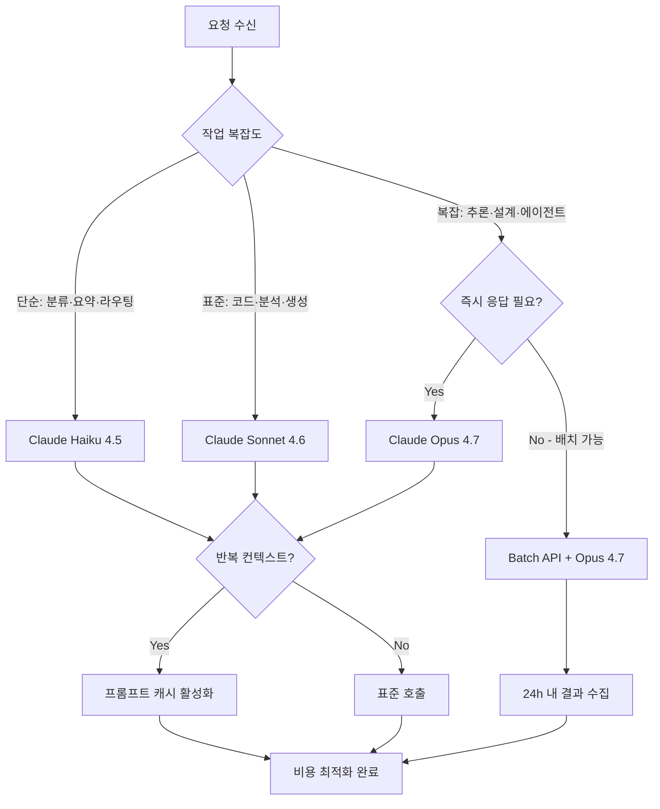

## 들어가며

Claude API를 에이전트 워크플로우에 연결하기 시작하면 누구나 마주치는 시점이 있다. 월말 청구서를 열었을 때 예상보다 훨씬 큰 숫자가 찍혀 있는 그 순간. 코드는 잘 돌아가고, 에이전트는 제 역할을 하고 있는데, 비용이 선형이 아니라 지수적으로 느껴진다.

이 글은 그 문제에 대한 **3축 프레임워크**를 제안한다: **모델 라우팅**(어떤 모델을 쓸 것인가), **프롬프트 캐시**(같은 컨텍스트를 반복 청구받지 않을 것인가), **배치 처리**(시간 여유가 있는 작업은 반값에 처리할 것인가). 가격 수치는 Anthropic 공식 가격 문서[^pricing]에서만 직접 인용하며, 이 글을 쓰는 시점(2026년 5월)을 기준으로 한다.

[^pricing]: Anthropic, *Pricing*, platform.claude.com/docs/en/about-claude/pricing. 가격은 언제든 변동될 수 있으므로 최신 정보는 공식 페이지에서 확인하기 바란다.

---

## 1. 2026-05 가격 스냅샷

2026년 5월 기준 Claude API 현행 가격이다. 단위는 모두 **MTok(백만 토큰) 당 USD**.

### 표준 API 가격

| 모델 | 입력 | 캐시 쓰기 (5분) | 캐시 쓰기 (1시간) | 캐시 읽기 | 출력 |
|:-----|-----:|---------------:|----------------:|----------:|-----:|
| Claude Opus 4.7 | $5 | $6.25 | $10 | $0.50 | $25 |
| Claude Sonnet 4.6 | $3 | $3.75 | $6 | $0.30 | $15 |
| Claude Haiku 4.5 | $1 | $1.25 | $2 | $0.10 | $5 |

### 배치 API 가격 (표준 대비 50% 할인)

| 모델 | 배치 입력 | 배치 출력 |
|:-----|----------:|----------:|
| Claude Opus 4.7 | $2.50 | $12.50 |
| Claude Sonnet 4.6 | $1.50 | $7.50 |
| Claude Haiku 4.5 | $0.50 | $2.50 |

> **주의**: Claude Opus 4.7은 이전 세대와 다른 새 토크나이저를 사용한다. 동일한 텍스트에 대해 최대 35% 더 많은 토큰이 소비될 수 있다는 점을 비용 계획에 반영해야 한다.[^tokenizer]
{: .prompt-warning }

[^tokenizer]: Anthropic, *Pricing*, platform.claude.com/docs/en/about-claude/pricing — "Opus 4.7 uses a new tokenizer compared to previous models, contributing to its improved performance on a wide range of tasks. This new tokenizer may use up to 35% more tokens for the same fixed text."

---

## 2. 모델 라우팅 원칙

가장 단순하고 효과적인 비용 절감은 **작업에 맞는 모델을 쓰는 것**이다. Opus에 Haiku 수준 작업을 맡기면 입력 기준 5배, 출력 기준 5배 비용이 나간다.

### 3계층 라우팅 기준

| 계층 | 모델 | 적합한 작업 |
|:-----|:-----|:-----------|
| Tier 1 (저비용) | Claude Haiku 4.5 | 분류, 요약, 태깅, 번역, 라우팅 판단, 입력 검증 |
| Tier 2 (균형) | Claude Sonnet 4.6 | 코드 생성·수정, 구조화된 출력, 일반 분석·답변 |
| Tier 3 (고성능) | Claude Opus 4.7 | 복잡한 추론, 아키텍처 설계, 장문 분석, 에이전틱 코딩 |

### 모델 라우팅 의사결정 다이어그램



> 에이전트 워크플로우에서 오케스트레이터와 서브에이전트를 분리 설계할 때, 오케스트레이터는 Sonnet, 반복 실행 워커는 Haiku로 나누는 패턴이 효과적이다. 오케스트레이터가 반드시 Opus일 필요는 없다.
{: .prompt-tip }

---

## 3. 프롬프트 캐시

프롬프트 캐시는 한 번 처리한 컨텍스트를 재사용해 반복 입력 비용을 줄이는 기능이다. 긴 시스템 프롬프트, 공통 문서, 대화 이력 등에 효과적이다.

### 캐시 가격 배율

캐시 가격은 기본 입력 단가에 대한 배율로 표현된다.[^cachepricing]

| 작업 | 배율 | 유효 시간 |
|:-----|-----:|:--------:|
| 5분 캐시 쓰기 | 1.25× | 5분 |
| 1시간 캐시 쓰기 | 2× | 1시간 |
| 캐시 읽기 (히트) | **0.1×** | 앞선 쓰기와 동일 |

[^cachepricing]: Anthropic, *Pricing — Prompt caching*, platform.claude.com/docs/en/about-claude/pricing — "A cache hit costs 10% of the standard input price, which means caching pays off after just one cache read for the 5-minute duration (1.25x write), or after two cache reads for the 1-hour duration (2x write)."

### 손익분기점 계산

캐시 쓰기 비용을 회수하려면 몇 번의 히트가 필요할까?

**5분 캐시** (쓰기 1.25×, 히트 0.1×):
- 쓰기 시점에 표준 대비 1.25배 지불
- 히트 1회마다 표준(1.0×) 대신 0.1× 지불 → 히트당 0.9× 절약
- 쓰기 비용 회수: 1.25 ÷ 0.9 ≈ **약 1.4회 → 2회 히트부터 순이익**

**1시간 캐시** (쓰기 2×, 히트 0.1×):
- 쓰기 시점에 표준 대비 2배 지불
- 쓰기 비용 회수: 2 ÷ 0.9 ≈ **약 2.2회 → 3회 히트부터 순이익**

> 시스템 프롬프트나 공통 컨텍스트가 수백 토큰 이상이고 같은 세션에서 반복 호출된다면, 캐시 활성화는 대부분의 경우 유리하다.
{: .prompt-tip }

### 실전 설정 방법

Anthropic API는 두 가지 방식으로 캐시를 활성화한다:

- **자동 캐싱**: 요청 최상위에 `cache_control` 필드를 추가하면 시스템이 자동으로 캐시 포인트를 관리한다. 대부분의 경우 이 방식으로 충분하다.
- **명시적 캐시 포인트**: 특정 콘텐츠 블록에 직접 `cache_control`을 지정한다. 캐시할 범위를 세밀하게 제어할 때 사용한다.

배치 API와 캐시 할인은 중첩 적용된다. 두 기능을 함께 사용하면 각각의 절감 효과가 모두 적용된다.[^stacking]

[^stacking]: Anthropic, *Pricing — Prompt caching*, platform.claude.com/docs/en/about-claude/pricing — "These multipliers stack with other pricing modifiers, including the Batch API discount and data residency."

---

## 4. 배치 처리

시간이 걸려도 괜찮은 작업이라면 Batch API가 가장 강력한 단일 비용 절감 도구다.

### 특징

- **50% 할인**: 표준 API 대비 입력·출력 모두 정확히 절반
- **24시간 완료**: 비동기로 처리되며 결과는 나중에 수집
- **프롬프트 캐시와 병용 가능**: 두 할인이 중첩 적용됨

### 적합한 사용 사례

- 코드 리뷰 자동화 (PR 머지 전 비동기 분석)
- 대량 문서 요약·분류
- 에이전트 결과물 사후 검증
- 야간 배치 리포트 생성
- 테스트 케이스 대량 생성

### 부적합한 사용 사례

- 인터랙티브 채팅 (즉각 응답 필요)
- 스트리밍이 필요한 UX
- Claude Managed Agents 세션 (배치 모드 미지원)[^managedagents]

[^managedagents]: Anthropic, *Pricing — Claude Managed Agents pricing*, platform.claude.com/docs/en/about-claude/pricing — "Batch API discount: Sessions are stateful and interactive. There is no batch mode."

> 배치 처리와 캐시를 동시에 활용하면, 반복 컨텍스트가 많은 대규모 파이프라인에서 표준 단가 대비 크게 낮은 실효 비용을 달성할 수 있다. 다만 실제 절감 폭은 캐시 히트율과 배치 비율에 따라 크게 달라지므로, 파이프라인 특성을 먼저 측정한 뒤 적용하는 것이 선행돼야 한다.
{: .prompt-info }

---

## 5. 컨텍스트 위생

같은 모델, 같은 캐시 설정이라도 컨텍스트가 커질수록 비용은 정비례로 증가한다. **컨텍스트 위생(Context Hygiene)** 은 불필요한 토큰이 청구되지 않도록 관리하는 실천이다.

### 주요 비용 누수 원인

**① 시스템 프롬프트 비대화**

`CLAUDE.md`나 지침 파일이 반복 업데이트 없이 계속 추가되다 보면 수천 토큰짜리 시스템 프롬프트가 된다. 작업 유형별로 최소화된 시스템 프롬프트를 분리 관리하면 불필요한 입력 토큰을 줄일 수 있다.

**② 도구 정의 토큰 누수**

Tool use는 생각보다 많은 토큰을 소비한다. 도구 이름·설명·스키마 전체가 매 요청마다 입력 토큰으로 청구된다. 현재 작업에 필요하지 않은 도구는 요청에서 제외하는 것이 효과적이다.

**③ 대화 이력 무제한 누적**

멀티턴 대화에서 이전 턴 전체를 컨텍스트로 유지하면 이력이 쌓일수록 비용이 선형으로 증가한다. 요약 압축, 슬라이딩 윈도우, 또는 명시적 이력 잘라내기를 적용하라.

**④ 서브에이전트 컨텍스트 격리 미흡**

오케스트레이터가 모든 서브에이전트 결과를 자신의 컨텍스트에 누적하면 오케스트레이터 비용이 빠르게 증가한다. 서브에이전트 결과를 구조화된 요약으로 압축해 오케스트레이터에 전달하는 패턴이 이를 방지한다.

---

## 6. 1M 컨텍스트 함정

Claude Opus 4.7과 Claude Sonnet 4.6은 1M 토큰 컨텍스트를 지원하며, Anthropic 가격 문서에는 "900k 토큰 요청도 9k 토큰 요청과 같은 단가"라고 명시돼 있다.[^longcontext] 이는 사실이지만, 두 가지 함정이 숨어 있다.

[^longcontext]: Anthropic, *Pricing — Long context pricing*, platform.claude.com/docs/en/about-claude/pricing — "A 900k-token request is billed at the same per-token rate as a 9k-token request."

### 함정 1: 새 토크나이저 = 더 많은 토큰

Claude Opus 4.7은 새 토크나이저를 사용한다. 동일한 텍스트를 처리할 때 이전 모델 대비 **최대 35% 더 많은 토큰**이 소비될 수 있다. 같은 문서를 Sonnet 4.6과 Opus 4.7에 각각 넣으면 Opus 4.7 쪽이 더 많은 토큰을 소비할 수 있다.

### 함정 2: 긴 컨텍스트 = 큰 절대 비용

단가는 같아도 토큰 수가 크면 총비용이 크다. 단위 환산 예시:

- 입력 100k 토큰 + Claude Opus 4.7 = $5 × 0.1 = **$0.50**
- 입력 500k 토큰 + Claude Opus 4.7 = $5 × 0.5 = **$2.50**
- 입력 900k 토큰 + Claude Opus 4.7 = $5 × 0.9 = **$4.50**

> 1M 컨텍스트는 필요할 때 쓸 수 있다는 것이지, 기본값으로 사용해야 한다는 의미가 아니다. 작업에 실제로 필요한 컨텍스트 범위를 먼저 측정하라.
{: .prompt-warning }

---

## 7. 월 비용 추적

비용 최적화의 출발점은 **현재 어디서 비용이 발생하는지** 파악하는 것이다. 추정만으로는 어느 계층에서 비용이 집중되는지 알기 어렵다.

### Claude Console 활용

Anthropic은 Claude Console에서 모델별·기능별 사용량 내역을 실시간으로 제공한다. 최적화 시작 전에 확인할 항목:

- **모델별 입력/출력 토큰 분포**: Opus가 전체 비용의 몇 %를 차지하는가?
- **캐시 히트율**: 쓰기 대비 히트 비율이 낮으면 캐시 설계를 재검토
- **배치 vs 동기 비율**: 배치로 전환 가능한 워크로드가 얼마나 되는가?

### 비용 구조 계산 프레임워크

실제 비용 계획에 참고할 수 있는 공식이다. 모든 단가는 공식 가격[^pricing] 기준이다.

```
월 예상 비용 ≈
  (Haiku 입력 MTok × $1)    + (Haiku 출력 MTok × $5)
+ (Sonnet 입력 MTok × $3)   + (Sonnet 출력 MTok × $15)
+ (Opus 입력 MTok × $5)     + (Opus 출력 MTok × $25)

절감분:
- 캐시 히트: 해당 입력 토큰의 90% × 히트 MTok
- 배치 처리: 표준 가격의 50% × 배치 처리 MTok
```

실제 절감분은 캐시 히트율과 배치 처리 비율에 따라 달라지므로, 위 공식을 베이스라인으로 두고 실제 사용 데이터로 검증하는 것이 중요하다.

> 비용 추적 없이 최적화를 시작하면 엉뚱한 계층에서 시간을 낭비하게 된다. 먼저 1~2주 데이터를 수집하고, 가장 비용이 큰 모델 계층을 우선 최적화하라.
{: .prompt-tip }

---

## 8. Pro/Max vs API

개인 구독 플랜(Pro, Max)과 API는 서로 다른 용도를 위해 설계됐다.

### 구분 기준

| | 구독 플랜 (Pro·Max) | API |
|:--|:----------------|:----|
| **과금 방식** | 월정액 고정 | 사용량 기반 |
| **대상** | 개인 대화형 사용 | 개발자·조직 |
| **에이전트 통합** | claude.ai 내 | 직접 API 호출 |
| **워크플로우 자동화** | 제한적 | 자유롭게 가능 |
| **캐시·배치 최적화** | 미지원 | 지원 |

### 언제 API가 필요한가

자동화된 워크플로우, 에이전트 파이프라인, 대량 처리, 커스텀 통합이 필요한 경우 API가 필요하다. 구독 플랜은 API 호출을 직접 지원하지 않으며, 캐시나 배치 최적화도 적용되지 않는다.

### 언제 구독 플랜이 유리한가

대화형 사용, 소량 작업, claude.ai 기반 작업 흐름이라면 구독 플랜이 더 간단하고 예측 가능한 비용 구조를 제공한다.

> 개발자 본인은 구독 플랜으로 대화형 탐색을 하면서, 프로덕션 파이프라인은 API로 운영하는 혼합 패턴도 흔하다. 두 방식은 배타적이지 않다.
{: .prompt-info }

현재 플랜별 정확한 가격은 [claude.com/pricing](https://claude.com/pricing) 공식 페이지에서 확인하라.

---

## 결론: 3축 프레임워크 요약

비용 최적화는 한 번에 모든 것을 바꾸는 작업이 아니다. 현재 가장 큰 비용 원인을 찾아 하나씩 개선하는 반복 과정이다.

**① 라우팅**: 작업 복잡도에 맞는 모델을 쓰는 것이 가장 빠른 절감 방법이다. Haiku와 Sonnet을 적절히 배분하는 것만으로도 비용 구조가 크게 달라질 수 있다.

**② 캐시**: 반복 컨텍스트가 있다면 캐시를 활성화하라. 5분 캐시는 2회, 1시간 캐시는 3회 히트만 있어도 쓰기 비용을 회수하고 순이익 구간에 진입한다.

**③ 배치**: 즉시 응답이 필요 없는 워크로드는 Batch API로 전환하라. 같은 모델에서 50%의 할인이 적용된다.

세 축을 모두 적용하는 것이 이상적이지만, 먼저 현재 사용 데이터를 수집하고 가장 큰 비용 계층에서 시작하는 것이 실질적인 접근이다.

---

*관련 글:*
- [AI 병렬 작업 구축 가이드 — 여러 AI를 동시에 운용하여 생산성 극대화하기](/posts/ai-parallel-workers-guide/)
- [바이브 코딩 피로(Vibe Coding Fatigue) — AI 개발자의 번아웃을 명명하다](/posts/vibe-coding-fatigue/)
- [AI 코딩 하네스 구축 가이드 — 2026년 자동화 워크플로우 완전 정복](/posts/ai-coding-harness-guide/)
