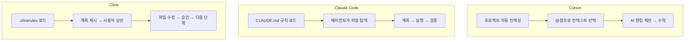
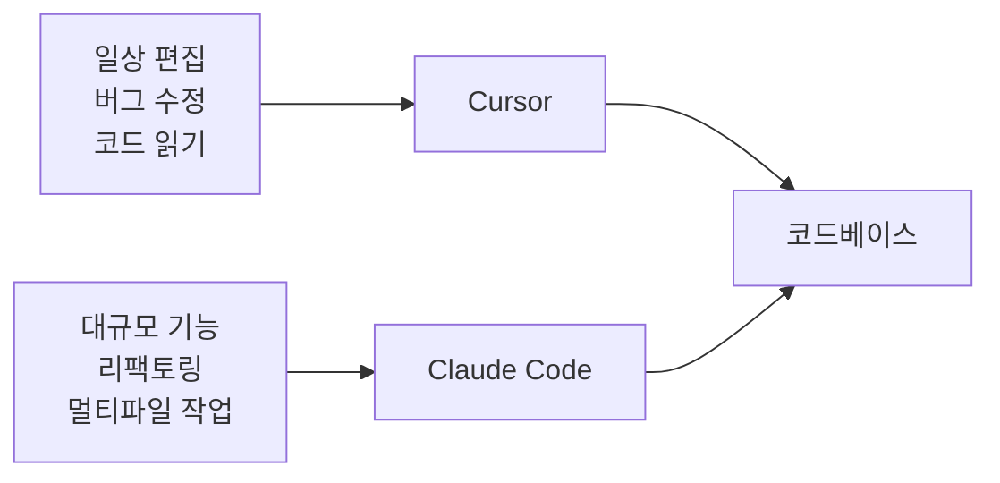
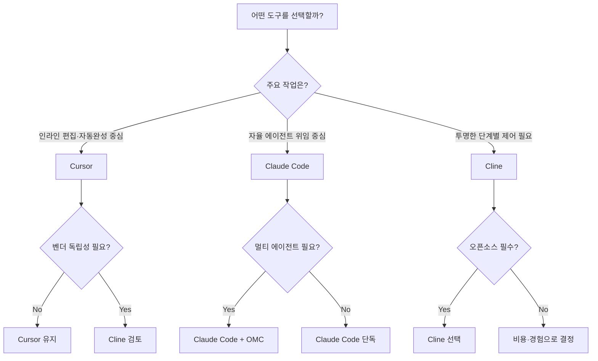

## 들어가며

"어떤 AI 코딩 도구가 제일 좋나요?" 2026년에도 이 질문은 끊이지 않는다. 그리고 솔직히 말하면, 이 질문은 잘못 설계되어 있다.

Cursor, Claude Code, Cline — 세 도구는 서로 경쟁하면서도 서로 다른 개발자를 위해 만들어졌다. 기능 목록을 나열하는 비교는 결국 "그래서 뭘 써야 해?"에 답하지 못한다. 이 글은 **워크플로우 철학**이라는 렌즈로 세 도구를 들여다보고, 당신의 상황에 맞는 선택 기준을 제시한다.

---

## 1. 2026년 5월 — 세 도구의 포지셔닝

### 세 진영의 현재 좌표

2025년까지만 해도 "AI 코딩 도구"는 주로 자동 완성 보조 수준이었다. 2026년에는 세 제품이 각자 다른 방향으로 성숙했다.

**Cursor**는 VS Code 포크(fork)로 시작해 지금은 독자적인 IDE가 됐다. AI가 에디터 안에서 자연스럽게 녹아든 경험을 제공하는 게 핵심 포지션이다. Tab 자동 완성, Composer 멀티파일 편집, 채팅 사이드바가 모두 에디터 안에 내장되어 있다. 개발자는 에디터를 떠나지 않고 AI와 협업한다.

**Claude Code**는 Anthropic이 2025년 출시한 터미널 기반 에이전트다. IDE가 없다. 에디터가 없다. 터미널 하나로 파일을 읽고, 코드를 짜고, 테스트를 실행하고, git을 조작한다. 자율 실행(agentic execution)을 기본 전제로 설계됐다. 2026년에는 oh-my-claudecode 같은 오케스트레이션 레이어가 생겨 멀티 에이전트 워크플로우가 일상화됐다.

**Cline**(구 Claude Dev)은 VS Code 익스텐션이다. Apache 2.0 라이선스로 완전 오픈소스다.[^cline-license] BYOK(Bring Your Own Key) 모델이기 때문에 Anthropic, OpenAI, Google, Ollama 등 어느 모델 제공자든 연결할 수 있다. 모든 파일 수정·터미널 명령에 사람의 승인을 요구하는 것이 설계 원칙이다.

[^cline-license]: Cline GitHub 저장소. Apache License 2.0. <https://github.com/cline/cline/blob/main/LICENSE>

| | Cursor | Claude Code | Cline |
|---|---|---|---|
| **인터페이스** | GUI 에디터 (VS Code 포크) | 터미널 CLI | VS Code 익스텐션 |
| **자율성** | 보조 → 에이전트 선택 | 에이전트 우선 | 단계별 승인 |
| **라이선스** | 상업용 구독 | 상업용 (API/구독) | Apache 2.0 오픈소스 |
| **모델 선택** | Cursor 제공 모델 고정 | Anthropic 모델 | BYOK — 자유 선택 |
| **자체 호스팅** | 불가 | 불가 | 가능 (Ollama 등) |

---

## 2. 워크플로우 철학 비교

세 도구의 가장 큰 차이는 기능이 아니라 **철학**이다. 어디에서 작업하고, 어떤 모드로 동작하며, 사람이 얼마나 개입하고, 어떤 라이선스인가. 4축으로 정리하면:

| 축 | Cursor | Claude Code | Cline |
|---|---|---|---|
| **1차 인터페이스** | GUI 에디터 | 터미널 CLI | VS Code 익스텐션 |
| **기본 모드** | 보조(Assist)·에이전트 선택 | 에이전트 우선(Agentic-first) | 단계별 승인(Step-approve) |
| **휴먼 개입 방식** | 명령 후 자동 진행, 필요 시 리뷰 | 권한 게이트(Permission gate) | 모든 파일·명령 사전 승인 |
| **라이선스** | 상업용 구독 | 상업용 (Anthropic) | Apache 2.0 오픈소스 |

### 철학의 핵심 차이

**Cursor**의 철학은 "마찰 없는 흐름(frictionless flow)"이다. 에디터 안에서 AI와 대화하고, Tab 한 번으로 제안을 수락하고, Composer로 여러 파일을 한 번에 수정한다. 개발자는 기존 IDE 워크플로우를 유지하면서 AI를 레이어로 얹는다. **AI를 보조 도구로 사용하는 개발자**를 위한 설계다.

**Claude Code**의 철학은 "에이전트에게 위임(delegate to agent)"이다. 개발자는 목표와 제약을 전달하고, 에이전트가 파일 탐색부터 테스트 실행까지 스스로 수행한다. 속도보다 자율성이 우선이다. **AI를 팀원처럼 운용하는 개발자**를 위한 설계다.

**Cline**의 철학은 "투명한 통제(transparent control)"다. 에이전트가 무엇을 할지 먼저 계획을 보여주고, 각 단계마다 사람의 승인을 받는다. 느리지만 예측 가능하다. **AI를 믿기 어려운 환경이나 학습 목적의 개발자**를 위한 설계다.

> 세 도구를 모두 써본 경험으로 말하면: 어느 하나가 "우월"하지 않다. 작업 유형과 맥락이 선택을 결정한다.
{: .prompt-tip }

---

## 3. 비용 구조 비교

비용은 단순히 "얼마냐"의 문제가 아니다. **어떻게 과금되느냐**가 실제 사용 패턴에 영향을 미친다.

### Cursor

Cursor는 정액제 구독 모델이다. Pro 플랜은 월 $20이며 빠른(fast) 프리미엄 요청을 포함한다.[^cursor-pricing] 빠른 요청 한도를 초과하면 느린(slow) 요청으로 전환되거나 추가 요금이 발생한다. 내부적으로 어떤 모델이 쓰이는지 완전히 투명하지는 않다.

[^cursor-pricing]: Cursor 공식 요금 안내. <https://www.cursor.com/pricing>

정액제의 장점은 **예산 예측 가능성**이다. 한 달에 $20을 내고 한도 내에서 마음껏 쓸 수 있다. 단점은 실제 사용량이 요금에 반영되지 않아, 적게 쓰는 팀에게는 낭비가 될 수 있다.

### Claude Code

Claude Code는 두 가지 방식으로 사용할 수 있다.

1. **Claude Pro·Max 구독 포함**: 월 $20(Pro) 또는 그 이상(Max) 구독에 Claude Code가 포함된다.[^anthropic-pricing] 구독 한도 내에서 사용 가능하다.
2. **API 키 직접 사용**: Anthropic API 요금을 입력·출력 토큰 기준으로 직접 지불한다. 대용량 에이전트 작업은 비용이 상당히 발생할 수 있다.

[^anthropic-pricing]: Anthropic 요금 안내. <https://www.anthropic.com/pricing>

에이전트 모드로 큰 코드베이스를 탐색하는 작업은 토큰 소모가 많다. oh-my-claudecode 같은 오케스트레이션 레이어를 쓰면 병렬 에이전트를 운용하게 되어 비용 관리가 더 중요해진다.

### Cline (BYOK 종량제)

Cline은 자체 요금이 없다. VS Code 익스텐션 자체는 무료다. 비용은 사용자가 선택한 모델 API를 통해 직접 발생한다.

이 모델의 의미:
- **API 제공자를 자유롭게 선택** → 비용 최적화 가능
- **로컬 모델(Ollama)** 사용 시 LLM 비용 제로 가능
- **클라우드 API 사용 시** 사용량이 그대로 비용으로 전환 → 많이 쓸수록 예산 예측이 어려울 수 있음

| | Cursor Pro | Claude Code (Pro 포함) | Cline (Claude API 직접 연결) |
|---|---|---|---|
| **기본 요금** | $20/월 | $20/월 (Pro) | 익스텐션 무료 |
| **과금 방식** | 정액 + 크레딧 한도 | 구독 한도 또는 토큰 종량제 | 순수 API 종량제 |
| **비용 예측성** | 높음 | 중간 | 낮음 (사용량 의존) |
| **고사용량 경제성** | 유리 | 중간 | 불리할 수 있음 |
| **저사용량 경제성** | 불리 | 중간 | 유리 |
| **벤더 락인** | 높음 | 중간 (Anthropic 의존) | 낮음 |

---

## 4. 벤치마크와 그 한계

### Artificial Analysis의 역할

AI 모델 성능 벤치마크를 비교할 때 Artificial Analysis(artificialanalysis.ai)가 자주 인용된다.[^aa] 이 사이트는 코딩 벤치마크(HumanEval, SWE-bench 등), 응답 속도, 토큰당 비용을 지속적으로 업데이트하며 게시한다. 세 도구가 지원하는 모델들의 현재 성능 순위를 확인할 때 참고할 수 있다.

[^aa]: Artificial Analysis — AI Model Benchmarks & Rankings. <https://artificialanalysis.ai>

### 벤치마크의 세 가지 한계

그러나 SWE-bench 등 코딩 벤치마크 점수가 높다고 해서 실무 생산성이 높은 것은 아니다. 세 가지 이유 때문이다.

**① 컨텍스트가 다르다**: 벤치마크는 독립적인 함수 수준 문제를 푼다. 실제 코드베이스는 수만 개의 파일과 암묵적 컨벤션, 팀의 히스토리가 얽혀 있다. 모델 성능이 좋아도 컨텍스트 관리를 못 하면 실패한다.

**② 도구 통합이 다르다**: 모델 점수는 같아도 Cursor·Claude Code·Cline이 모델을 어떻게 통합했느냐에 따라 실제 경험이 달라진다. 동일 모델을 써도 시스템 프롬프트, 컨텍스트 주입 방식, 멀티턴 대화 관리가 다르다.

**③ 최신성이 빠르다**: AI 코딩 도구 분야는 수개월 단위로 판도가 바뀐다. 오늘의 벤치마크가 내일의 현실이 아닐 수 있다. 결정을 내리기 전에 Artificial Analysis 현재 페이지를 직접 확인하라.

> 벤치마크는 "이 모델이 이 정도 수준이다"를 알려주지만, "이 도구로 이 팀이 생산적일 것이다"는 알려주지 않는다.
{: .prompt-warning }

---

## 5. 컨텍스트 관리 차이

실무에서 가장 체감 차이가 큰 영역 중 하나는 **AI가 내 코드베이스를 얼마나, 어떻게 이해하느냐**다. 세 도구의 접근 방식은 명확히 다르다.

### Cursor: 자동 인덱싱

Cursor는 프로젝트를 자동으로 인덱싱한다. `@codebase`, `@file`, `@docs` 같은 참조(reference)로 원하는 컨텍스트를 채팅에 끌어올 수 있다. `.cursorrules` 파일로 AI 행동 지침을 설정한다.

- **장점**: 별도 설정 없이 즉시 작동한다. 처음 쓰는 사람도 쉽게 시작할 수 있다.
- **단점**: 자동 인덱싱의 범위와 정확도를 개발자가 세밀하게 제어하기 어렵다. 불필요한 파일이 컨텍스트에 포함될 수 있다.

### Claude Code: 명시적 컨텍스트 + CLAUDE.md

Claude Code는 에이전트가 직접 파일을 읽고 탐색한다. `CLAUDE.md`라는 마크다운 파일에 프로젝트 규칙, 금지 패턴, 개발 컨벤션을 명시하면 모든 세션에서 이 지침이 우선 적용된다. oh-my-claudecode의 경우 중첩 CLAUDE.md, 스킬(skills), 훅(hooks)으로 컨텍스트를 정밀하게 제어한다.

- **장점**: 컨텍스트를 완전히 제어할 수 있다. 무엇이 주어지는지 투명하다.
- **단점**: 초기 설정이 필요하다. CLAUDE.md를 잘 작성하지 않으면 에이전트가 반복적으로 잘못된 판단을 내린다.

### Cline: MCP + .clinerules

Cline은 MCP(Model Context Protocol) 서버를 통해 외부 컨텍스트를 주입할 수 있다. `.clinerules` 파일로 행동 지침을 설정한다. 각 작업 단계마다 어떤 파일을 읽었는지 사용자에게 보여준다.

- **장점**: 각 액션이 투명하다. 어떤 파일을 읽고 어떤 명령을 실행하려는지 승인 전에 확인할 수 있다.
- **단점**: 컨텍스트 자동 관리가 약하다. 큰 코드베이스에서 적절한 파일을 찾아내는 작업을 에이전트에게 충분히 위임하기 어렵다.

---

## 6. 작업별 사용 시나리오

### 시나리오 1: 함수 단위 수정

**상황**: 특정 함수의 로직 버그를 찾아 수정해야 한다.

- **Cursor**: 해당 파일을 열고 AI 채팅에서 버그를 설명한다. Composer가 수정안을 인라인으로 보여준다. 빠르고 마찰이 없다.
- **Claude Code**: "이 함수의 버그를 수정해줘"라고 지시하면 에이전트가 관련 파일을 탐색하고 테스트까지 실행한다. 오버헤드가 있지만 주변 코드까지 살핀다.
- **Cline**: 에이전트가 파일 읽기 → 분석 → 수정 계획을 단계별로 보여준다. 각 단계에 승인이 필요하다. 시간이 걸리지만 무슨 일이 일어나는지 정확히 알 수 있다.

**추천**: 이 시나리오에서는 **Cursor**가 가장 빠르다.

### 시나리오 2: 대규모 리팩토링

**상황**: 여러 파일에 걸친 인증 모듈을 새 아키텍처로 리팩토링해야 한다.

- **Cursor**: Composer로 여러 파일을 동시에 편집할 수 있다. 그러나 리팩토링 계획과 의존성 분석은 개발자가 직접 해야 한다.
- **Claude Code**: `planner → architect → executor` 순서로 에이전트를 조율하면 체계적인 리팩토링이 가능하다. 워크트리 격리로 충돌 없이 병렬 작업도 된다.
- **Cline**: 단계별로 리팩토링 계획을 확인하며 진행할 수 있다. 리스크를 최소화하고 싶을 때 좋다. 그러나 규모가 크면 승인 단계가 너무 많아진다.

**추천**: 이 시나리오에서는 **Claude Code**가 강점을 발휘한다.

### 시나리오 3: 벤더 락인 회피

**상황**: 특정 AI 제공자에 묶이지 않아야 하는 기업 환경이거나, 오픈소스 정책이 필요한 팀이다.

- **Cursor**: Cursor 제공 모델에 의존한다. 자체 호스팅 불가.
- **Claude Code**: Anthropic 모델에 의존한다. API 키로 사용하는 경우 일부 유연성이 있지만 본질적으로 Anthropic 생태계에 묶인다.
- **Cline**: Apache 2.0 오픈소스, BYOK. 모델 제공자를 언제든 바꿀 수 있다. 로컬 모델도 지원한다.

**추천**: 이 시나리오에서는 **Cline**이 유일한 현실적 선택지다.

---

## 7. 같이 쓰는 패턴

실제로 세 도구는 상호 배타적이지 않다. 많은 개발자들이 혼합해서 사용한다.

### 패턴 A: Cursor + Claude Code (에디터 + 에이전트 분리)

일상적인 편집·소규모 수정은 Cursor로 처리하고, 복잡한 멀티파일 작업·대규모 기능 구현은 Claude Code에 위임한다. 에디터의 편의성과 에이전트의 자율성을 모두 활용하는 패턴이다.

### 패턴 B: Claude Code + Cline (에이전트 + 투명 검토)

Claude Code로 빠르게 구현하고, Cline으로 변경 사항을 검토하거나 세밀한 수정을 수행한다. 보안·규정 준수가 중요한 환경에서 유용하다.

### 패턴 C: 단일 도구 집중

세 도구를 동시에 갖추면 [바이브 코딩 피로](/posts/vibe-coding-fatigue/)가 발생할 수 있다. 도구 전환 자체가 인지 비용이다. 경험이 적은 팀이라면 하나를 깊게 파는 것이 더 낫다.

> 도구를 많이 쓰는 것이 아니라 **잘** 쓰는 것이 핵심이다. 스위칭 비용을 과소평가하지 마라.
{: .prompt-warning }

---

## 8. oh-my-claudecode 관점

이 블로그는 Claude Code + oh-my-claudecode(OMC) 기반 AQ(AI-Quartermaster) 워크플로우를 운용하는 관점에서 쓰인다. 편향이 있다는 것을 먼저 밝힌다.

**Cursor의 한계 (OMC 기준)**: Cursor는 에디터 안에서 탁월하지만, 멀티 에이전트 오케스트레이션이나 워크트리 격리 같은 고급 워크플로우 지원이 제한적이다. `planner → architect → executor` 같은 역할 분리가 어렵다.

**Claude Code의 강점 (OMC 기준)**: CLAUDE.md, 스킬(skills), 훅(hooks)으로 에이전트 행동을 정밀하게 제어할 수 있다. 워크트리 격리로 여러 이슈를 동시에 진행한다. 검증(verifier) 에이전트를 별도 레인으로 분리해 자기 승인을 방지한다. OMC의 `ralph`, `ultrawork`, `team` 같은 오케스트레이션 패턴은 Claude Code 위에서 동작하도록 설계됐다.

**Cline의 역할**: Cline의 단계별 승인 모델은 OMC의 권한 게이트(permission gate) 철학과 공명한다. 높은 리스크 작업, 프로덕션 환경 작업, 처음 접하는 코드베이스에서는 Cline의 신중한 방식을 참고할 만하다.

> AQ 워크플로우에서는 Claude Code를 기반으로 삼되, 처음 탐색하는 코드베이스나 고위험 작업에는 Cline의 투명한 단계를 참고하는 방식으로 운용한다.
{: .prompt-info }

---

## 9. 선택 기준 정리

복잡한 비교를 단순화하면:

| 상황 | 추천 |
|---|---|
| VS Code 에디터를 떠나기 싫다 | Cursor 또는 Cline |
| 복잡한 멀티파일 작업을 에이전트에 위임하고 싶다 | Claude Code |
| 모든 AI 액션을 직접 확인하고 승인하고 싶다 | Cline |
| 특정 AI 벤더에 묶이기 싫다 | Cline (BYOK) |
| 멀티 에이전트 오케스트레이션을 운용하고 싶다 | Claude Code + OMC |
| 비용을 최소화하고 로컬 모델을 쓰고 싶다 | Cline + Ollama |
| 에디터와 에이전트를 함께 쓰고 싶다 | Cursor + Claude Code |

---

## 마치며

2026년 AI 코딩 도구 시장은 "하나를 고르면 된다"는 단계를 지났다. 세 도구는 각각 다른 문제를 풀고 있다.

- **Cursor**는 에디터 경험을 풀었다.
- **Claude Code**는 자율 에이전트 실행을 풀었다.
- **Cline**은 투명성과 벤더 독립성을 풀었다.

당신이 풀어야 할 문제가 무엇인지를 먼저 정의하라. 도구 선택은 그 다음이다.

---

*관련 글:*
- [바이브 코딩 피로(Vibe Coding Fatigue) — AI 개발자의 번아웃을 명명하다](/posts/vibe-coding-fatigue/)
- [Claude Code vs Codex - AI 코딩 에이전트 방법론 비교와 선택 가이드](/posts/claude-code-vs-codex-ai/)
- [AI 코딩 하네스 구축 가이드 — 2026년 자동화 워크플로우 완전 정복](/posts/ai-coding-harness-guide/)
- [AI 병렬 작업 구축 가이드 — 여러 AI를 동시에 운용하여 생산성 극대화하기](/posts/ai-parallel-workers-guide/)
