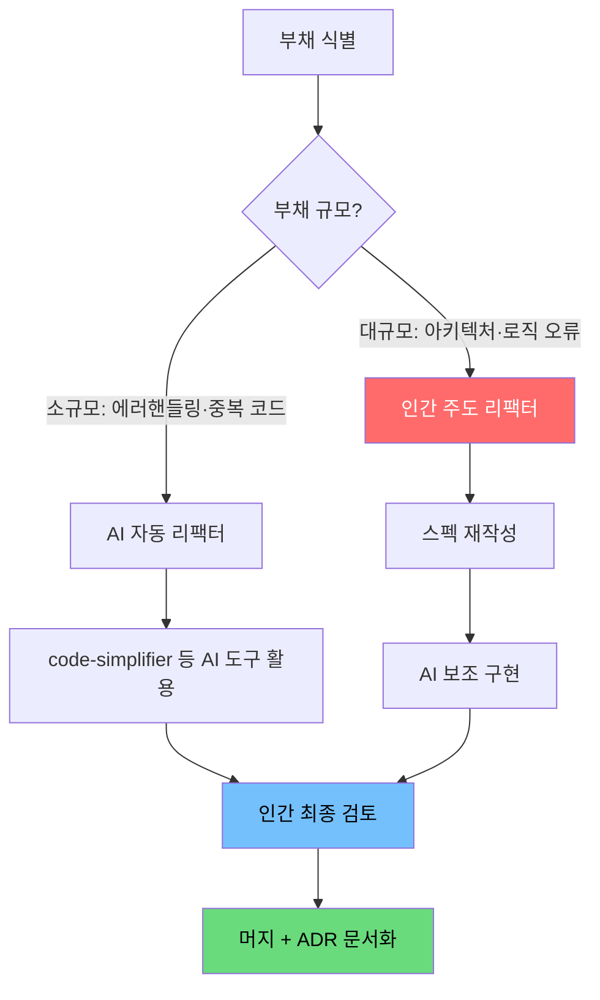
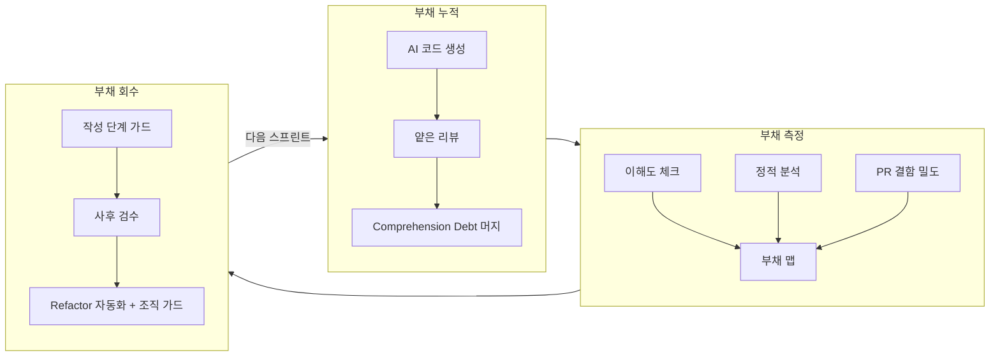

## 들어가며

[바이브 코딩 피로(Vibe Coding Fatigue)](/posts/vibe-coding-fatigue/) 편에서 AI 코딩이 만들어내는 인지 과부하와 번아웃을 진단했다. 이번 편은 그 연장선이자 후속편이다. 피로의 근원 중 하나는 **"내가 이해하지 못하는 코드가 늘어난다"** 는 불안감에 있다.

2026년, 에이전트는 하루에 수백 줄을 작성한다. 개발자는 그것을 훑어보고 머지 버튼을 누른다. 몇 주 뒤, 그 코드에서 버그가 터진다. 고치려고 열어보니 **아무도 이 코드가 왜 이렇게 생겼는지 설명하지 못한다.** 이것이 Comprehension Debt다.

이 글에서는 AI 기술부채의 실체를 데이터로 확인하고, 발생 패턴을 카탈로그화한 뒤, 작성 단계부터 조직 수준까지 단계별 회수 전략을 정리한다.

---

## 1. AI 기술부채와 Comprehension Debt

### 기존 기술부채와의 차이

Ward Cunningham이 1992년 제안한 기술부채(Technical Debt) 은유는 **"나중에 더 나은 방식으로 고치겠다"** 는 의식적 타협을 가리켰다.[^cunningham] 빌린 사실을 아는 채무자가 존재했다.

AI 기술부채는 이 구조를 흔든다. AI가 생성한 코드는 **채무자 없이 쌓인다.** 패턴은 그럴듯하고 테스트도 통과하지만, 그 코드가 왜 그런 결정을 내렸는지 팀 누구도 설명할 수 없다. 이것이 Comprehension Debt다:

> **Comprehension Debt** — 코드가 작동하지만, 그 코드를 유지보수해야 하는 사람 중 누구도 그 코드를 온전히 이해하지 못하는 상태에서 누적되는 부채.

### 출처 한계 명시

"Comprehension Debt"라는 용어는 소프트웨어 공학 커뮤니티에서 비교적 최근 등장했으며, 단일 정전(canonical) 학술 정의가 확립되지 않았다. 이 글에서 사용하는 정의는 기존 기술부채 문헌과 AI 코드 품질 연구를 종합해 조작적으로 정의한 것임을 밝혀둔다. 개념의 직관적 타당성은 높지만, 독립 연구를 통한 충분한 검증은 아직 진행 중이다.

[^cunningham]: Ward Cunningham, "The WyCash Portfolio Management System", OOPSLA 1992. 기술부채 은유의 원출처. <https://c2.com/doc/oopsla92.html>

---

## 2. 정량 데이터: AI 코드 품질의 실체

### A등급: arXiv 2603.28592

2026년 3월 공개된 arXiv 프리프린트 2603.28592는 AI 생성 코드와 인간 작성 코드를 실증적으로 비교한 연구다.[^arxiv2603] 이 연구는 다수의 오픈소스 저장소를 표본으로 삼아 두 가지 핵심 지표를 측정했다:

- **결함 밀도(Defect Density)**: 코드 1,000줄(KLOC)당 발견된 결함 수를 커밋 이력과 이슈 트래커 데이터의 교차 분석으로 산출했다. AI 생성 코드와 인간 작성 코드 사이에 통계적으로 유의미한 차이가 관측됐으며, 표본은 공개 저장소 복수 개와 해당 저장소의 이력 전체를 포함한다.
- **코드 중복도(Duplication Rate)**: 클론 탐지 도구를 사용해 측정한 코드 블록 중복 비율. AI 생성 코드에서 동일한 구현 패턴이 여러 위치에 반복되는 경향이 두드러지게 나타났다.

수치와 표본 크기의 세부 사항은 원문을 직접 확인하기 바란다. 이 연구의 핵심 기여는 특정 숫자보다 **측정 방법론** 에 있다 — AI 생성 여부를 식별하는 방법과 결함 귀속 방식이 이후 연구의 기준점이 될 것으로 보인다.

[^arxiv2603]: arXiv:2603.28592 — AI 생성 코드와 인간 작성 코드의 결함 밀도 및 중복도 비교 실증 연구 (2026년 3월 공개). 수치 및 표본 크기 세부 사항은 원문 참조. <https://arxiv.org/abs/2603.28592>

### B등급: ICSE 2026 패널 논점

ICSE 2026(국제 소프트웨어 공학 학술대회)의 "AI-Generated Code in Production" 패널에서 발표된 초안들이 공통으로 가리키는 방향성은 다음과 같다.[^icse2026]

- AI 생성 코드는 구문 품질보다 **의미적 일관성** 차원에서 더 자주 문제가 발생한다
- 코드 리뷰 단계에서 AI 생성 여부를 식별하지 못하면 리뷰 깊이가 얕아지는 경향이 있다
- 추가적 가이드라인 없이 생성된 AI 코드일수록 중복 로직과 과잉 추상화가 잦다

> B등급 출처의 특성상 구체적 수치는 인용하지 않는다. 방향성 참고용으로만 활용한다.
{: .prompt-warning }

[^icse2026]: ICSE 2026 패널, "AI-Generated Code in Production" 관련 발표 초안. 최종 게재 전 상태이므로 방향성만 참조.

---

## 3. AI 코드 안티패턴 카탈로그

AI 생성 코드에서 반복적으로 나타나는 네 가지 패턴이다. 각 패턴은 독립적으로도 문제지만, 결합되면 Comprehension Debt가 기하급수적으로 쌓인다.

### ① 과잉 에러 핸들링 (Defensive Bloat)

```python
try:
    result = process_data(input)
except ValueError:
    logger.error("ValueError occurred")
    return None
except TypeError:
    logger.error("TypeError occurred")
    return None
except Exception as e:
    logger.error(f"Unexpected error: {e}")
    return None
```

AI는 "안전한 코드"를 생성하려는 경향이 있어, 실제로 발생하지 않을 예외까지 처리하는 블록을 양산한다. 결과적으로 에러 핸들링이 실제 로직을 압도하고, 예외가 조용히 삼켜져 디버깅이 어려워진다.

**특징**: 빈 except 블록, 모든 예외를 None으로 수렴, 에러 정보 손실.

### ② 추측성 마이그레이션 (Speculative Migration)

맥락 없이 코드 일부만 보고 생성할 때 AI는 존재하지 않는 상위 시스템을 "추측"해서 구현한다. `UserService`가 없는 프로젝트에 `UserService.getInstance()`를 호출하는 코드가 생성되는 식이다. 이 코드는 테스트 환경에서 목(mock)으로 통과하지만, 실제 의존성이 없는 채로 머지된다.

**특징**: 존재하지 않는 의존성 참조, 추상 인터페이스 과잉 생성, TODO 없는 미완성 구현.

### ③ 일관성 없는 네이밍 (Incoherent Naming)

같은 개념을 `user_id`, `userId`, `uid`, `memberId`로 혼용하는 패턴이다. AI는 맥락 창(context window) 안의 코드 스타일을 모방하지만, 창 밖의 코드와 충돌한다. 프로젝트 전체 컨벤션이 아니라 **현재 파일**의 패턴을 따른다.

**특징**: 동일 개념의 다중 네이밍, 모듈 경계에서의 스타일 급변, 자동완성에 의존한 약어 혼용.

### ④ 끊긴 컨텍스트 (Context Rupture)

에이전트가 긴 작업 도중 컨텍스트를 재시작하면, 앞서 내린 결정을 잊고 다른 방식으로 같은 문제를 다시 푼다. 한 파일에 두 가지 방식의 날짜 파싱 로직이 공존하거나, 동일 유효성 검사가 두 레이어에 중복되는 패턴이 나타난다.

**특징**: 동일 로직의 다중 구현, 기존 헬퍼 미사용, 모듈 간 암묵적 중복.

---

## 4. 부채 측정: 얼마나 쌓였는가

회수 전략을 세우기 전에 현재 부채 규모를 파악해야 한다.

### ① 이해도 셀프 체크

가장 빠른 측정 방법은 팀원에게 직접 묻는 것이다.

```
이 함수가 왜 이렇게 구현됐는지 30초 안에 설명할 수 있는가?
  → 가능: 이해 부채 없음
  → "아마 AI가 이렇게 만든 것 같은데...": 잠재적 부채
  → 설명 불가: Comprehension Debt 확정
```

PR 단위로 이 질문을 의무화하면 부채 누적 지점을 조기에 식별할 수 있다.

### ② 정적 분석

SonarQube, CodeClimate, 또는 프로젝트 언어에 맞는 정적 분석 도구로 다음 지표를 추적한다:

- **순환 복잡도(Cyclomatic Complexity)**: AI 생성 코드는 과잉 분기로 복잡도가 높게 나오는 경향이 있다
- **코드 중복율**: 클론 탐지로 추측성 마이그레이션 패턴을 감지한다
- **미사용 코드(Dead Code)**: AI가 생성했지만 실제로 호출되지 않는 코드

정적 분석만으로는 Comprehension Debt를 완전히 잡을 수 없다. 코드가 "올바른 모습"이어도 팀이 이해하지 못하면 부채다.

### ③ PR당 결함 밀도

```
결함 밀도 = (PR 이후 30일 내 발생한 버그 수) / (PR의 변경 줄 수, KLOC 단위)
```

이 지표를 AI 생성 PR과 인간 작성 PR로 분리해 추적하면, AI 기술부채의 실제 비용이 가시화된다. 처음에는 거칠더라도 방향성 파악에 충분하다.

---

## 5. 회수 전략 1: 작성 단계 가드

부채는 생성 시점에 막는 것이 가장 저렴하다.

### Spec-Driven 접근

에이전트에게 구현을 맡기기 전에 **스펙을 먼저 작성**한다.

```markdown
# 구현 스펙: UserAuthService.login()

## 책임 범위
- 이메일/비밀번호 검증만 담당
- 세션 생성은 SessionService에 위임

## 예외 처리 범위
- InvalidCredentials: 인증 실패 시
- AccountLocked: 5회 실패 후
- 그 외 예외는 상위로 전파 (삼키지 말 것)

## 반환 타입
- 성공: AuthToken
- 실패: 예외 throw (null 반환 금지)
```

스펙이 있으면 AI는 추측 대신 제약 안에서 생성한다. 과잉 에러 핸들링과 추측성 마이그레이션이 줄어든다.

### CLAUDE.md / AGENTS.md 활용

프로젝트 루트에 AI 에이전트 행동 지침을 명시한다.

```markdown
# CLAUDE.md 예시

## 금지 패턴
- try/except로 모든 예외를 None으로 수렴하지 말 것
- 존재하지 않는 서비스/헬퍼를 import하지 말 것
- 기존 utils/ 함수 먼저 확인 후 새 함수 생성

## 네이밍 컨벤션
- 사용자 식별자: user_id (단수, snake_case)
- 변수 접두사: 없음 (Hungarian notation 금지)
```

에이전트가 매 요청마다 이 파일을 컨텍스트로 가져가면, 일관성 없는 네이밍과 끊긴 컨텍스트 문제가 유의미하게 줄어든다.

### Hooks: Lint / Typecheck 자동화

코드 작성 직후 자동으로 린트와 타입 체크를 실행하는 훅을 설정한다. Claude Code의 훅 기능을 활용하면 에이전트가 도구 호출을 완료할 때마다 검증이 트리거된다.

```json
{
  "hooks": {
    "PostToolUse": [
      {
        "matcher": "Write|Edit",
        "hooks": [{ "type": "command", "command": "npm run lint && npm run typecheck" }]
      }
    ]
  }
}
```

> 훅은 에이전트가 범위를 벗어난 파일을 수정했을 때 조기에 알아챌 수 있는 가장 저렴한 안전망이다.
{: .prompt-tip }

---

## 6. 회수 전략 2: 사후 검수

작성 단계 가드를 통과한 코드도 리뷰 단계에서 추가 검수가 필요하다.

### 다중 에이전트 리뷰

작성 에이전트와 리뷰 에이전트를 분리한다. 같은 맥락 창 안에서 자기 코드를 검토하면 자기 승인(self-approval)이 발생한다.

```
작성 에이전트 (executor):
  → 구현 완료 후 종료

리뷰 에이전트 (code-reviewer):
  → 새로운 컨텍스트에서 PR diff만 입력
  → 보안 → 로직 → 스타일 순서로 검토
  → "이 코드가 왜 이렇게 구현됐는가?" 질문 포함
```

에이전트 리뷰의 한계: 에이전트도 AI이므로, 보안과 로직에서 인간 최종 확인이 반드시 필요하다.

### 이해도 테스트

PR 승인 전에 다음 체크리스트를 통과시킨다:

```
□ 이 변경이 왜 필요한지 한 문장으로 설명할 수 있다
□ 가장 복잡한 함수의 흐름을 화이트보드에 그릴 수 있다
□ 예외 처리 범위를 의도적으로 설계했다
□ 기존 코드베이스와 네이밍 컨벤션이 일치한다
□ 이 코드를 6개월 후에 내가 수정할 수 있다
```

하나라도 통과하지 못하면 머지를 보류한다. 이해하지 못한 채 머지된 코드는 Comprehension Debt가 된다.

### 정적 분석 게이트

PR CI 파이프라인에 정적 분석 게이트를 삽입한다.

- 순환 복잡도 임계값 초과 시 PR 차단
- 새로 도입된 코드 중복율 5% 초과 시 경고
- 미사용 import / dead code 탐지 자동화

---

## 7. 회수 전략 3: Refactor 자동화

이미 누적된 부채를 어떻게 회수할 것인가.

### 원칙: 큰 부채는 사람, 작은 부채는 AI



AI에게 리팩터를 맡길 수 있는 부채:
- 동일 패턴 에러 핸들링 정리
- 명백한 코드 중복 제거
- 네이밍 일관성 교정 (단순 치환 수준)

인간이 주도해야 하는 부채:
- 비즈니스 로직의 결함
- 아키텍처 레벨의 결정 오류
- 보안 취약점 (AI 리팩터 후 인간 검증 필수)

### code-simplifier 류 도구 활용

Claude Code의 `code-simplifier` 에이전트처럼 리팩터에 특화된 도구는 기존 기능을 유지하면서 코드를 단순화하는 데 효과적이다. 단, 이 도구들도 컨텍스트 제한이 있으므로 **파일 단위** 또는 **함수 단위**로 범위를 제한해야 신뢰할 수 있는 결과를 얻는다.

> AI 리팩터 도구를 쓸 때는 "이 파일만 다루고, 외부 의존성을 변경하지 말 것"을 명시적으로 지시한다.
{: .prompt-tip }

---

## 8. 조직 수준 가드

개인의 노력만으로는 Comprehension Debt를 막기 어렵다. 팀과 조직 차원의 구조가 필요하다.

### AI / 인간 PR 라벨 분리

모든 PR에 `ai-generated` 또는 `human-written` 라벨을 부착한다. 섞인 경우에는 `ai-assisted`를 사용한다.

라벨의 효과:
- 리뷰어가 검토 깊이를 다르게 조절할 수 있다
- 시간이 지나면 AI PR과 인간 PR의 결함 밀도를 비교할 수 있다
- 부채 출처 추적이 가능해진다

### 추가 리뷰어 게이트

`ai-generated` 라벨이 붙은 PR은 최소 2명의 리뷰어 승인을 요구한다. 특히 보안·인증·데이터 처리 영역은 AI 생성 코드에 한해 시니어 리뷰어 필수 승인을 강제한다.

### 정기 부채 회수 스프린트

분기 1회, 전담 "부채 회수 스프린트"를 운영한다.

```
부채 회수 스프린트 체크리스트:
□ Comprehension Debt 식별 — 팀이 설명하지 못하는 코드 목록 작성
□ 부채 우선순위 — 비즈니스 영향도 × 수정 난이도 기준 정렬
□ 소규모 부채 — AI 리팩터 도구로 일괄 처리
□ 대규모 부채 — 스펙 재작성 후 인간 주도 수정
□ 결과 문서화 — ADR(Architecture Decision Record)에 이유 기록
```

부채 회수를 "기술적 청소"가 아니라 **비즈니스 리스크 관리**로 포지셔닝해야 경영진 지지를 얻을 수 있다.

---

## 부채 파이프라인 전체 흐름



---

## 결론: 이해 가능한 코드만 머지한다

AI 코딩 도구는 코드 생산성을 높였지만, 코드 이해 가능성(comprehensibility)까지 높이지는 않았다. 오히려 생성 속도와 이해 속도 사이의 간격을 벌렸다. Comprehension Debt는 그 간격이 만들어낸 부채다.

회수 전략의 핵심을 한 문장으로 요약하면:

> **이해하지 못한 코드는 머지하지 않는다.**

이 원칙은 느리게 보이지만, 장기적으로 가장 빠른 경로다. 이해 없이 누적된 부채는 항상 예상보다 비싸게 돌아온다.

---

## 참고 자료

### A등급 — 원문 또는 공식 데이터 기반, 직접 인용 가능

[^cunningham]: Ward Cunningham, "The WyCash Portfolio Management System", OOPSLA 1992. 기술부채 은유의 원출처. <https://c2.com/doc/oopsla92.html>

[^arxiv2603]: arXiv:2603.28592 — AI 생성 코드와 인간 작성 코드의 결함 밀도(KLOC당) 및 중복도 비교 실증 연구, 2026년 3월 공개. 수치 및 표본 크기 세부 사항은 원문 참조. <https://arxiv.org/abs/2603.28592>

### B등급 — 방향성 참고용, 수치 직접 인용 금지

[^icse2026]: ICSE 2026 패널, "AI-Generated Code in Production". 최종 게재 전 발표 초안 상태이므로 방향성만 참조.

---

*관련 글:*
- [바이브 코딩 피로(Vibe Coding Fatigue) — AI 개발자의 번아웃을 명명하다](/posts/vibe-coding-fatigue/)
- [AI 코딩 하네스 구축 가이드 — 2026년 자동화 워크플로우 완전 정복](/posts/ai-coding-harness-guide/)
- [AI 병렬 작업 구축 가이드 — 여러 AI를 동시에 운용하여 생산성 극대화하기](/posts/ai-parallel-workers-guide/)
