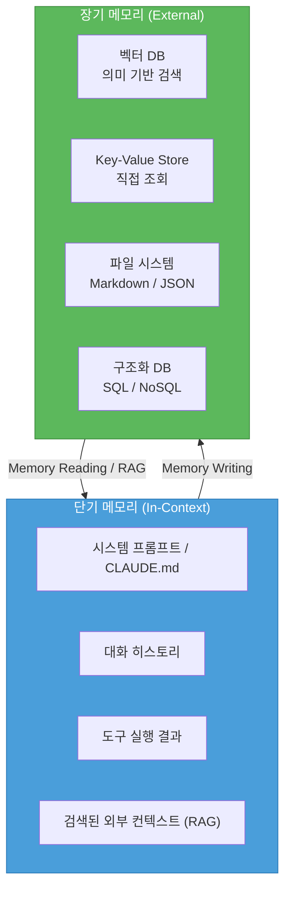
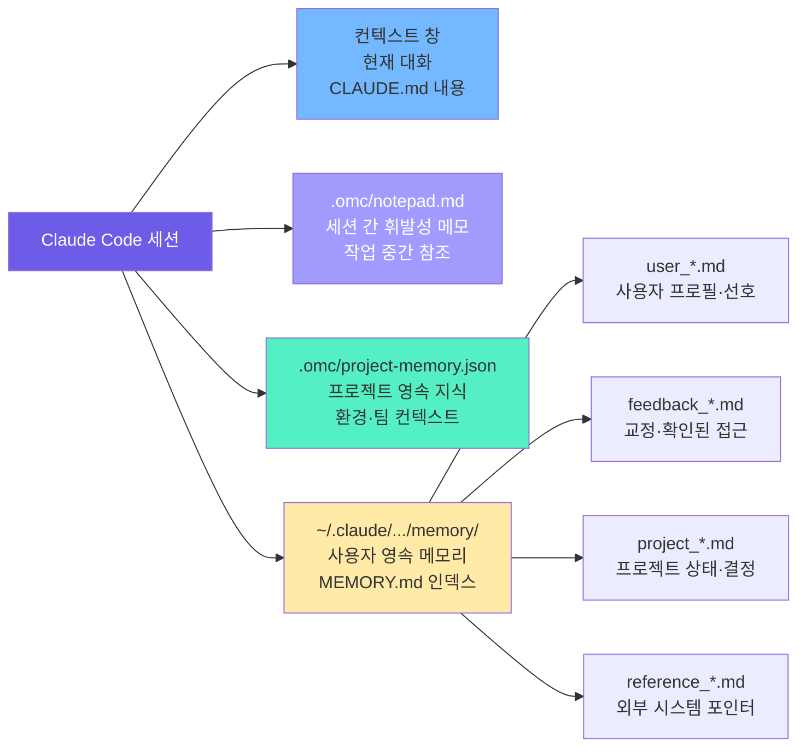

## 들어가며

"에이전트에게 같은 말을 반복해야 한다." 멀티 에이전트 워크플로우를 운용하다 보면 어김없이 마주치는 불편함이다. 새 세션이 시작되면 컨텍스트는 초기화되고, 지난 대화에서 합의했던 내용, 반복해서 교정했던 패턴, 공들여 쌓은 프로젝트 지식이 모두 사라진다.

이것은 현재 대부분의 LLM 기반 에이전트가 가진 구조적 한계다. 그리고 이 문제를 해결하려는 시도 — **메모리 시스템** — 는 2023년부터 빠르게 발전하고 있다. 이 글에서는 AI 에이전트의 메모리를 단기와 장기로 나누어 아키텍처를 정리하고, oh-my-claudecode(OMC) 스택에서 실제로 메모리를 어떻게 운용하는지 공유한다.

---

## 1. 메모리의 개념 — AI 에이전트 관점의 정의

Lilian Weng은 2023년 6월 블로그 포스트 *"LLM Powered Autonomous Agents"* 에서 에이전트의 메모리를 인지과학의 분류를 빌려 세 계층으로 정리했다.[^weng]

[^weng]: Lilian Weng, *"LLM Powered Autonomous Agents"*, Lil'Log, June 2023. <https://lilianweng.github.io/posts/2023-06-23-agent/>

- **감각 메모리(Sensory Memory)**: 입력 데이터의 즉각적 인식. 임베딩이나 원시 텍스트로 표현된다.
- **단기 메모리(Short-term Memory)**: 컨텍스트 창(context window) 안에 담긴 현재 대화.
- **장기 메모리(Long-term Memory)**: 컨텍스트 창 밖에 외부 저장소에 유지되는 정보.

이 분류는 지금도 에이전트 메모리 설계의 기본 프레임으로 통용된다. 컨텍스트 창은 아무리 커져도 유한하고, 세션이 끝나면 사라진다. 장기 메모리는 이 한계를 외부 저장소로 우회한다.

메모리 설계에서 핵심 질문은 두 가지다.

1. **무엇을 언제 저장할 것인가?** — 모든 것을 저장하면 노이즈가 쌓인다.
2. **무엇을 언제 검색할 것인가?** — 필요 이상으로 검색하면 컨텍스트가 오염된다.

---

## 2. 단기 메모리 — 컨텍스트 창의 현재

단기 메모리의 물리적 경계는 **컨텍스트 창** 이다. 창이 길수록 비용·지연·집중도 저하 문제가 따라온다. 단기 메모리 안에 담기는 것들은 다음과 같다.

| 유형 | 설명 |
|------|------|
| 시스템 프롬프트 | CLAUDE.md, 역할 정의, 컨벤션 |
| 대화 히스토리 | 이전 메시지, 도구 실행 결과 |
| 작업 중간 결과 | 단계별 산출물, 코드 출력 |
| 검색된 외부 컨텍스트 | RAG로 가져온 장기 메모리 조각 |

단기 메모리의 운용 원칙은 **위생(hygiene)** 이다. 관련 없는 정보가 창 안에 쌓이면 에이전트의 집중도가 떨어진다. 태스크 단위로 컨텍스트를 초기화하거나, 오래된 대화를 압축하는 방식이 일반적으로 사용된다.

> [바이브 코딩 피로](/posts/vibe-coding-fatigue/)에서 언급한 **컨텍스트 위생(Context Hygiene)** 원칙의 근거가 바로 여기에 있다. 에이전트가 집중해야 할 정보만 창 안에 남기는 것이 핵심이다.
{: .prompt-tip }

---

## 3. 장기 메모리 — 영속화 패턴

컨텍스트 창 밖의 정보를 저장하고 검색하는 장기 메모리는 크게 네 가지 저장 형태로 구분된다.

### 3-1. 벡터 데이터베이스 (Semantic Retrieval)

텍스트를 임베딩 벡터로 변환해 저장하고, 의미적 유사도로 검색하는 방식. RAG(Retrieval-Augmented Generation)의 핵심 인프라다.

**장점**: 자연어 쿼리로 관련 정보를 불러올 수 있다. 키를 몰라도 의미만으로 검색 가능하다.  
**단점**: 임베딩·인덱싱 비용, 검색 품질의 불확실성, 근접 검색이 반드시 관련 검색을 의미하지 않는다.

### 3-2. Key-Value 저장소 (Direct Lookup)

특정 키로 정보를 저장하고 조회하는 방식. Redis, 파일 이름 기반 저장 등이 여기에 해당한다.

**장점**: 단순하고 빠르다. 키를 아는 경우 즉각 접근할 수 있다.  
**단점**: 키를 알아야 접근할 수 있다. 탐색적 쿼리에 취약하다.

### 3-3. 파일 시스템 (Document Memory)

마크다운, JSON 파일 등으로 정보를 저장하는 방식. 버전 관리(git)와 자연스럽게 통합되고, 사람이 직접 편집하거나 확인할 수 있다.

**장점**: 투명하고 감사(audit)하기 쉽다. 에이전트와 사람이 함께 읽고 쓸 수 있다.  
**단점**: 규모가 커지면 인덱싱·검색이 필요해진다.

### 3-4. 구조화 데이터베이스 (Structured Memory)

SQL이나 NoSQL로 정형화된 데이터를 저장한다. 관계 탐색이나 집계 쿼리에 강하다.

**장점**: 복잡한 쿼리, 관계 탐색, 일관성 보장.  
**단점**: 스키마 설계 비용, 비정형 정보를 다루기 어렵다.

실제 에이전트 시스템은 이 네 가지를 목적에 따라 조합한다. 정해진 정답은 없고, 저장할 정보의 성격과 검색 패턴에 따라 선택이 달라진다.

---

## 4. 메모리 계층 아키텍처

단기와 장기 메모리의 관계를 도식화하면 다음과 같다.

장기 메모리에서 단기 메모리로의 흐름이 **검색(Retrieval)**, 그 반대 방향이 **쓰기(Writing)** 다. 에이전트의 메모리 설계 품질은 이 두 방향 흐름을 얼마나 정확하게 제어하느냐에 달려 있다.

---

## 5. 연구 사례 — 메모리를 활용한 에이전트 실험들

### Generative Agents (Park et al., 2023)

Stanford/Google Research가 발표한 *"Generative Agents: Interactive Simulacra of Human Behavior"*[^park]는 가상 마을에서 25명의 AI 에이전트가 사회적 상호작용을 하는 실험이다. 에이전트들은 **메모리 스트림(Memory Stream)** 을 유지하고, 세 가지 기준으로 메모리를 검색해 행동을 결정한다.

[^park]: Park et al., *"Generative Agents: Interactive Simulacra of Human Behavior"*, arXiv, 2023. <https://arxiv.org/abs/2304.03442>

- **최신성(Recency)**: 최근 기억일수록 높은 가중치 (지수적 감쇠 적용)
- **중요도(Importance)**: LLM 자체가 1~10점으로 평가한 중요도
- **관련성(Relevance)**: 현재 상황과의 의미적 유사도

세 점수의 가중 합산으로 검색 우선순위를 결정한다. 이 실험은 단순한 "사실 저장"을 넘어, **메모리의 선택과 우선순위화**가 에이전트 행동 품질을 결정한다는 것을 보여준다.

### MemGPT (Packer et al., 2023)

UC Berkeley의 Packer et al.이 제안한 MemGPT[^memgpt]는 운영체제의 가상 메모리(virtual memory) 개념을 LLM에 적용한다. 컨텍스트 창을 주 메모리(Main Memory)로, 외부 저장소를 보조 메모리(Secondary Memory)로 취급하고, 에이전트 스스로 두 레이어 간 데이터 이동을 제어한다.

[^memgpt]: Packer et al., *"MemGPT: Towards LLMs as Operating Systems"*, arXiv, 2023. <https://arxiv.org/abs/2310.08560>

핵심 아이디어는 **에이전트 자율 메모리 관리**다. LLM이 단순히 도구를 사용하는 것이 아니라, 어떤 정보를 장기 저장소로 내보내고 어떤 정보를 불러올지 스스로 결정한다. 이는 "무엇을 기억할지"를 사람이 설계하는 것이 아니라 에이전트에게 위임하는 방향을 제시한다.

---

## 6. oh-my-claudecode 메모리 스택 실운용

이 블로그를 운영하는 AI-Quartermaster(AQ) 워크플로우는 oh-my-claudecode(OMC) 위에서 동작한다. OMC가 실제로 사용하는 메모리 계층은 다음과 같다.

### 계층별 수명 주기

| 계층 | 수명 | 용도 |
|------|------|------|
| 컨텍스트 창 | 세션 내 | 현재 작업 |
| `.omc/notepad.md` | 세션 간 (~수일) | 진행 중 작업 메모 |
| `.omc/project-memory.json` | 프로젝트 기간 | 팀·환경 지식 |
| `memory/*.md` | 영구 | 사용자 선호·피드백 |

### 메모리 유형별 저장 전략

OMC 자동 메모리는 네 가지 유형으로 저장을 구분한다.

- **user**: 사용자의 역할, 선호, 전문 지식 — 에이전트가 소통 방식을 조정하는 데 사용한다.
- **feedback**: 교정되거나 확인된 접근 방식 — "같은 실수를 반복하지 않는다"의 핵심이다. 교정뿐 아니라 *성공적으로 확인된* 비자명한 선택도 저장한다.
- **project**: 진행 중인 작업·결정·이슈 — 상대적 날짜("목요일까지")는 절대 날짜로 변환해 저장한다.
- **reference**: 외부 시스템의 위치 정보 — "어디서 찾아야 하는가"에 대한 포인터다.

> **설계 원칙**: 코드 패턴, 컨벤션, 파일 경로는 메모리에 저장하지 않는다. 이것들은 코드베이스에서 직접 파생할 수 있다. 메모리는 코드에서 읽을 수 없는 것 — 선호, 교정, 프로젝트 맥락 — 을 저장한다.
{: .prompt-info }

MEMORY.md는 인덱스 파일로, 각 메모리 파일의 한 줄 요약과 경로를 관리한다. 인덱스가 길어지면 관련 항목을 찾기 어려워지므로, 200줄 이내를 목표로 한다. 메모리가 업데이트될 때는 기존 파일을 덮어쓰고, 인덱스도 함께 갱신한다.

---

## 7. 가드레일과 실패 패턴

### 환각 메모리 — 가장 위험한 오류

메모리 시스템이 없으면 에이전트는 매 세션 백지에서 시작하지만, 메모리 시스템이 있으면 **잘못된 메모리가 행동을 오염시킨다**. "지난 대화에서 이렇게 결정했다"는 메모리가 틀렸을 때, 에이전트는 틀린 전제 위에서 작업을 이어간다.

완화 전략:

- 메모리 저장 시점에 **충분한 컨텍스트**(이유, 배경)를 함께 기록한다.
- 오래된 메모리는 현재 코드베이스·환경과 비교해 재검증한 뒤 업데이트한다.
- 메모리와 현재 관찰이 충돌하면 **현재 관찰을 우선**한다.

### 메모리 과적재 — 노이즈가 신호를 덮는다

모든 것을 저장하려는 충동을 경계해야 한다. 메모리 인덱스가 길어질수록 관련 항목을 찾기 어려워지고, 검색된 메모리가 컨텍스트를 불필요하게 채운다. **저장 기준을 명확히 하는 것**이 메모리 품질을 결정한다.

저장하지 말아야 하는 것들:

- 코드에서 추론 가능한 패턴·컨벤션·파일 경로
- 일시적인 작업 상태나 현재 대화 컨텍스트
- git 히스토리로 확인 가능한 변경 사항

### 메모리 스탈니스 — 오래된 정보의 함정

메모리는 작성 시점의 스냅샷이다. 특정 파일 경로, 함수명, 플래그를 기억하는 메모리는 해당 파일이 삭제되거나 함수가 리팩토링되면 틀린 정보가 된다.

> **운용 원칙**: 메모리가 특정 경로·함수·설정값을 언급한다면, 실제 사용 전에 현재 상태를 확인한다. "메모리에 X가 있다"는 "X가 지금도 존재한다"와 다르다. 충돌 시 현재 관찰을 신뢰하고 스탈 메모리는 업데이트하거나 제거한다.
{: .prompt-warning }

### 자기 승인 — 메모리를 쓴 에이전트가 메모리를 검증할 수 없다

메모리를 작성한 에이전트가 같은 세션에서 그 메모리를 검증하면 순환이 된다. [바이브 코딩 피로](/posts/vibe-coding-fatigue/)에서 언급한 Read/Write 분리 원칙이 메모리 관리에도 동일하게 적용된다 — 쓰는 에이전트와 검증하는 에이전트는 분리되어야 한다.

---

## 8. 결론 — 메모리 설계의 세 가지 원칙

에이전트 메모리 시스템을 설계하고 운용하면서 반복해서 확인하는 원칙 세 가지다.

### ① 저장 기준 > 저장 용량

무엇을 저장하느냐가 얼마나 많이 저장하느냐보다 중요하다. 좋은 메모리 시스템은 용량이 크기 때문이 아니라, **저장 가치 있는 것을 선별**하기 때문에 유용하다. 저장 기준이 없으면 메모리는 노이즈 저장소가 된다.

### ② 검색 시점이 저장 시점만큼 중요하다

장기 메모리가 아무리 잘 구축되어 있어도, 필요한 순간에 적절히 검색되지 않으면 없는 것과 같다. 언제 메모리를 활성화할지, 어떤 쿼리로 검색할지의 판단 로직이 저장 구조만큼 중요하다.

### ③ 메모리는 참고 자료지 정답지가 아니다

메모리는 과거의 기록이고, 현재 코드베이스·환경·대화는 현재의 진실이다. 둘이 충돌할 때 현재 관찰이 우선한다. 에이전트가 메모리를 맹신하면 스탈 정보에 기반한 행동을 하게 된다.

---

에이전트 메모리 시스템은 아직 표준화가 진행 중인 영역이다. 벡터 DB와 RAG의 조합, MemGPT식 자율 메모리 관리, OMC식 파일 기반 영속화 — 어느 하나가 모든 사용 사례를 커버하지 않는다. 현재 사용하는 스택의 특성을 이해하고, 메모리의 한계를 인식하는 것이 실용적인 출발점이다.

---

*관련 글:*
- [바이브 코딩 피로 — AI 개발자의 번아웃을 명명하다](/posts/vibe-coding-fatigue/)
- [AI 병렬 작업 구축 가이드 — 여러 AI를 동시에 운용하여 생산성 극대화하기](/posts/ai-parallel-workers-guide/)
- [Claude Code 스킬 작성 완전 가이드](/posts/claude-code-skills-guide/)
