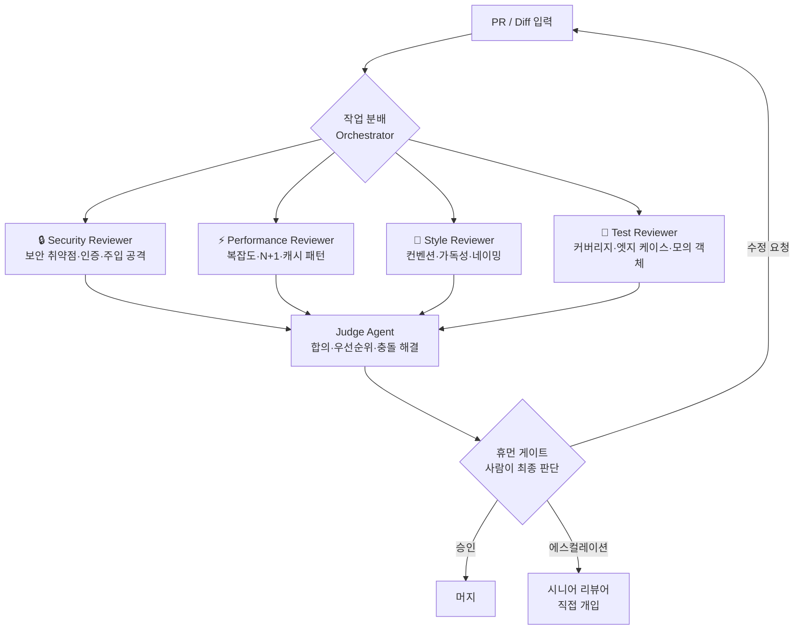

## 들어가며

코드 리뷰는 소프트웨어 품질의 마지막 방어선이다. 그런데 빠르게 성장하는 팀일수록 이 관문이 병목으로 작용한다. 기능 PR 한 건에 보안·성능·코드 스타일·테스트 커버리지를 모두 꼼꼼히 살피려면 숙련된 리뷰어가 적어도 30분에서 1시간 이상을 투자해야 한다.

AI 에이전트를 이 과정에 투입하는 팀이 빠르게 늘고 있다. 단, **AI는 리뷰어를 대체하지 않는다.** 이 글에서 다룰 패턴의 핵심은 AI가 반복적·구조적 검수 작업을 병렬로 처리하고, 사람은 최종 판단과 고맥락 결정에만 집중하도록 역할을 재배분하는 것이다. **AI는 보조, 휴먼 게이트는 필수다.**

이 글은 [AI 병렬 작업 구축 가이드](/posts/ai-parallel-workers-guide/)의 코드 리뷰 응용편이다. 병렬 AI 워커 개념이 낯설다면 먼저 해당 글을 읽어 볼 것을 권한다.

## 목차

- [왜 단일 AI 리뷰어로는 부족한가?](#왜-단일-ai-리뷰어로는-부족한가)
- [2026년 2월, 다중 에이전트 리뷰가 주류가 된 이유](#2026년-2월-다중-에이전트-리뷰가-주류가-된-이유)
- [HubSpot Sidekick 사례 분석](#hubspot-sidekick-사례-분석)
- [4-리뷰어 분할 패턴 설계](#4-리뷰어-분할-패턴-설계)
- [합의 에이전트와 충돌 해결](#합의-에이전트와-충돌-해결)
- [휴먼 게이트: 반드시 사람이 결정해야 하는 지점](#휴먼-게이트-반드시-사람이-결정해야-하는-지점)
- [실행 가이드: oh-my-claudecode 서브에이전트 활용](#실행-가이드-oh-my-claudecode-서브에이전트-활용)
- [피해야 할 안티패턴](#피해야-할-안티패턴)
- [참고](#참고)

---

## 왜 단일 AI 리뷰어로는 부족한가?

기존 AI 코드 리뷰 도구들은 하나의 LLM에 전체 diff를 넣고 포괄적 피드백을 받는 방식을 취한다. 이 접근에는 세 가지 구조적 한계가 있다.

**첫째, 컨텍스트 경쟁.** 단일 프롬프트에 보안 취약점 탐지, 성능 분석, 코딩 컨벤션 검사, 테스트 커버리지 평가를 모두 요청하면 모델이 각 관점을 얕게 처리한다. 마치 한 명의 리뷰어에게 보안 감사, 성능 프로파일링, 스타일 가이드 적용을 동시에 맡기는 것과 같다.

**둘째, 전문성의 한계.** 보안 취약점 탐지와 성능 병목 분석은 요구하는 사고 방식이 다르다. 전자는 공격자 관점의 트레이스, 후자는 실행 경로와 I/O 패턴 분석이 필요하다. 같은 컨텍스트 창에 두 역할을 섞으면 어느 쪽도 깊이 있게 처리되지 않는다.

**셋째, 비용과 속도의 트레이드오프.** 전체 diff를 큰 모델 하나에 넣으면 토큰 비용이 높고 응답이 느리다. 역할을 분할하면 작은 모델을 병렬로 써서 비용과 지연 모두를 줄일 수 있다.

다중 에이전트 리뷰는 이 세 문제를 모두 해결하는 방향으로 설계된다.

---

## 2026년 2월, 다중 에이전트 리뷰가 주류가 된 이유

2026년 초, 주요 AI 코딩 도구들이 에이전트 기반 리뷰 기능을 잇달아 출시하거나 강화했다.

| 도구 | 다중 에이전트 리뷰 특징 |
|------|------------------------|
| **Grok Build** | xAI의 코딩 에이전트. 저장소 전체 컨텍스트를 기반으로 보안·의존성 리뷰 자동화 |
| **Windsurf** | Codeium의 플로우 기반 에이전트. IDE 안에서 다중 리뷰어 역할 순차·병렬 실행 |
| **Claude Code Agent Teams** | Anthropic의 팀 모드. 서브에이전트를 병렬 스폰해 역할별 리뷰 리포트 생성 |
| **Codex CLI** | OpenAI의 터미널 기반 에이전트. PR diff를 파이프라인으로 넘겨 전문화 리뷰 체인 구성 |

이 흐름의 배경을 Anthropic의 보고서는 다음과 같이 정리한다.

> "As agentic coding matures, single-pass review gives way to specialist sub-agents — each with a focused mandate — operating in parallel, with a human remaining the final decision-maker."
>
> — *Anthropic, Agentic Coding Trends Report (2026)*[^1]

[^1]: Anthropic Agentic Coding Trends Report (2026). 원문은 Anthropic 공식 사이트에서 확인 가능. 위 인용은 핵심 요지를 발췌한 것으로, 전후 맥락을 포함한 원문 확인을 권장한다.

공통된 흐름은 **"한 번의 큰 리뷰 → 여러 번의 집중 리뷰"**로의 전환이다. 각 에이전트는 좁고 명확한 책임만 갖고, 결과는 judge 역할의 에이전트 또는 사람이 통합한다. 에이전트 자체가 "좋은 코드가 무엇인지"를 결정하는 것이 아니라, 미리 정의된 체크리스트를 빠르고 일관되게 실행하는 역할에 머문다.

---

## HubSpot Sidekick 사례 분석

HubSpot의 내부 AI 코드 리뷰 도구 **Sidekick**은 현재까지 공개된 사례 중 수치가 가장 구체적으로 알려진 케이스다.

InfoQ 보도에 따르면, HubSpot은 Sidekick 도입 후 다음과 같은 결과를 보고했다.

> "HubSpot's Sidekick achieved **90% Faster Feedback** on pull requests and saw **80% Engineer Approval** in internal surveys."
>
> — *InfoQ, "HubSpot's Sidekick: AI Code Review at Scale" (2026)*[^2]

[^2]: InfoQ 기사의 해당 수치는 HubSpot 내부 측정값으로, 외부 독립 검증은 공개되지 않았다. 팀 규모·코드베이스 특성에 따라 결과가 달라질 수 있다.

이 수치를 해석할 때 맥락이 중요하다.

**"90% Faster Feedback"**은 PR 오픈 후 첫 번째 리뷰 코멘트까지의 대기 시간 단축을 의미한다. AI가 수 분 내에 초기 피드백을 제공하므로 수치 자체는 달성 가능한 목표다. 그러나 이것이 "리뷰 품질의 90% 향상"을 의미하지는 않는다.

**"80% Engineer Approval"**은 엔지니어 만족도 설문 결과다. 도입 후 긍정 응답 비율로, 팀 문화·사용 방식·온보딩 품질에 크게 좌우된다.

Sidekick 설계의 핵심 원칙은 **리뷰어를 대체하지 않는다는 선언**이었다. AI 코멘트는 "제안(suggestion)" 레이블을 달고, 최종 승인은 반드시 사람 리뷰어가 수행해야 머지가 허용된다. 속도 이익은 AI가 가져가고, 판단 권한은 사람이 유지하는 구조다.

---

## 4-리뷰어 분할 패턴 설계

PR 한 건을 아래 4개 전문 에이전트로 분할하는 것이 현재 가장 많이 적용되는 패턴이다.



각 에이전트의 역할과 검수 초점은 다음과 같다.

### Security Reviewer

- OWASP Top 10 기준 취약점 스캔
- 인증·인가 로직 우회 가능성
- 외부 입력값의 sanitization 여부
- 알려진 CVE를 포함한 의존성 취약점
- 시크릿·자격증명 하드코딩 탐지

### Performance Reviewer

- 알고리즘 복잡도 변화 (O(n) → O(n²) 등)
- ORM N+1 쿼리 패턴
- 불필요한 재계산과 캐시 미스 지점
- 메모리 누수 가능성
- 네트워크 I/O 최적화 기회

### Style Reviewer

- 팀 컨벤션 준수 (린터 규칙 초과 분석)
- 함수·변수 네이밍의 의도 전달력
- 복잡한 로직의 가독성과 분리 가능성
- 주석의 필요성 및 정확성
- 기존 코드베이스 패턴과의 일관성

### Test Reviewer

- 새 로직 대비 테스트 커버리지
- 엣지 케이스·경계값 처리
- 모의 객체의 현실 반영도
- 테스트 독립성 (실행 순서 의존 여부)
- 실패 시 메시지의 진단 가능성

> **설계 원칙**: 각 에이전트는 다른 에이전트의 리포트를 보지 않은 상태에서 독립적으로 실행한다. 앵커링 편향 없이 독립적인 관점을 얻기 위한 장치다.

---

## 합의 에이전트와 충돌 해결

4개 에이전트의 결과를 받는 **Judge Agent**는 다음을 수행한다.

**1. 중복 제거**: 여러 에이전트가 동일한 문제를 다른 표현으로 보고한 경우 하나로 통합한다.

**2. 우선순위 정렬**: 심각도(critical → major → minor) 기준으로 정렬한다. 보안 critical 항목은 항상 최상위에 올린다.

**3. 충돌 해결**: 에이전트 간 상충하는 권고를 처리한다. 예를 들어 성능을 위한 인라이닝과 가독성을 위한 함수 분리가 충돌할 경우, 미리 정의된 우선순위 규칙을 적용한다.

```yaml
conflict_resolution:
  security_vs_performance:
    winner: security
    reason: 취약점은 재현 가능하고 악용 가능하지만, 성능 저하는 측정 후 결정 가능
  style_vs_readability:
    winner: context_dependent
    reason: judge가 코드베이스 전체 컨벤션 파일 참조 후 판단
  test_coverage:
    blocking: true
    threshold: 새 로직 대비 커버리지 80% 미만
```

**4. 조치 가능성 필터**: "고려해볼 수 있음" 수준의 제안은 별도 섹션으로 분리하고, 블로킹 항목만 메인 리포트에 표시한다.

Judge Agent의 최종 출력은 구조화된 리포트다. 머지 블로킹 여부를 명시하고 이유를 항목별로 기재한다. 이 리포트는 PR 코멘트로 자동 첨부되지만, **머지 버튼을 누르는 것은 항상 사람이다.**

---

## 휴먼 게이트: 반드시 사람이 결정해야 하는 지점

AI 리뷰가 아무리 정교해도 자동 머지는 허용하지 않는다. 다음 상황에서는 반드시 사람이 개입해야 한다.

### 절대적 휴먼 게이트 (자동화 불가)

| 상황 | 이유 |
|------|------|
| **보안 critical 항목 존재** | AI가 false positive를 낼 수 있음. 실제 위협인지 판단은 사람이 |
| **아키텍처 변경 포함** | 장기 유지보수 영향은 시스템 전체 맥락을 아는 사람만 판단 가능 |
| **외부 API 계약 변경** | 하위 호환성 파괴 범위를 AI가 완전히 파악하기 어려움 |
| **데이터 마이그레이션 관련** | 롤백 불가 작업에 AI 단독 승인 금지 |
| **프로덕션 핫픽스** | 속도 압박 상황에서 AI 리뷰만 믿고 머지하는 관행 금지 |

### 조건부 휴먼 게이트 (팀 정책에 따라)

- AI 신뢰도 점수가 팀 임계값 미만인 경우
- 신규 파일이 전체 diff의 50% 이상인 대형 PR
- 2인 이상이 수정한 공유 모듈 변경
- 릴리스 브랜치 직접 머지

> **원칙**: 게이트의 수를 늘릴수록 AI 리뷰의 속도 이점이 줄어든다. 팀이 실제로 지킬 수 있는 최소한의 게이트를 명문화하는 것이 중요하다.

**에스컬레이션 경로도 사전에 설계해야 한다.** Judge Agent가 명확한 결론을 내리지 못한 경우 (예: 성능과 보안이 균등하게 critical), 자동으로 시니어 리뷰어에게 알림을 보내도록 워크플로우를 구성한다. 에스컬레이션 경로 없이 Judge Agent가 "결론 보류"를 반환하면 PR이 무기한 대기 상태에 빠질 수 있다.

---

## 실행 가이드: oh-my-claudecode 서브에이전트 활용

**oh-my-claudecode(OMC)**는 이 패턴을 Claude Code 위에서 즉시 구성할 수 있는 전문 서브에이전트를 제공한다.

이 블로그의 코드 변경 검수는 OMC의 세 가지 서브에이전트를 조합해 운영하고 있다.

- **`code-reviewer`**: 전반적 코드 품질·로직 결함·SOLID 원칙 위반 탐지. 심각도 등급 피드백을 구조화된 형태로 생성한다.
- **`security-reviewer`**: OWASP Top 10, 시크릿 노출, 안전하지 않은 패턴에 집중 탐지. 보안 전문 시각으로 diff를 재검토한다.
- **`verifier`**: 변경사항이 실제로 동작하는지 증거 기반으로 검증한다. 완료 선언 전에 호출해 "완료"와 "검증된 완료"를 구분한다.

### 독립 실행 패턴

```bash
# PR diff를 파일로 저장 후 각 에이전트를 별도 컨텍스트로 실행
git diff main...HEAD > /tmp/pr_diff.txt

# 1. 보안 리뷰 (독립 컨텍스트)
claude --agent security-reviewer < /tmp/pr_diff.txt > /tmp/security_report.txt

# 2. 코드 품질 리뷰 (독립 컨텍스트)
claude --agent code-reviewer < /tmp/pr_diff.txt > /tmp/code_report.txt

# 3. 두 리포트 통합 후 검증
cat /tmp/security_report.txt /tmp/code_report.txt | claude --agent verifier
```

에이전트를 별도 컨텍스트로 실행하는 것이 핵심이다. 같은 세션에서 순차 호출하면 앞 에이전트의 결과가 뒤 에이전트의 판단에 영향을 준다.

### OMC 팀 모드 활용

팀 모드를 쓰면 병렬 실행과 결과 통합을 자동화할 수 있다.

```bash
/team "PR diff를 받아 security-reviewer·code-reviewer·verifier 서브에이전트로
병렬 리뷰하고, 결과를 Judge 역할로 통합해 블로킹 항목 목록을 생성하라.
최종 승인은 내가 직접 한다."
```

> **주의**: OMC 팀 모드 결과는 항상 사람이 검토한 후 머지를 결정한다. `verifier` 서브에이전트가 "검증 완료"를 보고해도 이것은 기술적 체크리스트 통과를 의미할 뿐, 머지 승인이 아니다.

### 병렬 AI 워커와의 연계

[AI 병렬 작업 구축 가이드](/posts/ai-parallel-workers-guide/)에서 소개한 **포크-조인 패턴**을 코드 리뷰에 그대로 적용할 수 있다. PR diff를 fork 지점으로 삼고, 4개 에이전트 리뷰를 병렬 브랜치로 실행한 뒤, Judge Agent에서 join한다. 오케스트레이터가 각 에이전트를 독립 워크트리에서 실행하면 컨텍스트 오염 없이 진정한 독립 리뷰를 보장할 수 있다.

---

## 피해야 할 안티패턴

### 1. AI 리뷰 결과를 그대로 머지

가장 위험한 패턴이다. "AI가 LGTM 했으니 머지"는 AI가 리뷰어를 대체한다는 착각에서 비롯된다. AI는 훈련 데이터 기반으로 패턴을 탐지할 뿐, 비즈니스 컨텍스트·팀 히스토리·배포 환경을 모른다.

### 2. 단일 에이전트에 모든 역할 부여

"보안·성능·스타일·테스트를 모두 리뷰해라"처럼 광범위한 지시는 각 영역을 얕게 처리하는 결과를 만든다. 역할을 분리하지 않으면 다중 에이전트 패턴의 이점이 사라진다.

### 3. 에이전트 결과를 서로 공유한 후 재평가 요청

"Security Reviewer 결과를 보고 Performance Reviewer도 의견을 내라"는 방식은 앵커링 편향을 만든다. 독립적 관점을 얻으려면 에이전트는 서로의 결과를 모르는 상태에서 실행해야 한다.

### 4. 모든 AI 코멘트를 블로킹 항목으로 처리

"AI가 지적했으니 무조건 수정"은 개발 속도를 AI 리뷰 이전보다 더 낮출 수 있다. minor 제안과 critical 블로커를 명확히 구분하고, minor는 개발자 재량으로 처리할 수 있도록 정책을 설계한다.

### 5. AI 리뷰 리포트를 PR 코멘트로만 남기기

AI 리뷰 리포트가 PR 코멘트에만 존재하고 사람이 읽지 않으면 아무 효과가 없다. 최소한 "이 PR의 AI 리뷰 결과를 읽었습니까?"를 머지 조건으로 체크박스화하는 것이 필요하다.

### 6. 보안 리뷰를 AI에만 위임

보안 취약점 탐지에서 AI의 false negative(놓친 취약점)는 false positive(없는 취약점 탐지)보다 훨씬 비용이 크다. 보안과 관련된 코드 변경에는 반드시 사람 보안 리뷰를 병행해야 한다.

---

## 참고

다음은 이 글을 작성하는 데 참조한 자료들이다. 직접 인용 없이 링크·논점 요약으로만 처리한다.

- [GitHub Engineering Blog](https://github.blog/engineering/) — GitHub 내부 AI 리뷰 도입 경험; false positive 관리와 팀 적응 과정 중심
- [Google Testing Blog](https://testing.googleblog.com/) — 대규모 코드베이스에서 AI 리뷰 도입 시 발생한 컨텍스트 길이·언어별 품질 차이 논의
- [Martin Fowler's Bliki](https://martinfowler.com/bliki/) — AI 리뷰의 가치는 속도가 아닌 일관성에 있다는 관점; 인간 리뷰어와의 역할 경계 제안
- [USENIX Security Symposium Proceedings](https://www.usenix.org/conference/usenixsecurity26) — 다중 에이전트 vs 단일 에이전트 리뷰의 취약점 탐지율 비교; 전문화 에이전트의 recall 향상 효과
- [ACM Queue](https://queue.acm.org/) — 자동화 리뷰에 대한 지나친 신뢰가 만드는 보안 맹점; 휴먼 게이트 유지의 필요성 논거

---

## 마치며

다중 에이전트 코드 리뷰는 리뷰 대기 시간을 줄이고 각 관점의 깊이를 높이는 현실적인 방법이다. 그러나 이 패턴이 가치를 발휘하려면 두 가지가 선행되어야 한다.

**하나, 역할 설계가 명확해야 한다.** 에이전트 수를 늘리는 것이 목적이 아니라, 각 에이전트가 잘 정의된 하나의 책임만 갖도록 설계하는 것이 핵심이다.

**둘, 휴먼 게이트를 타협하지 말아야 한다.** AI 리뷰 품질이 높아질수록 "이제 자동 머지해도 되지 않나?"는 유혹이 생긴다. 그 유혹을 이기는 것이 신뢰할 수 있는 AI 리뷰 시스템의 조건이다.

다음 글에서는 이 패턴을 실제 Claude Code 서브에이전트 구성 파일과 함께 단계별로 구현하는 방법을 다룬다.

- [claude-code-subagents-patterns](/posts/claude-code-subagents-patterns/) (예정)
- [ai-generated-code-tech-debt](/posts/ai-generated-code-tech-debt/) (예정)
