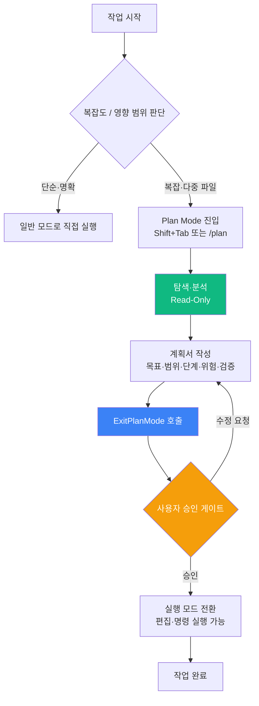

## 들어가며

AI 에이전트가 파일을 수정하고 명령을 실행하는 시대에, "어디서 멈추고 사람의 확인을 받을 것인가"는 점점 중요한 질문이 되고 있다. Claude Code의 **Plan Mode**는 이 질문에 대한 하나의 구조적 답이다.

Plan Mode는 AI가 계획을 세우는 단계와 실행하는 단계를 명시적으로 분리한다. 이 글에서는 Plan Mode의 개념부터 `ExitPlanMode` 도구의 동작 원리, 효과적인 계획서 구조, 서브에이전트 및 `AskUserQuestion`과의 결합 패턴, 그리고 흔한 안티패턴까지 실전 중심으로 정리한다.

---

## 1. Plan Mode란 무엇인가

Plan Mode는 Claude Code가 **읽기 전용(read-only) 상태**로 동작하는 특수 모드다. 이 모드에서 Claude는:

- 파일을 **읽고 탐색**할 수 있다 (`Read`, `Grep`, `Glob`, 조회용 `Bash` 등)
- 파일을 **수정하거나 생성할 수 없다** (`Edit`, `Write` 차단)
- 시스템에 영향을 주는 **명령을 실행할 수 없다** (빌드, 테스트, 배포 명령 차단)

이 제약은 Claude가 코드베이스를 충분히 이해하고 계획을 수립한 뒤, 사람의 확인을 받아야만 실행 단계로 넘어가도록 강제하는 구조다. Plan Mode의 핵심 목적은 하나다: **의도 정렬(intent alignment)**. AI가 무엇을 어떻게 할 것인지를 먼저 명확히 하고, 사람이 그 계획에 동의한 후에 실행을 시작하게 하는 것이다.

> Plan Mode는 "AI를 느리게 만드는 기능"이 아니라, "틀린 방향으로 빠르게 가는 것을 막는 기능"이다.
{: .prompt-info }

---

## 2. Plan Mode를 켤 때

Plan Mode가 특히 유용한 상황은 다음과 같다.

### 다중 파일 변경이 필요한 경우

한 기능을 구현하기 위해 `src/`, `tests/`, `config/` 등 여러 곳을 동시에 건드려야 한다면, Plan Mode에서 먼저 변경 범위를 확정하는 것이 안전하다. AI가 임의로 파일 범위를 확장하는 "scope creep"을 사전에 차단할 수 있다.

### 영향 범위가 불확실한 리팩토링

"이 함수를 추출하면 어디까지 영향이 가는가"처럼 파급 효과가 불분명한 작업은, Plan Mode에서 탐색 후 계획을 확인받는 것이 좋다. 계획 없이 바로 수정하다 보면 예상치 못한 파일이 연쇄적으로 변경되는 상황이 생긴다.

### 새 기능의 범위 분할이 어려운 경우

요구사항이 여러 하위 작업으로 자연스럽게 분리되지 않을 때, Plan Mode에서 Claude가 분석하여 적절한 단계로 쪼개도록 한 뒤 승인을 받으면 이후 실행이 매끄럽다.

### 의도 정렬이 필요한 경우

"내가 원하는 것을 Claude가 제대로 이해했는가"를 실행 전에 확인하고 싶다면 Plan Mode가 적합하다. 특히 처음 작업하는 코드베이스나 도메인에서는, 계획서를 먼저 검토함으로써 AI의 이해 오류를 조기에 잡을 수 있다.

---

## 3. Plan Mode를 쓰지 않아도 될 때

모든 작업에 Plan Mode를 적용하면 오히려 비효율이 생긴다. 다음 상황에서는 Plan Mode가 필요하지 않다.

### 탐색·이해만 하는 작업

"이 파일이 어떻게 동작하지?" 같은 단순 조사 작업은 Plan Mode 없이도 읽기만 하면 된다. 변경 의도 자체가 없다면 일반 모드에서 진행해도 차이가 없고, 계획 수립의 오버헤드만 추가된다.

### 1줄~수 줄 수정

오타 수정, 변수명 변경, 단순 설정값 교체처럼 영향 범위가 자명한 수정은 Plan Mode 없이 바로 처리하는 것이 빠르다. 계획 수립에 드는 비용이 수정 자체보다 클 수 있다.

### 디버깅 중 빠른 실험

버그 재현을 위해 로그를 추가하거나 설정을 잠깐 바꿔보는 탐색적 디버깅은, Plan Mode가 오히려 속도를 방해한다. 즉각적인 피드백 루프가 필요한 상황에서는 일반 모드가 적합하다.

---

## 4. 활성화와 종료 방법

### Shift+Tab — 토글 단축키

Claude Code CLI에서 `Shift+Tab`을 누르면 Plan Mode와 일반 모드 사이를 전환한다. 가장 직관적인 방법으로, 대화 중에도 실시간으로 모드를 바꿀 수 있다.

### /plan 명령 (v2.1.0+)

Claude Code v2.1.0 이후 버전에서는 `/plan` 슬래시 명령으로 Plan Mode를 활성화할 수 있다.[^plan-cmd] 슬래시 명령 방식은 키보드 단축키보다 의도를 명시적으로 표현한다는 점에서, 팀 내 워크플로우를 문서화할 때 유용하다.

[^plan-cmd]: v2.1.0 이전 버전에서는 `Shift+Tab`이 주요 진입 방식이다. `claude --version`으로 버전을 확인하고, 사용 중인 환경의 기능 지원 여부를 먼저 점검하길 권한다.

> Plan Mode 활성화 상태는 CLI 입력창 옆의 모드 표시로 확인할 수 있다. 현재 어느 모드인지 헷갈릴 때는 이 표시를 확인한다.
{: .prompt-tip }

---

## 5. ExitPlanMode 동작 원리 — 승인 게이트

Plan Mode의 핵심 메커니즘은 `ExitPlanMode`라는 도구 호출에 있다. 이 부분이 Plan Mode를 단순한 "읽기 전용 모드"에서 **구조적 승인 게이트**로 만드는 장치다.

### ExitPlanMode는 어떻게 작동하는가

Claude가 Plan Mode에서 계획 수립을 마치면 `ExitPlanMode`를 호출한다. 이 도구 호출 자체가 사용자 승인을 요청하는 게이트로 작동한다.[^anthropic-planmode]

[^anthropic-planmode]: Anthropic 공식 문서에 따르면, Plan Mode에서 Claude는 파일 편집·명령 실행 도구에 접근할 수 없으며, `ExitPlanMode` 도구 호출이 사용자 확인을 거쳐 실행 모드로 전환하는 메커니즘이다. 자세한 내용은 [Anthropic Claude Code 문서](https://docs.anthropic.com/en/docs/claude-code/overview)를 참고한다.

1. Claude가 `ExitPlanMode` 호출 → 계획 요약이 사용자에게 제시됨
2. 사용자가 **승인(approve)** 하면 → 일반 실행 모드로 전환, 파일 수정·명령 실행 가능
3. 사용자가 **수정 요청**하면 → Plan Mode 상태 유지, Claude가 계획을 재수립



### 도구 호출이 게이트인 이유

Piebald-AI의 분석이 이 지점을 명확히 짚는다: `ExitPlanMode`는 단순한 모드 전환 명령이 아니라, Claude Code 하니스(harness)가 **사용자 승인 인터럽트를 주입하는 훅 지점**이다.[^piebald] Claude가 이 도구를 호출하면 런타임은 실행을 잠시 중단하고 사용자에게 계획을 제시한다. 사용자의 응답 없이는 다음 단계로 넘어갈 수 없다.

[^piebald]: Piebald-AI의 Claude Code Plan Mode 내부 동작 분석. Claude Code의 도구 호출 구조를 추적하여, `ExitPlanMode`가 실행 전 사용자 확인을 강제하는 게이트 포인트로 설계되어 있음을 설명한다.

이 구조가 중요한 이유는, **사람이 "실행해도 된다"는 신호를 명시적으로 보내지 않으면 아무 일도 일어나지 않기 때문**이다. 의도하지 않은 파일 변경이나 시스템 명령 실행을 구조적으로 차단한다.

---

## 6. 효과적인 계획서 구조

Plan Mode에서 작성하는 계획서가 좋을수록, 승인 후 실행 단계의 오류가 줄어든다. 좋은 계획서의 구성 요소는 다음과 같다.

### 계획서 5요소

| 요소 | 설명 | 예시 |
|------|------|------|
| **목표** | 이 작업이 달성해야 하는 것 | "사용자 인증 미들웨어 분리" |
| **범위** | 어떤 파일을 어떻게 변경하는가 | `src/middleware/auth.ts` 신규 생성, `app.ts` 수정 |
| **단계** | 순서가 있는 실행 스텝 | 1. 미들웨어 파일 생성 → 2. 라우터 수정 → 3. 테스트 추가 |
| **위험·롤백** | 실패 시 어떻게 복구하는가 | "기존 `app.ts`는 변경 전 커밋으로 복구 가능" |
| **검증** | 어떻게 완료를 확인하는가 | "기존 테스트 통과 + 신규 인증 테스트 통과" |

### 계획서 길이의 트레이드오프

계획서가 너무 짧으면 실행 중 모호성이 생기고, 너무 길면 검토하는 데 시간이 걸려 Plan Mode의 이점이 줄어든다.

- **적정 길이**: 담당자가 2~3분 안에 읽고 "이걸로 진행해도 되겠다"고 판단할 수 있는 분량
- **단계가 3개 이하**: 계획서가 필요 없을 만큼 단순한 작업일 수 있다
- **단계가 10개 이상**: 작업을 더 작게 쪼개거나, 페이즈로 나눠 별도 승인을 받는 것을 고려

> 계획서를 "완전한 문서"로 만들려는 욕심을 경계하라. 계획서의 목적은 의사소통이지, 기록 보존이 아니다.
{: .prompt-warning }

### planner 서브에이전트 활용

복잡한 작업에서는 Claude 자신이 계획을 세우는 대신, `planner` 서브에이전트를 별도로 호출하여 더 깊이 있는 계획 수립을 위임하는 패턴이 효과적이다. [Claude Code 스킬 작성 완전 가이드](/posts/claude-code-skills-guide/)에서 다룬 에이전트 위임 원칙이 여기서도 동일하게 적용된다: 작업의 특성에 맞는 전문 에이전트를 활용하면 계획의 품질이 올라간다.

---

## 7. 서브에이전트 조합 — planner → executor 패턴

Plan Mode와 서브에이전트를 결합하면 계획 수립과 실행을 완전히 분리할 수 있다.

### 기본 위임 패턴

```
planner 에이전트 (Plan Mode 내에서 실행)
  └─ 코드베이스 탐색
  └─ 계획서 작성 (.omc/plans/feature-plan.md)
  └─ ExitPlanMode 호출 → 사용자 승인

executor 에이전트 (승인 후 실행 모드에서)
  └─ 계획서 로드
  └─ 단계별 구현
  └─ 검증
```

이 패턴의 핵심은 **계획을 세우는 에이전트와 실행하는 에이전트를 분리**하는 것이다. 같은 에이전트가 계획도 세우고 바로 실행하면, 계획 단계의 제약이 실질적으로 희석될 수 있다.

### oh-my-claudecode에서의 적용

oh-my-claudecode의 `ralplan` 스킬이 이 패턴의 대표적인 구현 사례다. `ralplan`은 먼저 요구사항의 모호성을 점수로 측정한 뒤 — 모호성이 일정 임계값 이하일 때만 — `planner` 에이전트를 통해 계획을 수립하고, 사용자 승인을 받은 후 `ralph`나 `ultrawork`로 실행을 위임한다.

```
ralplan
  └─ 모호성 게이트 (ambiguity score ≤ threshold)
  └─ planner → 계획서 작성
  └─ 승인 게이트 (ExitPlanMode)
  └─ ralph / ultrawork → 실행
```

> 서브에이전트 조합 패턴에 대한 더 자세한 내용은 이후 *claude-code-subagents-patterns* 포스트에서 다룰 예정이다.
{: .prompt-info }

---

## 8. AskUserQuestion 결합 패턴

Plan Mode에서 계획을 수립하다 보면 선택지가 생긴다. "A 방식으로 할까, B 방식으로 할까?" 이 선택을 Claude 혼자 결정하지 않고 사용자에게 명시적으로 묻는 것이 `AskUserQuestion` 도구의 역할이다.

### 계획 중 불확실 선택지 명시화

`AskUserQuestion`은 Plan Mode 중에도 사용할 수 있다. Claude가 계획을 세우다가 트레이드오프가 있는 분기점을 만나면, 사용자에게 선택지를 제시하고 답을 기다릴 수 있다.

예를 들어 인증 방식을 결정해야 하는 상황에서:

- **선택 1: JWT 방식** — 서버리스 확장성·상태 비저장, 단 토큰 폐기가 복잡
- **선택 2: 세션 방식** — 즉시 폐기 가능·구현 단순, 단 서버 상태 필요·스케일 아웃 제약

이 두 선택지를 `AskUserQuestion`으로 제시하면, 사용자가 트레이드오프를 인지한 상태에서 명확하게 결정을 내릴 수 있다.

### 의사결정의 가시화

`AskUserQuestion`의 중요한 부수 효과는, 어떤 결정이 어떤 이유로 내려졌는지를 대화 흐름에 남긴다는 것이다. AI가 임의로 결정한 것이 아니라, 사용자가 명시적으로 선택했음이 명확해진다. "왜 이렇게 구현됐지?"를 나중에 추적할 때 이 흔적이 도움이 된다.

### ExitPlanMode와의 이중 동의 구조

`AskUserQuestion`을 `ExitPlanMode`와 조합하면 두 단계의 명시적 동의를 확보할 수 있다:

1. **계획 중**: `AskUserQuestion`으로 핵심 선택지에 대한 결정
2. **계획 완료**: `ExitPlanMode`로 전체 계획에 대한 최종 승인

이 이중 승인 구조는 복잡한 작업일수록 효과적이다. 계획 수립 과정에서 이미 주요 결정들을 함께 했으므로, 최종 계획서 승인 단계에서 큰 이견이 생기는 경우가 드물어진다.

> `AskUserQuestion`을 남발하면 사용자가 피로를 느낄 수 있다. 트레이드오프가 실질적으로 있는 선택지에만 사용하고, 명확한 정답이 있는 질문은 Claude가 판단하도록 두는 것이 좋다.
{: .prompt-warning }

---

## 9. 안티패턴

### ❌ 모든 작업에 Plan Mode 적용

Plan Mode는 비용이 있다. 탐색 → 계획 → 승인 → 실행의 흐름은 단순 작업에서는 오히려 병목이 된다. "작업의 영향 범위가 자명하고, 실패해도 빠르게 복구할 수 있는 경우"는 Plan Mode 없이 진행하는 것이 효율적이다.

**언제 Plan Mode를 쓰지 않을지를 아는 것**이, 언제 쓸지를 아는 것만큼 중요하다.

### ❌ 과도하게 긴 계획서

10분 넘게 읽어야 하는 계획서는 Plan Mode의 목적에서 벗어난다. 계획서가 길어지면 사람이 제대로 검토하지 않고 승인하는 경향이 생기며, 이는 승인 게이트의 의미를 퇴색시킨다.

계획서가 지나치게 길어진다면, 작업 자체를 더 작게 분해하거나 여러 단계로 나눠 별도 승인을 받는 구조를 고려한다.

### ❌ ExitPlanMode 호출 없이 Plan Mode 종료

`Shift+Tab`으로 수동으로 모드를 전환하거나 Plan Mode를 우회하면, 승인 게이트가 작동하지 않는다. `ExitPlanMode` 도구 호출을 통해 종료해야 사용자 확인 절차가 보장된다.

oh-my-claudecode 환경에서는 이 점이 특히 중요하다. 자동화된 워크플로우에서 Plan Mode를 사용할 경우, `ExitPlanMode`를 명시적으로 호출하는 흐름이 스킬 또는 훅(hook) 설계에 포함되어 있어야 한다.

---

## 마치며

Claude Code Plan Mode는 AI 에이전트의 자율성과 사람의 통제 사이에서 균형을 잡는 실용적인 도구다. 모든 상황에 쓰는 만능 해결책이 아니라, "이 작업은 실행 전에 계획을 확인받을 만큼 복잡한가"를 판단하는 것이 Plan Mode 활용의 출발점이다.

`ExitPlanMode`가 단순한 모드 전환이 아닌 **구조적 승인 게이트**라는 점, `AskUserQuestion`과 결합하면 계획 수립 과정 자체를 협업 프로세스로 만들 수 있다는 점이 이 기능의 핵심이다.

속도보다 정확도가 필요한 작업, 영향 범위가 불확실한 변경, 팀 내 의도 정렬이 필요한 상황 — 이 세 가지가 겹칠 때 Plan Mode는 가장 큰 가치를 발휘한다.

---

*관련 글:*
- [Claude Code 스킬 작성 완전 가이드 — AI 워크플로우 자동화의 핵심](/posts/claude-code-skills-guide/)
- [바이브 코딩 피로(Vibe Coding Fatigue) — AI 개발자의 번아웃을 명명하다](/posts/vibe-coding-fatigue/)
