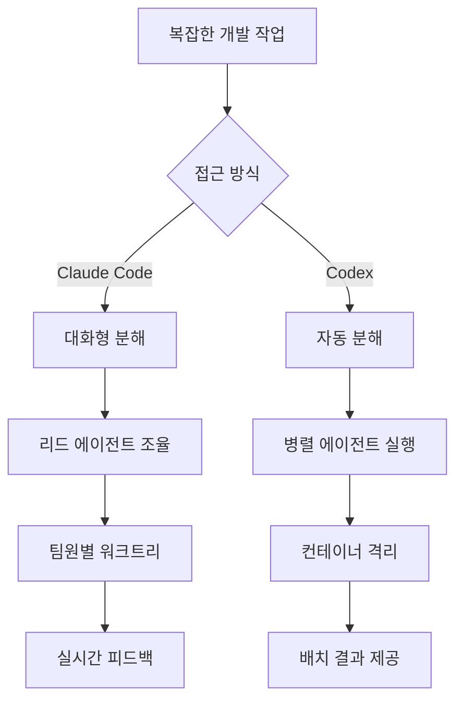

# Claude Code vs OpenAI Codex: Comparative Analysis Framework

**Phase 1 Analysis Results**
**Date**: 2026-03-25
**Issue**: #68 — Claude Code vs Codex: AI 코딩 에이전트 방법론 비교 블로그 포스트

## 프레임워크 개요

이 문서는 Claude Code와 OpenAI Codex의 방법론적 차이를 체계적으로 분석하기 위한 비교 프레임워크를 제시합니다. 단순한 기능 비교를 넘어서 각 도구의 설계 철학, 접근 방식, 그리고 적용 시나리오의 차이점을 중심으로 분석합니다.

## 1. 비교 차원 정의

### 1.1 아키텍처적 차원 (Architectural Dimensions)

| 차원 | Claude Code | OpenAI Codex | 분석 기준 |
|------|-------------|--------------|-----------|
| **실행 모델** | 단일 스레드 마스터 루프 | App Server 아키텍처 | 복잡성, 확장성, 제어 가능성 |
| **에이전트 오케스트레이션** | Agent Teams (리드 에이전트 중심) | 다중 에이전트 병렬 실행 | 조율 방식, 충돌 해결, 작업 분배 |
| **환경 격리** | Git 워크트리 기반 | 클라우드 컨테이너 샌드박스 | 보안, 성능, 개발 환경 일치성 |

### 1.2 워크플로우 차원 (Workflow Dimensions)

| 차원 | Claude Code | OpenAI Codex | 분석 기준 |
|------|-------------|--------------|-----------|
| **상호작용 모델** | 대화형, 추론 과정 표시 | 자율적 실행 후 결과 제공 | 투명성, 제어 수준, 학습 가능성 |
| **개발자 역할** | Outcome Engineer | 전통적 개발자 + AI 어시스턴트 | 역할 변화, 기술 요구사항 |
| **피드백 루프** | 실시간 승인/수정 | 배치 검토 | 반응성, 정확성, 효율성 |

### 1.3 효율성 차원 (Efficiency Dimensions)

| 차원 | Claude Code | OpenAI Codex | 분석 기준 |
|------|-------------|--------------|-----------|
| **토큰 효율성** | 높은 소모 (설명적) | 2-3배 효율적 | 비용, 속도, 처리량 |
| **컨텍스트 활용** | ~100만 토큰 지원 | 컴팩션 기술 활용 | 대용량 프로젝트 처리 능력 |
| **출력 품질** | 정밀한 레이아웃 보존 | 작동하는 최소 결과 | 완성도, 유지보수성 |

### 1.4 보안 및 격리 차원 (Security & Isolation Dimensions)

| 차원 | Claude Code | OpenAI Codex | 분석 기준 |
|------|-------------|--------------|-----------|
| **실행 환경** | 로컬 터미널 | 보안 격리 컨테이너 | 데이터 프라이버시, 접근 제어 |
| **네트워크 접근** | 제한 없음 | 작업 중 비활성화 | 보안 위험, 기능 제약 |
| **데이터 처리** | 로컬 파일 시스템 | 사전 로드된 저장소 | 민감 데이터 처리 |

## 2. 방법론적 차이점 매트릭스

### 2.1 설계 철학 비교

| 영역 | Claude Code 접근법 | Codex 접근법 | 방법론적 함의 |
|------|-------------------|-------------|-------------|
| **개발 패러다임** | "Vibe Coding" - 의도 중심 | 코드 완성 및 자동화 | 추상화 수준의 차이 |
| **제어 철학** | 협업적 제어 | 자율적 실행 | 개발자 참여도 |
| **투명성** | 추론 과정 노출 | 블랙박스 실행 | 디버깅 및 학습 |

### 2.2 작업 분해 및 실행 방식



### 2.3 성능 특성 비교

| 메트릭 | Claude Code | OpenAI Codex | 상대적 우위 |
|--------|-------------|--------------|-------------|
| **초기 설정 시간** | 빠름 (로컬) | 중간 (컨테이너 시작) | Claude Code |
| **대용량 프로젝트** | 제한적 | 우수 (컴팩션) | Codex |
| **정확도** | 높음 (대화형 수정) | 중간 (일회성 실행) | Claude Code |
| **처리량** | 낮음 | 높음 | Codex |
| **비용 효율성** | 낮음 (토큰 소모) | 높음 | Codex |

## 3. 사용 사례별 적합성 분석

### 3.1 Claude Code 최적 시나리오

#### 3.1.1 연구 및 탐색적 개발
- **특징**: 불확실한 요구사항, 반복적 탐색 필요
- **이유**: 대화형 워크플로우로 방향 조정 용이
- **예시**: 새로운 아키텍처 설계, 프로토타입 개발

#### 3.1.2 학습 및 지식 전달
- **특징**: 과정 이해가 중요한 상황
- **이유**: 추론 과정 노출로 학습 효과 극대화
- **예시**: 복잡한 알고리즘 구현, 신입 개발자 교육

#### 3.1.3 크리티컬한 시스템 개발
- **특징**: 높은 정확성과 검증 필요
- **이유**: 실시간 피드백과 정밀한 제어
- **예시**: 금융 시스템, 의료 소프트웨어

### 3.2 OpenAI Codex 최적 시나리오

#### 3.2.1 대규모 배치 작업
- **특징**: 명확한 요구사항, 반복적 패턴
- **이유**: 토큰 효율성과 자율적 실행
- **예시**: 레거시 코드 마이그레이션, 대량 리팩터링

#### 3.2.2 보안이 중요한 환경
- **특징**: 격리된 실행 환경 필요
- **이유**: 컨테이너 기반 보안 격리
- **예시**: 클라우드 서비스 개발, 엔터프라이즈 환경

#### 3.2.3 비용 최적화가 중요한 프로젝트
- **특징**: 예산 제약, 효율성 중시
- **이유**: 2-3배 높은 토큰 효율성
- **예시**: 스타트업 프로젝트, 대규모 자동화

### 3.3 하이브리드 접근법

#### 3.3.1 단계별 조합 전략
```
Phase 1: Claude Code로 아키텍처 설계 및 핵심 로직 구현
Phase 2: Codex로 반복적 작업 및 테스트 코드 생성
Phase 3: Claude Code로 통합 및 최종 검증
```

#### 3.3.2 역할 기반 분담
- **설계 및 리뷰**: Claude Code (협업적 접근)
- **구현 및 테스트**: Codex (효율적 실행)

## 4. 의사결정 프레임워크

### 4.1 선택 기준 매트릭스

```
프로젝트 특성 평가:

1. 요구사항 명확성: [ 낮음 ] ──→ [ 높음 ]
   낮음(1-3): Claude Code 유리
   높음(7-10): Codex 유리

2. 학습 중요도: [ 낮음 ] ──→ [ 높음 ]
   높음(7-10): Claude Code 유리
   낮음(1-3): Codex 유리

3. 보안 요구사항: [ 낮음 ] ──→ [ 높음 ]
   높음(7-10): Codex 유리 (격리)
   낮음(1-3): Claude Code 유리 (유연성)

4. 비용 민감도: [ 낮음 ] ──→ [ 높음 ]
   높음(7-10): Codex 유리
   낮음(1-3): Claude Code 유리

5. 프로젝트 규모: [ 소규모 ] ──→ [ 대규모 ]
   소규모(1-3): Claude Code 유리
   대규모(7-10): Codex 유리
```

### 4.2 의사결정 트리

```
개발 작업 시작
│
├── 요구사항이 명확한가?
│   ├── YES → 프로젝트 규모는?
│   │   ├── 대규모 → Codex 권장
│   │   └── 소규모 → 비용 고려
│   │       ├── 비용 중요 → Codex
│   │       └── 품질 중요 → Claude Code
│   │
│   └── NO → 학습이 중요한가?
│       ├── YES → Claude Code 권장
│       └── NO → 보안 요구사항은?
│           ├── 높음 → Codex
│           └── 낮음 → Claude Code
```

## 5. 성능 벤치마크 프레임워크

### 5.1 정량적 지표

| 지표 | 측정 방법 | Claude Code 예상 | Codex 예상 |
|------|-----------|-----------------|------------|
| **토큰/태스크** | 동일 작업의 토큰 소모량 | 높음 | 낮음 (2-3배 효율) |
| **완료 시간** | 초기 요청부터 완료까지 | 가변적 | 일정함 |
| **정확도** | 요구사항 충족도 | 높음 | 중간 |
| **수정 횟수** | 완료까지 필요한 수정 | 낮음 | 높음 |

### 5.2 정성적 지표

| 영역 | 평가 기준 | 가중치 |
|------|-----------|--------|
| **개발자 경험** | 학습 용이성, 디버깅 편의성 | 25% |
| **코드 품질** | 가독성, 유지보수성, 문서화 | 30% |
| **프로젝트 적합성** | 요구사항 충족, 확장성 | 25% |
| **운영 효율성** | 비용, 속도, 안정성 | 20% |

### 5.3 테스트 시나리오 설계

#### 시나리오 1: 소규모 웹 애플리케이션
- **요구사항**: RESTful API, 인증, 데이터베이스 연동
- **복잡도**: 중간
- **예상 결과**: Claude Code의 협업적 접근이 유리

#### 시나리오 2: 대규모 데이터 처리 시스템
- **요구사항**: 배치 처리, 성능 최적화, 스케일링
- **복잡도**: 높음
- **예상 결과**: Codex의 효율성이 유리

#### 시나리오 3: 레거시 시스템 마이그레이션
- **요구사항**: 코드 변환, 테스트 생성, 문서화
- **복잡도**: 높음 (반복적)
- **예상 결과**: Codex의 자동화가 유리

## 6. 한계 및 고려사항

### 6.1 Claude Code의 한계
- **높은 토큰 소모**: 장기 프로젝트에서 비용 증가
- **로컬 환경 의존**: 환경 설정 문제 가능성
- **학습 곡선**: 새로운 협업 방식 적응 필요

### 6.2 Codex의 한계
- **블랙박스 특성**: 결정 과정 불투명
- **제한된 상호작용**: 실시간 피드백 어려움
- **환경 제약**: 클라우드 의존성, 네트워크 제한

### 6.3 공통 고려사항
- **모델 업데이트**: 성능 변화 가능성
- **생태계 발전**: 도구 통합 및 확장성
- **규제 및 정책**: 기업 환경에서의 제약

## 7. 결론 및 권장사항

### 7.1 핵심 인사이트

1. **방법론적 차이가 핵심**: 단순한 기능 비교를 넘어선 접근 방식의 차이
2. **상황 적응적 선택**: 프로젝트 특성에 따른 적절한 도구 선택 필요
3. **하이브리드 접근**: 각 도구의 강점을 조합한 활용 전략 유효

### 7.2 의사결정 가이드라인

- **학습 및 탐색 단계**: Claude Code 우선 고려
- **대규모 구현 단계**: Codex 우선 고려
- **비용 제약 환경**: Codex 우선 고려
- **높은 품질 요구**: Claude Code 우선 고려

### 7.3 향후 연구 방향

1. **실증적 벤치마크 수행**: 실제 프로젝트에서의 성능 측정
2. **개발자 경험 연구**: 사용성 및 학습 곡선 분석
3. **비용 효과 분석**: ROI 기반 도구 선택 모델
4. **통합 전략 개발**: 하이브리드 워크플로우 최적화

---

## 메타데이터

- **문서 버전**: 1.0
- **작성자**: Phase 1 Comparative Analysis
- **리뷰 상태**: 초안
- **다음 단계**: Phase 2 - 실증적 분석 및 사례 연구